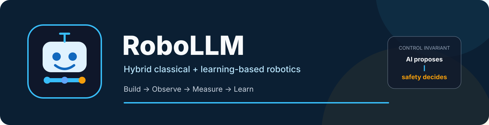
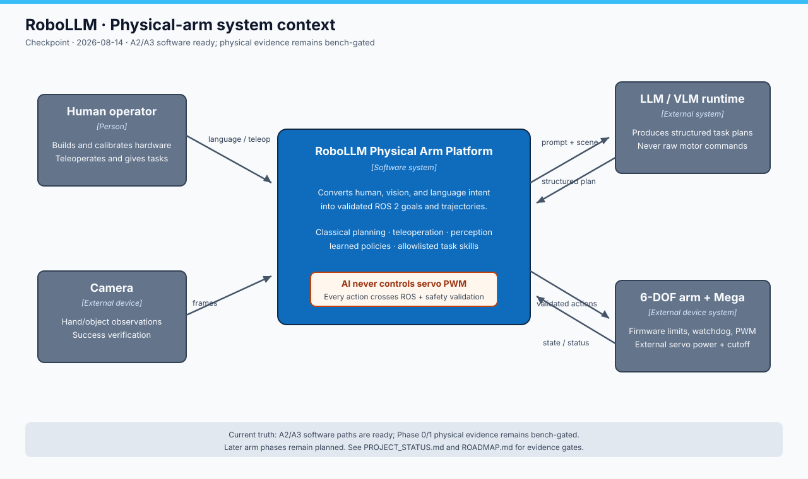

# RoboLLM · Hybrid robotics workbench



[](https://github.com/santapong/RoboLLM/actions/workflows/ci-fast.yml)
[](https://docs.ros.org/en/jazzy/)
[](https://www.python.org/)
[](ros2/README.md)
[](ROADMAP.md)

**RoboLLM is a learning-first robotics platform for building and evaluating
language-guided manipulation systems.** It connects ROS 2, simulation,
perception, teleoperation, robot learning, and a low-cost physical arm without
letting an LLM or learned policy bypass deterministic safety controls.

[Overview](#overview) · [Architecture](#architecture) ·
[Capabilities](#capabilities) · [Quick start](#quick-start) ·
[Physical arm](#physical-arm) · [Project structure](#repository-structure) · [Documentation](#documentation) ·
[Validation](#validation)

> [!IMPORTANT]
> The complete physical-arm Phase 0–5 plan is **not finished**. The repository
> currently provides the Phase 0 software/commissioning foundation and the
> v0.2.1 ROS 2 driver core. Hardware calibration, measured URDF/MoveIt execution,
> physical webcam mirroring, autonomous pick-and-place, VLA training, and the
> arm-specific LLM planner remain acceptance-gated work.

## Overview

RoboLLM is organized around four engineering principles:

| Principle | What it means in this repository |
|---|---|
| **One robot boundary** | The MCP server and browser dashboard share `src/robollm/bridge.py`; physical-arm commands converge on `robo_arm_driver`. |
| **AI proposes, safety decides** | Language and learned systems produce structured goals. ROS 2 validation, motion planning, firmware limits, and watchdogs decide what executes. |
| **Simulation is evidence, not hardware proof** | Every example names its environment. A successful RViz demo does not mark a physical-arm phase complete. |
| **Measure before claiming** | Acceptance tools record timing, error, state provenance, and success rates rather than relying on visual impressions. |

The repository serves two connected tracks:

- **Simulation and learning:** ROS 2 fundamentals, Nav2, MoveIt, PyBullet,
  MuJoCo, webcam teleoperation, gesture-driven manipulation, and dataset work.
- **Physical deployment:** a fail-closed 6-DOF arm stack built around ROS 2
  Jazzy, a validated serial driver, Arduino Mega firmware, and explicit bench
  acceptance gates.

## Architecture


The workbench has two control surfaces and one shared ROS 2 bridge:

- `apps/mcp/server.py` exposes 22 MCP tools for graph inspection, sensing,
  navigation, manipulation, simulation-world control, and rosbag workflows.
- `apps/dashboard/server.py` exposes browser teleoperation and telemetry through FastAPI
  and WebSocket endpoints.
- `src/robollm/bridge.py` owns the shared `rclpy` node, publishers, subscribers,
  action clients, speed limits, obstacle checks, and deadman behavior.

The physical arm uses a stricter chain:

```text
human / LLM / VLA / teleoperation
                 │ structured goal or JointTrajectory
                 ▼
        ROS 2 + motion planning
                 │ validated radians
                 ▼
          robo_arm_driver
                 │ calibrated raw degrees
                 ▼
        Arduino arm-fw 2.1
                 │ hard limits + slew + watchdog
                 ▼
             servo PWM
```

**An LLM, VLM, or VLA policy never sends PWM or unvalidated servo commands.**
See the [workbench C4 tour](docs/ARCHITECTURE.md) and the
[physical-arm C4 + Kruchten 4+1 model](docs/physical-arm/ARCHITECTURE.md).

## Capabilities

| Area | Capability | Evidence state | Entry point |
|---|---|---|---|
| LLM ↔ ROS 2 | 22 MCP tools for sensing, motion, Nav2, MoveIt, bags, TF2, and Gazebo objects | **Verified in simulation** | [`apps/mcp/server.py`](apps/mcp/server.py) |
| Human control | Browser telemetry, lidar radar, camera stream, WASD teleop, and navigation goals | **Verified in simulation** | [`apps/dashboard/`](apps/dashboard/TECHNICAL.md) |
| Robot software | Ten ROS 2 lessons plus packaged, navigation, manipulation, and humanoid examples | **Verified by example** | [`examples/`](examples/README.md) |
| Hand teleoperation | MediaPipe → filtering → workspace mapping → IK → 20 Hz trajectory | **Verified in RViz** | [`hand_follow`](examples/hand_follow/README.md) |
| Gesture manipulation | Fist/open-palm state machine with MoveIt scene attach/detach | **Verified in RViz** | [`gen3_pick_place`](examples/gen3_pick_place/README.md) |
| CAD | Headless FreeCAD → meshes → inertial URDF → PyBullet verification | **Verified headlessly** | [`cad/`](cad/README.md) |
| 3D scanning | Visual hull and photogrammetry routes to mesh, URDF, and printable STL | **Software ready; optics gated** | [`scan3d/`](scan3d/README.md) |
| Physical arm | `FollowJointTrajectory`, validation, serial mapping, simulator, and safe firmware | **v0.2.1 simulation-verified; bench-gated** | [`ros2/`](ros2/README.md) |
| Robot learning | Visual red-target task, 50-episode LeRobot recipe, safety evaluator, and guarded SmolVLA handoff | **B1 preparation complete; fine-tune GPU-paused** | [`B1 runbook`](examples/mujoco/B1.md) |
| Language planning | Schema-valid plans routed through allowlisted skills and safety checks | **Planned** | [Phase 5](docs/physical-arm/ROADMAP.md#phase-5) |

Status terms are defined in the
[documentation style guide](docs/STYLE_GUIDE.md): **Verified**,
**Code-ready**, **Bench-gated**, and **Planned**.

## Quick start

### Prerequisites

- Ubuntu 24.04
- ROS 2 Jazzy
- Python 3.12
- Gazebo Harmonic for mobile-robot simulation
- Docker for the self-contained webcam/MoveIt examples

The core simulation and classical vision paths are CPU-friendly; no NVIDIA GPU
is required.

### Clone and create the project environment

```bash
git clone https://github.com/santapong/RoboLLM.git
cd RoboLLM

python3 -m venv --system-site-packages .venv
.venv/bin/python -m pip install --upgrade pip
.venv/bin/python -m pip install -c requirements/ros-constraints.txt -r requirements/ros.txt
```

`--system-site-packages` lets the virtual environment reuse ROS 2’s system
`rclpy` installation. `requirements/ros-constraints.txt` keeps NumPy on the repository’s
ROS-compatible ABI line.

### Launch the TurtleBot3 workbench

```bash
scripts/launch/all.sh
```

This opens TurtleBot3 simulation and the dashboard at
<http://localhost:8080>. Individual launch helpers are also available:

```bash
scripts/launch/simulation/turtlebot.sh
scripts/launch/simulation/slam.sh
scripts/launch/simulation/nav2.sh /path/to/map.yaml
scripts/launch/simulation/moveit_panda.sh
```

### Connect an MCP client

The repository includes `.mcp.json`. An MCP client launched from the repository
registers the canonical `scripts/launch/mcp.sh` as the `ros2` server. Claude Code can also install
it at user scope:

```bash
claude mcp add --scope user ros2 -- /absolute/path/to/RoboLLM/scripts/launch/mcp.sh
```

Try: “List ROS 2 topics”, “Show the nearest obstacle”, or “Navigate to
x=1.5, y=0.5”. The complete walkthrough is in the
[live-session runbook](docs/live-session.md).

### Run the webcam manipulation examples

```bash
docker build -t ros2-arm:jazzy examples/hand_follow/docker/

examples/hand_follow/docker/ros2-arm handfollow preview:=true
examples/gen3_pick_place/docker/ros2-arm pickplace synthetic
```

These examples are self-contained RViz/MoveIt systems. They do not prove that
the DIY physical arm has passed the same capability gate.

## Physical arm



Start at the bench, not at MoveIt:

1. Complete the [Phase 0 hardware worksheet](docs/physical-arm/HARDWARE_WORKSHEET.md).
2. Measure electrical requirements, safe joint limits, directions, home
   positions, gripper endpoints, axes, and link geometry.
3. Update `ros2/robo_arm_driver/config/joints.yaml` and regenerate the firmware
   header with `hardware/generate_firmware_config.py`.
4. Prove cutoff, invalid-command rejection, watchdog behavior, and repeatable
   HOME before setting `calibrated: true`.
5. Only then build the measured URDF and MoveIt configuration.

The physical profile is intentionally fail-closed. Before calibration, only a
narrow single-joint commissioning path is available. See the
[hardware guide](hardware/README.md), [serial protocol](hardware/docs/serial_protocol.md),
and [Phase 0–5 delivery matrix](docs/physical-arm/ROADMAP.md).

## Repository structure

```text
RoboLLM/
├── apps/                    # MCP and browser dashboard applications
├── src/robollm/             # shared ROS 2 and Gazebo runtime code
├── configs/                 # checked training/runtime configuration
├── requirements/            # isolated ROS, LeRobot, and SmolVLA environments
├── scripts/                 # launch, CI, learning, and setup operations
├── tests/                   # unit and ROS integration suites
├── ros2/robo_arm_driver/    # validated physical-arm ROS 2 package
├── hardware/                # Mega firmware, protocol simulator, and bench tools
├── examples/                # ROS 2, simulation, teleop, and manipulation path
├── cad/                     # FreeCAD → URDF → PyBullet
├── scan3d/                  # capture → reconstruction → URDF/STL
└── docs/                    # architecture, runbooks, status, and diagrams
```

See the [project structure contract](docs/PROJECT_STRUCTURE.md) for ownership
rules and the compatibility paths retained for existing commands.

## Documentation

| Document | Purpose |
|---|---|
| [Documentation hub](docs/README.md) | Index of every first-party document and architecture diagram |
| [Project checkpoint](docs/PROJECT_STATUS.md) | Current software milestone, physical gates, and next phase |
| [Project structure](docs/PROJECT_STRUCTURE.md) | Canonical directory ownership and compatibility policy |
| [Architecture](docs/ARCHITECTURE.md) | Workbench C4 context, containers, and hand-teleop components |
| [Physical-arm architecture](docs/physical-arm/ARCHITECTURE.md) | Safety boundary, driver components, interfaces, and 4+1 views |
| [Physical-arm roadmap](docs/physical-arm/ROADMAP.md) | Honest Phase 0–5 status and evidence gates |
| [Learning roadmap](ROADMAP.md) | Research priorities, simulation/real tracks, and graduation rules |
| [Examples](examples/README.md) | Progressive robot-software learning path |
| [B1 GPU handoff](examples/mujoco/B1.md) | Frozen reaching benchmark, dataset/evaluator CLIs, and dry-run-first training workflow |
| [Changelog](CHANGELOG.md) | Delivered changes and verification evidence |
| [Branching workflow](docs/branching.md) | `develop`, `main`, and experiment branch conventions |

## Validation

The fast CI gate checks production Python surfaces, synchronized firmware
configuration, and native tests:

```bash
ruff check --select E9,F \
  src/ apps/ hardware/ ros2/robo_arm_driver/robo_arm_driver/ \
  examples/mujoco/ scripts/ tests/unit/

python hardware/generate_firmware_config.py --check
pytest tests/unit/ -q
```

Hardware-dependent ROS 2 builds, Arduino compilation/flashing, camera behavior,
and physical acceptance remain separate gates because they cannot be honestly
proven by native CI alone.

## Development

Day-to-day integration happens on `develop`. `main` receives verified merges
after the affected demos or physical acceptance gates run in their stated
environment. See [branching workflow](docs/branching.md) for the exact policy.

RoboLLM is a learning and research repository. Product-shaped tools graduate to
the separate RLM track only when they are useful independently of the lessons
that produced them.
