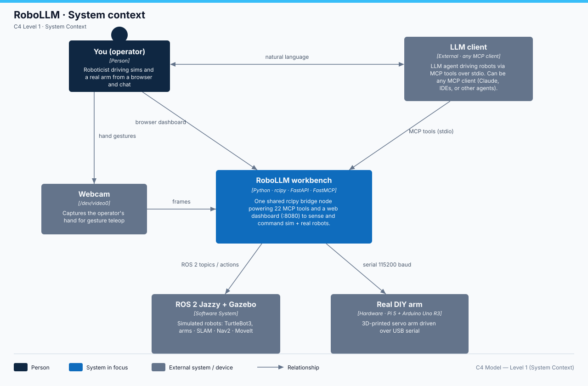

# robot-llm-loop

Your LLM ↔ robotics workbench. Claude (via MCP) can introspect and drive a ROS 2
robot and design CAD/URDF in FreeCAD — **and** you get a browser dashboard to
drive it yourself, a set of runnable examples to learn robot software, and a
webcam 3D scanner that turns real objects into robot parts.



`robot_bridge.py` is the single ROS 2 node; **both** Claude (MCP) and the web
dashboard use it, so you and the LLM drive the exact same robot. The full
picture — C4 context → containers → components diagrams with narrative — is in
[`docs/ARCHITECTURE.md`](docs/ARCHITECTURE.md).

## What's here
| Path | Purpose |
|------|---------|
| `robot_bridge.py` | The shared ROS 2 node (pubs/subs + helpers, deadman teleop). |
| `ros2_mcp_server.py` | MCP server — 22 tools Claude calls. **Edit to add robot skills.** |
| `run-server.sh` | Launches the `ros2` MCP server. |
| `web/` | Browser dashboard: live telemetry, lidar radar, WASD teleop, Nav2 goals. |
| `examples/` | Runnable ROS 2 + PyBullet + MuJoCo learning path. |
| `examples/hand_follow/` | **Webcam hand teleop**: a 6-DOF arm follows your LEFT hand in RViz (MediaPipe → IK, Docker or native). |
| `examples/gen3_pick_place/` | **Gesture pick-and-place** on a Kinova Gen3 lite: fist = grip, open palm = release. |
| `scan3d/` | Webcam → 3D mesh → URDF (CPU visual hull + COLMAP photogrammetry). |
| `hardware/` | **Real DIY arm**: Uno R3 firmware + serial driver + ROS 2 bridge + Pi 5 setup + `check_arduino.sh` health check — technical doc: [`hardware/TECHNICAL.md`](hardware/TECHNICAL.md). |
| `sim/launch_turtlebot.sh` | Starts TurtleBot3 in Gazebo (own terminal). |
| `docs/` | Architecture (C4), live-session playbook, branching — index in `docs/README.md`. |
| `assets/` | Outputs: `urdf/`, `cad/`, `screenshots/`, `scan/` (git-ignored). |
| `setup/dev-setup.sh` | Full machine provisioner. |
| `requirements-extra.txt` | Extra pip deps (numpy pinned to 1.26 for ROS). |

## 1 · Browser dashboard (easy teleop)  🕹️
```bash
web/run-web.sh          # then open http://localhost:8080
```
Hold **WASD** or the on-screen arrows to drive (auto-stops on release via a
deadman watchdog), watch live pose + a lidar radar, list topics, send Nav2 goals.
Runs alongside the sim and the MCP server — all three share the robot.

Technical: [`web/TECHNICAL.md`](web/TECHNICAL.md) — server internals, HTTP/WS endpoint tables, diagram.

## 2 · Talk to Claude (the MCP loop)
Start the sim (`sim/launch_turtlebot.sh`), then just ask:
- "List the ROS 2 topics." · "Where is the robot?" · "Drive forward 3 s, then turn left."
- "What's the nearest obstacle?" · "Navigate to x=1.5, y=0.5." (Nav2 running)

### MCP tools (`ros2_mcp_server.py`)
| Tool | Does |
|------|------|
| `list_topics` / `list_nodes` | Introspect the ROS graph |
| `get_robot_pose` | x / y / yaw / velocity from `/odom` |
| `get_laser_scan` | Nearest obstacle front/left/right/back from `/scan` |
| `drive` / `stop` | Move via `/cmd_vel` (auto-stop, safety cap) |
| `navigate_to` | Nav2 goal to (x, y, yaw) |
| `get_camera_image` | Capture the robot's camera to a JPEG — how Claude *sees* (waffle model) |
| `set_safe_mode` | Toggle obstacle-safe teleop (block forward into close obstacles) |
| `start_recording` / `stop_recording` | Record topics to a rosbag (build learning datasets) |
| `list_bags` / `play_bag` | Browse and replay recorded datasets |
| `get_transform` | TF2 lookup between any two frames (map→base_link→laser…) |
| `get_joint_states` | Every joint's position — the layer under MoveIt/ros2_control |
| `move_arm` | Plan + execute a MoveIt joint-space arm motion |
| `get_map_status` | SLAM/map progress: size, resolution, % explored |
| `spawn_object` / `delete_object` | Put boxes/spheres/cylinders into the Gazebo world ("red box in front of the robot") |
| `reset_world` / `list_world_objects` | Reset or inspect the simulation world |
| `run_ros2` | Run any `ros2` CLI command — the fast learn/introspect tool |

Add a tool = add an `@mcp.tool()` function, then restart Claude Code. (22 tools.)

**▶ Ready for the full demo?** Follow `docs/live-session.md` — a guided ~30 min
session where Claude sees, spawns objects, drives, maps, navigates, and moves an arm.

## 3 · Learn robot software (`examples/`)
A guided path: ROS 2 nodes → pub/sub → open-loop drive → closed-loop obstacle
avoidance → Nav2 goal (actions) → MoveIt arm, plus CPU physics sims (PyBullet,
MuJoCo) and two webcam **hand-teleop** arm examples (below). Launch helpers for
**SLAM** (map building), **Nav2** (navigation), and a **MoveIt Panda** arm live
in `sim/`. See `examples/README.md`.

### Drive an arm with your hand (webcam, CPU-only)
Two containerized examples turn the webcam into a robot controller — no GPU, no
Gazebo, no hardware. Build the shared image once
(`docker build -t ros2-arm:jazzy examples/hand_follow/docker/`), then:
```bash
examples/hand_follow/docker/ros2-arm handfollow preview:=true  # 6-DOF arm follows your LEFT hand in RViz
examples/gen3_pick_place/docker/ros2-arm pickplace synthetic   # Kinova Gen3 lite pick-and-place (fist=grip, palm=release), no camera needed
```
Details, native (non-Docker) routes, and verified numbers:
`examples/hand_follow/README.md` and `examples/gen3_pick_place/README.md`; the
pipeline walkthrough is in [`docs/ARCHITECTURE.md`](docs/ARCHITECTURE.md).

## 4 · Scan a real object with your webcam (`scan3d/`)
```bash
cd scan3d
../.venv/bin/python capture.py --background
../.venv/bin/python capture.py --turntable 36 --session mug
../.venv/bin/python visual_hull.py --session mug --height-mm 95
../.venv/bin/python mesh_to_urdf.py ../assets/scan/mug/mug_hull.obj --name mug
```
CPU-only visual hull runs on the laptop; a COLMAP photogrammetry path (dense step
on your GPU cloud) is included. See `scan3d/README.md`.

Technical: [`scan3d/TECHNICAL.md`](scan3d/TECHNICAL.md) — both reconstruction routes, script internals, diagram.

## 5 · CAD → URDF → sim (`cad/`, verified end-to-end)
A worked **2-link arm** proves the pipeline, and it runs headless:
```bash
freecadcmd cad/build_two_link_arm.py        # FreeCAD builds + exports meshes
.venv/bin/python cad/make_arm_urdf.py       # -> assets/urdf/two_link_arm/*.urdf
.venv/bin/python cad/verify_arm_pybullet.py # PASS: 2 revolute joints, tip moves
```
See `cad/README.md`. Or interactively via the `freecad` MCP: open FreeCAD →
**MCP Addon** workbench → **Start RPC Server**, then ask Claude:
- "In FreeCAD, create a 2-link robot arm and export it as URDF."
- "Make a 100×60×20 mm mounting bracket with four M4 holes."

Technical: [`cad/TECHNICAL.md`](cad/TECHNICAL.md) — headless build, joint-frame discipline, PyBullet verify, diagram.

## Documentation map
| Doc | What |
|-----|------|
| [`docs/ARCHITECTURE.md`](docs/ARCHITECTURE.md) | The C4 tour: context → containers → components diagrams + narrative. |
| [`CHANGELOG.md`](CHANGELOG.md) | What changed, when — grouped by date on `develop`. |
| [`docs/live-session.md`](docs/live-session.md) | Guided ~30 min LLM ↔ robot demo playbook. |
| [`docs/branching.md`](docs/branching.md) | Branch tiers: `main` / `develop` / `experiment/*`. |
| [`docs/README.md`](docs/README.md) | Index of every doc in the repo. |
| `examples/*/README.md` | Per-example run instructions (`examples/README.md` = the learning path). |
| `examples/hand_follow/docs/` · `examples/gen3_pick_place/docs/` | Researched theory (ROS 2 × LLM, teleop, grasping) + runbooks. |

## Setup
Extra Python deps live in the venv (created with `--system-site-packages` so it
sees ROS `rclpy`):
```bash
.venv/bin/python -m pip install -r requirements-extra.txt
```

## Install / distribute the MCP server
| Client | Format | Where |
|--------|--------|-------|
| Claude Code (yours) | user scope (done) + `.mcp.json` (project scope, in repo) | `claude mcp add --scope user ros2 -- ~/Desktop/robot-llm-loop/run-server.sh` |
| Claude Desktop | `.mcpb` bundle (drag-and-drop) | build with `mcpb/build_mcpb.sh` → `mcpb/dist/ros2-bridge.mcpb` |

`.mcpb` is a **Claude Desktop** format; **Claude Code uses `.mcp.json`** (shipped
in this repo — opening the folder registers `ros2` after one approval). Details
and the bundle build in `mcpb/README.md`.

## Version control
This folder is a git repo; `.venv/`, scan sessions, and large binaries are
git-ignored. Normal flow: `git add -A && git commit -m "…" && git push`.
