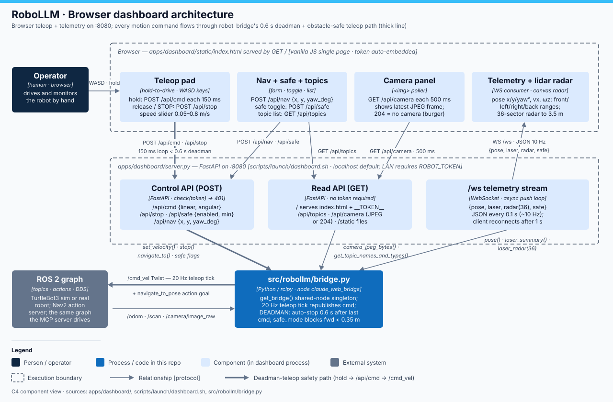

# RoboLLM · Dashboard application technical notes

> **RoboLLM field guide** · Build → Observe → Measure → Learn<br>
> [Home](../../README.md) · [Documentation](../../docs/README.md) · [Architecture](../../docs/ARCHITECTURE.md) · [Diagram](docs/web-architecture.svg)

**Status:** implemented human-control surface over the shared
`src/robollm/bridge.py` node.

This directory is the human operator UI of RoboLLM: a FastAPI app (`server.py`)
serving a single-page dashboard (`static/index.html`) on port 8080. It gives
live telemetry, a 36-sector lidar radar, the camera view, obstacle-safe WASD /
on-screen teleop, the topic list, and one-click Nav2 goals. It creates no ROS
plumbing of its own — it calls `get_bridge("claude_web_bridge")` from
`src/robollm/bridge.py`, the same shared rclpy node code the MCP server uses, so a
human and Claude drive the exact same robot through the same deadman-guarded
teleop path.



## Component walkthrough

- **`server.py`** — the FastAPI app (`RoboLLM dashboard`). Control
  endpoints (`/api/cmd`, `/api/stop`, `/api/nav`, `/api/safe`) run through
  `check(token)`: if `ROBOT_TOKEN` is set, a wrong/missing `?token=` query is a
  401. Read endpoints (`/`, `/api/topics`, `/api/camera`, `/static`, `/ws`)
  take no token. `GET /` injects the token into the page by replacing
  `__TOKEN__` in `index.html`, so a browser that loaded the page from this
  server authenticates automatically.
- **`static/index.html`** — all UI + JS in one file. Teleop is **hold-to-move**:
  pressing a pad button or WASD key POSTs `/api/cmd` immediately and then every
  150 ms; releasing (or the STOP button) POSTs `/api/stop`. The 150 ms repeat
  deliberately stays under the bridge's 0.6 s deadman, so a closed tab, dropped
  Wi-Fi, or stuck key stops the robot within 0.6 s. Speed slider 0.05–0.8 m/s
  (angular = `max(0.4, speed*3)` rad/s). Camera `` polls `/api/camera`
  every 500 ms (204 keeps the placeholder). The `/ws` socket updates pose,
  laser summary, safe-mode state and the radar canvas; it reconnects 1 s after
  a drop, and clicking the safe-mode value toggles it via `/api/safe`.
- **`scripts/launch/dashboard.sh`** — sources `/opt/ros/jazzy/setup.bash` (+ `~/ros2_ws` overlay
  if present), defaults `TURTLEBOT3_MODEL=burger` and `HOST=127.0.0.1`, then
  execs `.venv/bin/python -m uvicorn apps.dashboard.server:app --host $HOST --port 8080`
  from the repo root.
- **`src/robollm/bridge.py`** — publishes `/cmd_vel`; a 20 Hz timer
  republishes the last commanded Twist and enforces the safety rules: DEADMAN
  (no fresh `set_velocity()` within 0.6 s → publish zero Twist) and safe mode
  (forward motion blocked when the nearest front lidar return < 0.35 m,
  defaults `safe_mode=True`). `navigate_to()` sends a `navigate_to_pose`
  action goal (Nav2).

## Key files

| File | Role |
|------|------|
| `server.py` | FastAPI app: HTTP API + `/ws` telemetry push, token check |
| `static/index.html` | single-page UI: teleop, radar canvas, camera, Nav2 form, topics |
| `../../scripts/launch/dashboard.sh` | launcher: ROS env + venv + uvicorn on :8080 |
| `../../src/robollm/bridge.py` | shared rclpy node (`get_bridge()`), deadman + safe-mode teleop |

## HTTP / WebSocket interface

| Endpoint | Method | Token | Body / reply |
|----------|--------|-------|--------------|
| `/` | GET | – | `index.html` with `__TOKEN__` injected |
| `/api/topics` | GET | – | `[{topic, type}]` from the live graph |
| `/api/camera` | GET | – | latest JPEG; **204** if no camera image yet |
| `/api/cmd` | POST | yes | `{linear, angular}` → `bridge.set_velocity()` |
| `/api/stop` | POST | yes | → `bridge.stop()` |
| `/api/nav` | POST | yes | `{x, y, yaw_deg}` → `bridge.navigate_to(…, timeout_s=1.0)` |
| `/api/safe` | POST | yes | `{enabled, min_obstacle_m}` → bridge safe-mode flags |
| `/ws` | WS | – | pushes `{pose, laser, radar(36), safe}` every 0.1 s |

"Token: yes" only applies when `ROBOT_TOKEN` is set (LAN mode); with the
default empty token everything is open (localhost-only bind makes that safe).

## ROS 2 topics (via the shared bridge)

| Name | Type | Direction | Used for |
|------|------|-----------|----------|
| `/cmd_vel` | `geometry_msgs/Twist` | pub (20 Hz tick) | teleop with deadman + obstacle guard |
| `navigate_to_pose` | Nav2 action | client | dashboard Nav2 goal form |
| `/odom` | `nav_msgs/Odometry` | sub | pose/velocity telemetry |
| `/scan` | `sensor_msgs/LaserScan` | sub | front/left/right/back summary + radar |
| `/camera/image_raw` | `sensor_msgs/Image` | sub | JPEG frames (waffle/waffle_pi only) |

## Environment variables

| Var | Default | Meaning |
|-----|---------|---------|
| `HOST` | `127.0.0.1` | bind address; `0.0.0.0` exposes to the LAN |
| `ROBOT_TOKEN` | empty | shared secret; control endpoints then need `?token=` |
| `TURTLEBOT3_MODEL` | `burger` | set `waffle_pi` if you want the camera panel |

## Run + verify

```bash
scripts/launch/dashboard.sh                     # → http://localhost:8080  (Ctrl-C to stop)
HOST=0.0.0.0 ROBOT_TOKEN=secret scripts/launch/dashboard.sh   # LAN mode with auth

curl -s localhost:8080/api/topics | head -c 300   # JSON topic list = server up
curl -s -o /dev/null -w '%{http_code}\n' localhost:8080/api/camera  # 204 without camera
```

With `scripts/launch/simulation/turtlebot.sh` running, the header dot turns green (WS
connected), pose/lidar numbers move, and holding `W` drives the robot —
release and it stops within 0.6 s even if the tab dies.

## Gotchas

- The deadman lives in the **bridge**, not the page: anything that stops the
  150 ms `/api/cmd` refresh (tab close, network drop) halts the robot ≤ 0.6 s.
- Safe mode only blocks **forward** motion (`linear.x > 0`); reversing and
  rotating are never blocked. Toggle it by clicking the safe-mode value.
- Read endpoints (`/api/topics`, `/api/camera`, `/ws`) are unauthenticated by
  design — on a LAN, anyone can watch; only *control* needs the token.
- Camera stays blank on the default `burger` model — launch the sim with
  `TURTLEBOT3_MODEL=waffle_pi` (the bridge subscribes `/camera/image_raw`).
- Editing `src/robollm/bridge.py` while the dashboard runs requires restarting
  uvicorn (and Claude Code for the MCP side) — the node is a singleton.
- The page uses `ws://` + same-origin `location.host`; put it behind TLS and
  the WS URL scheme must change too.
