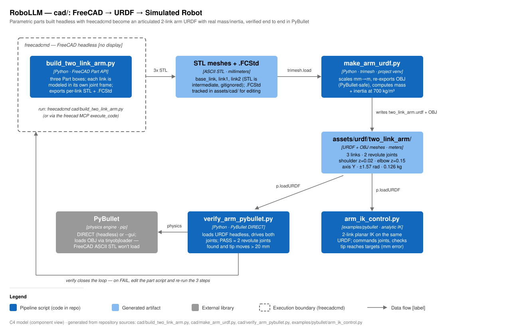

# cad/ — Technical notes: FreeCAD → URDF pipeline

This directory proves the CAD-to-robot pipeline end to end with a 2-link arm:
parametric FreeCAD parts are built **headless** (`freecadcmd`, no display),
exported as per-link meshes, assembled into a URDF with real mass/inertia
computed at 700 kg/m³, and then loaded into PyBullet to confirm the result is
an articulated robot that actually moves. The key discipline that makes it
work: every link is modeled in its **own joint frame** (origin at the joint
attaching it to its parent), so exported meshes and URDF joint origins line up
with no fudging.



## Component walkthrough

- **`build_two_link_arm.py`** — runs *inside* FreeCAD's Python (`freecadcmd`,
  the GUI console, or the `freecad` MCP `execute_code` tool). Builds three
  `Part.makeBox` solids centered in x/y and growing +z from z=0:
  `base_link` 60×60×20 mm, `link1` 20×20×150 mm (origin = shoulder joint),
  `link2` 20×20×120 mm (origin = elbow joint). Exports each as STL to
  `assets/urdf/two_link_arm/meshes/` and saves `assets/cad/two_link_arm.FCStd`.
- **`make_arm_urdf.py`** — runs in the project venv. For each link: loads the
  mm STL with trimesh, scales ×0.001 to meters, re-exports as **OBJ** (PyBullet
  can't parse FreeCAD's ASCII STL), then computes mass, center of mass, and the
  inertia tensor at `DENSITY = 700` kg/m³ (convex hull fallback if the mesh
  isn't watertight). Writes `two_link_arm.urdf`: shoulder joint at z=0.02 m,
  elbow at z=0.15 m, both revolute about Y, limits ±1.57 rad, effort 10,
  velocity 2.0. Total mass 0.126 kg.
- **`verify_arm_pybullet.py`** — closes the loop. Loads the URDF into PyBullet
  (DIRECT, headless; `--gui` to watch), lists joints, commands both revolute
  joints to 0.8 rad, steps 480 frames, and PASSes only if it found exactly
  2 revolute joints **and** the link2 tip moved > 20 mm (≈200 mm in practice).
  Exit code 0/1, so it works as a CI-style gate.

## Key files

| File | Runs with | Does |
|------|-----------|------|
| `build_two_link_arm.py` | `freecadcmd` (or FreeCAD GUI / MCP) | Build 3 link solids, export STL + `.FCStd` |
| `make_arm_urdf.py` | project `.venv` (trimesh) | STL→OBJ in meters, inertia @ 700 kg/m³, write URDF |
| `verify_arm_pybullet.py` | project `.venv` (pybullet) | Load URDF, drive joints, PASS/FAIL on motion |
| `README.md` | — | Narrative version of this pipeline |

## Generated artifacts

| Path | Tracked? | Contents |
|------|----------|----------|
| `assets/urdf/two_link_arm/two_link_arm.urdf` | yes | 3 links, 2 revolute joints, meters |
| `assets/urdf/two_link_arm/meshes/*.obj` | yes | sim-ready meshes (meters) |
| `assets/urdf/two_link_arm/meshes/*.stl` | no (`.gitignore`: `assets/**/*.stl`) | mm intermediates, regenerated by step 1 |
| `assets/cad/two_link_arm.FCStd` | yes | editable FreeCAD document |

Consumers: `verify_arm_pybullet.py` and `examples/pybullet/arm_ik_control.py`
(analytic 2-link IK against the same URDF; its `L1`/`L2`/`SHOULDER_Z`
constants must match the dimensions in `build_two_link_arm.py`).

## Run + verify (from the repo root)

```bash
freecadcmd cad/build_two_link_arm.py         # 1. build + export meshes
.venv/bin/python cad/make_arm_urdf.py        # 2. OBJ + inertia + URDF
.venv/bin/python cad/verify_arm_pybullet.py  # 3. PASS: 2 revolute joints, tip moves
.venv/bin/python cad/verify_arm_pybullet.py --gui   # watch it (needs display)
```

Verified headless with FreeCAD 0.21: URDF loads with 2 working revolute joints
and the end-effector moves when commanded. Downstream check:
`.venv/bin/python examples/pybullet/arm_ik_control.py`.

## Gotchas

- **FreeCAD's ASCII STL breaks PyBullet** ("cannot extract mesh"). Never point
  a URDF at the STLs — `make_arm_urdf.py`'s OBJ re-export exists for this.
- **Units**: FreeCAD works in mm, URDF in meters. The conversion happens once,
  in trimesh (`apply_scale(0.001)`); the URDF then uses `scale="1 1 1"`.
- **Link frames are the contract.** If you move a joint in
  `build_two_link_arm.py`, update the matching `joint_origin_z_m` in
  `make_arm_urdf.py`'s `LINKS` table (and `examples/pybullet/arm_ik_control.py`
  geometry constants) or the arm assembles wrong.
- Steps 2–3 need the project venv (trimesh, pybullet — numpy pinned 1.26.4 per
  repo law); step 1 needs only `freecadcmd`, no venv and no RPC server.
- Non-watertight meshes get convex-hull inertia silently — fine for boxes,
  check it if you add concave links (grippers).
- Extend by editing `build_two_link_arm.py` (sizes, third joint, gripper) and
  re-running the three steps; scanned meshes from `../scan3d` can become links.
