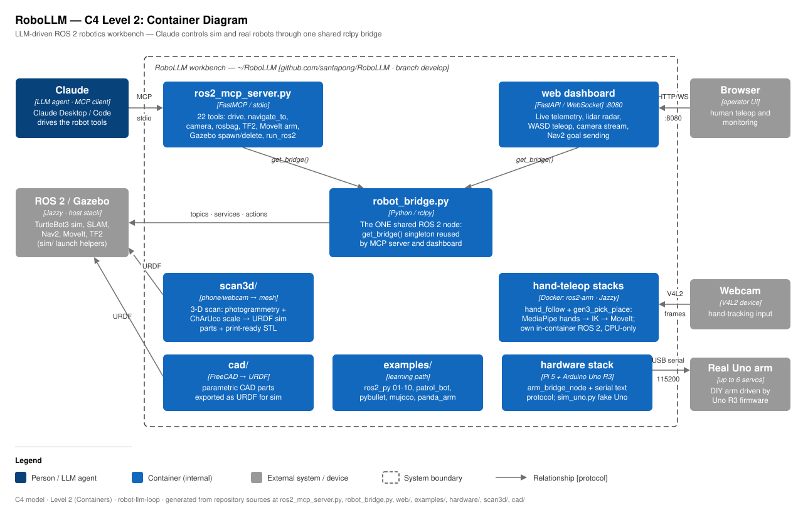
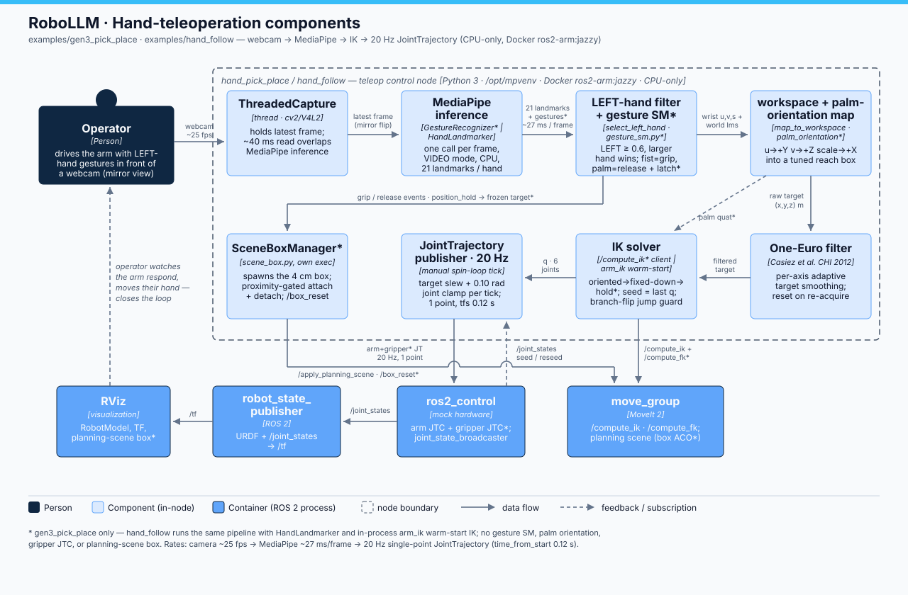

# RoboLLM · C4 architecture tour

> **RoboLLM field guide** · Build → Observe → Measure → Learn 
> [Home](../README.md) · [Documentation](README.md) · [Roadmap](../ROADMAP.md) · [Physical arm](physical-arm/ARCHITECTURE.md)

This doc walks the workbench top-down using the [C4 model](https://c4model.com/):
a small stack of zoom levels where each diagram answers one question —
**Context** (level 1: who uses the system and what it talks to), **Containers**
(level 2: the separately runnable pieces and the protocols between them), and
**Components** (level 3: inside one container). Read the levels in order the
first time; after that, jump straight to the zoom you need. The diagrams are
plain SVGs in `docs/architecture/` — they render on GitHub and in any browser,
no tooling required.

The DIY arm now has its own delivery-focused architecture set: C4 context,
container, and driver-component SVGs plus a 4+1 view model. It distinguishes
implemented foundations from reusable examples and planned phases; see
[`physical-arm/ARCHITECTURE.md`](physical-arm/ARCHITECTURE.md).

## Level 1 — System context: who uses what

Two actors drive everything. The **human operator** uses natural language,
drives from the browser dashboard, and waves a hand at the webcam for teleop.
The **language-model client** — Claude Code/Desktop or any compatible MCP
client — calls the workbench’s tools over stdio. The workbench turns both
kinds of intent into the same robot traffic: ROS 2 topics
and actions into the **ROS 2 Jazzy + Gazebo** stack (TurtleBot3 sim, SLAM,
Nav2, MoveIt), and a 115200-baud text serial protocol to the **real DIY arm**
(Raspberry Pi 5 + Arduino Uno R3). The **webcam** feeds frames in for
hand-gesture teleop and for the `scan3d/` object scanner. The point of the
whole system sits on those two left-hand arrows: the human and the LLM are
peers, driving the exact same robot through the exact same machinery.

## Level 2 — Containers: one bridge, many surfaces

Inside the boundary, every control surface converges on **`robot_bridge.py`**.
`get_bridge()` is a module-level singleton: the first call inits rclpy, builds
the one `Bridge` node, and starts a daemon spin thread; everything after that
reuses it. The MCP server (`ros2_mcp_server.py`, FastMCP over stdio, 22 tools)
and the web dashboard (`web/`, FastAPI + WebSocket on :8080) are both thin
layers over this same module — which is why there is **one** bridge node and
not a node per feature. A robot helper written once (deadman teleop watchdog,
speed caps, Nav2 goal sending, camera capture) is instantly available to both
the LLM and the human, with identical safety behavior; a process never spawns
competing publishers on `/cmd_vel`; and adding a capability means touching one
file, not re-plumbing ROS in every surface. Around that core: `cad/` and
`scan3d/` produce URDF models the sim consumes, and the `hardware/` stack
carries the same bridge idea to the real Uno arm over serial.

The **hand-teleop stacks** (`examples/hand_follow` and
`examples/gen3_pick_place`) are the deliberate exception: they run in their own
Docker container with an in-container ROS 2 Jazzy, not against the host stack
or the shared bridge. Three reasons. First, dependencies the host should not
carry: the Kinova `kortex` packages plus a SHA-pinned fix for the broken
upstream `gen3_lite` macro, and a MediaPipe venv that must coexist with this
repo's `numpy==1.26.4` law — baked into one image instead of negotiated with
the host install. Second, reproducibility: both examples vendor their own
`ros2_ws/` and ship an identical `docker/` launcher + Dockerfile, so the
verified end-to-end environment is exactly what a fresh cloner builds
(`docker build -t ros2-arm:jazzy docker/` — one image serves both examples),
CPU-only. Third, design intent: the 20 Hz hand-tracking control loop is
deliberately classical and deterministic — an LLM belongs in a *supervisory*
role only ("stop following", "half speed" via the `/follow_enable` service and
parameters), never inside the loop, so the stack stays isolated from the
LLM-facing bridge by construction.

## Level 3 — Components: inside the hand-teleop pipeline

Both examples share one pipeline shape; `gen3_pick_place` extends each stage.
A webcam frame is mirrored (`cv2.flip`, so the preview behaves like a mirror)
and handed to **MediaPipe**: `hand_follow` runs HandLandmarker (21 landmarks,
~35 FPS on a desktop CPU), `gen3_pick_place` runs GestureRecognizer — one
inference (~27 ms) returning gesture label, handedness, and landmarks
together. A **LEFT-hand filter** keeps only the mirror-corrected left hand,
reading the gesture at the *same result index* as the tracked hand. A
**One-Euro filter** smooths each axis (the classic jitter-vs-lag trade, tuned
via `min_cutoff`/`beta`), then a **workspace mapping** turns normalized image
landmarks plus a hand-size depth proxy into a clamped target in the arm's
workspace — `gen3_pick_place` also derives gripper orientation from a
palm-rigid frame (wrist + 3 MCP knuckles only; fingertips move during a fist),
degrading gracefully to top-down when the palm angle is shallow. **IK** closes
the loop: `hand_follow` uses warm-start analytic IK (`arm_ik.solve_track`,
median 0.38 ms), `gen3_pick_place` calls MoveIt's `/compute_ik` warm-seeded
from the previous solution (~5.6 ms median). The result streams as a
single-point **JointTrajectory at 20 Hz** into `ros2_control`, and RViz shows
the arm move — glass-to-RViz ≈ 100–150 ms.

The **fist=grip state machine** (`gesture_sm.py` — pure Python, ROS-free, 14
unit tests) has two states, `RELEASED` and `GRIPPING`, with asymmetric
hysteresis. Grip commits after 3 consecutive `Closed_Fist` frames at score
≥ 0.60. Release is stickier and demands *positive* evidence of an open hand:
`Open_Palm` ≥ 0.60 for 4 consecutive frames, or a landmark-openness fallback
for tilted palms the classifier can't label — losing tracking never releases,
so a dropped detection mid-carry holds the object. A transition latch freezes
the position target to its value ~150 ms *before* the fist began forming, so
curling your fingers doesn't yank the arm. On grip within 6 cm of the box, the
gripper closes (a second JointTrajectory controller — the stock
GripperActionController silently ignores topic streams) and the box
**attaches** to the gripper in the MoveIt planning scene, riding along as you
move; gripping too far away simply keeps re-evaluating the gate as you carry
the fist over. On release the box **detaches** and stays where your hand left
it; `/box_reset` respawns it.

## Where to go next

- [`../examples/hand_follow/README.md`](../examples/hand_follow/README.md) —
  run the left-hand-following arm (Docker or native), knobs, verified numbers.
- [`../examples/gen3_pick_place/README.md`](../examples/gen3_pick_place/README.md) —
  run the gesture pick-and-place on the Kinova Gen3 lite.
- Theory docs:
  [`handfollow-inception.md`](../examples/hand_follow/docs/handfollow-inception.md)
  (ROS 2 × LLM landscape + teleop pipeline research) and
  [`pickplace-theory.md`](../examples/gen3_pick_place/docs/pickplace-theory.md)
  (grasp orientation + gesture design rationale); runbooks sit next to each.
- [`../examples/README.md`](../examples/README.md) — the whole learning path,
  from `01_hello_node.py` up.
- [`physical-arm/ARCHITECTURE.md`](physical-arm/ARCHITECTURE.md) — the real
  arm's C4 and 4+1 views, safety boundary, interfaces, and delivery status.
- Technical deep-dives: each example (incl. `examples/wall_weld/`) ships a `TECHNICAL.md` next to its code —
  [`ros2_py`](../examples/ros2_py/TECHNICAL.md),
  [`patrol_bot`](../examples/colcon_pkg/patrol_bot/TECHNICAL.md),
  [`pybullet`](../examples/pybullet/TECHNICAL.md),
  [`mujoco`](../examples/mujoco/TECHNICAL.md),
  [`panda_arm`](../examples/panda_arm/TECHNICAL.md),
  [`hand_follow`](../examples/hand_follow/TECHNICAL.md),
  [`gen3_pick_place`](../examples/gen3_pick_place/TECHNICAL.md) — plus
  [`hardware/TECHNICAL.md`](../hardware/TECHNICAL.md) for the real arm stack,
  [`web/TECHNICAL.md`](../web/TECHNICAL.md) for the dashboard,
  [`scan3d/TECHNICAL.md`](../scan3d/TECHNICAL.md) for the webcam scanner, and
  [`cad/TECHNICAL.md`](../cad/TECHNICAL.md) for the FreeCAD → URDF pipeline;
  internals, topic/param tables, and per-module architecture diagrams.
- [`live-session.md`](live-session.md) — the guided ~30 min LLM ↔ robot demo:
  Claude sees, spawns objects, drives, maps, navigates, and moves an arm.
- [`branching.md`](branching.md) — how `main` / `develop` / `experiment/*` are used.
- [`README.md`](README.md) — index of every doc in the repo.
