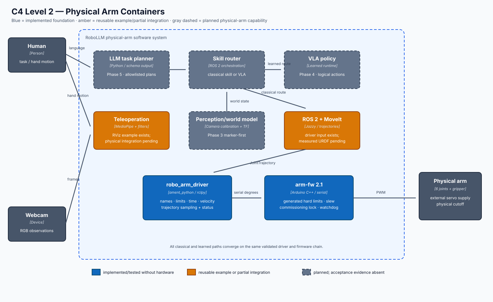
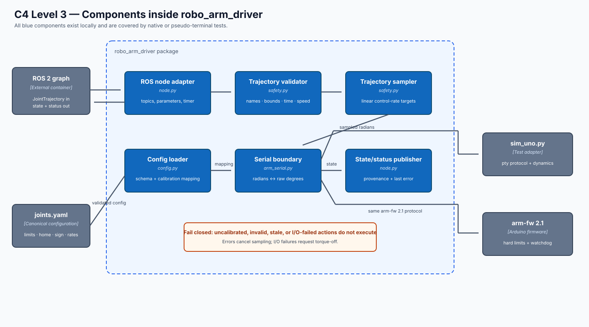
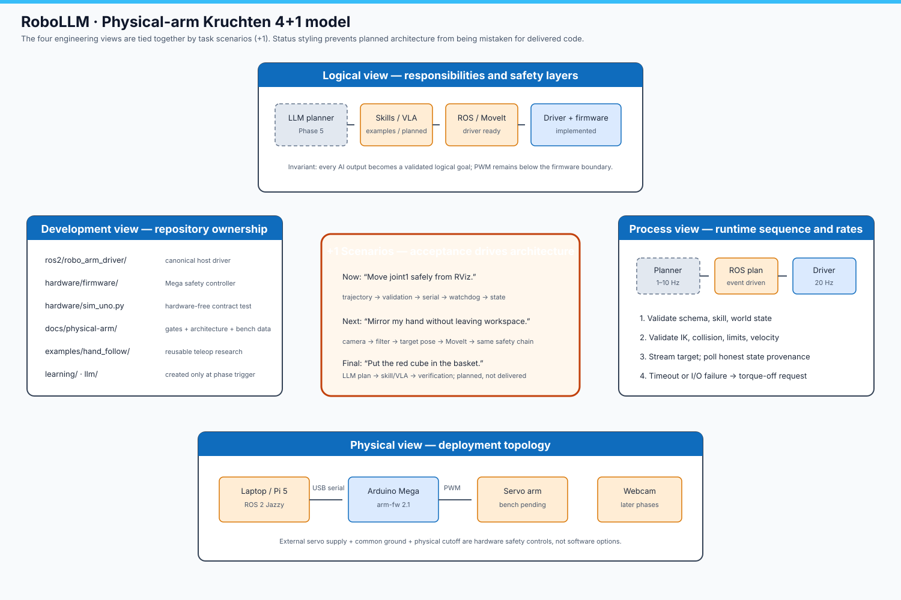

# Physical arm architecture

Status date: **2026-08-12**. This document describes the target architecture
and labels delivery status explicitly. The Phase 0 software foundation and
v0.2 driver core exist; the physical bench, measured model, autonomous
manipulation, learned policy, and language planner are not complete.

## Non-negotiable control boundary

```text
LLM / VLA / teleoperation
          ↓ logical goal or trajectory
ROS 2 task and motion layers
          ↓ JointTrajectory (radians)
robo_arm_driver validation
          ↓ calibrated servo targets (degrees)
Arduino hard limits + watchdog
          ↓ PWM
6-DOF arm
```

An LLM, VLM, or learned policy never sends PWM or raw servo coordinates. The
only raw-degree boundary is the serial driver. Before calibration, the only
motion path is a firmware-constrained, single-joint commissioning command.

## C4 model

### Level 1 — system context


The operator, camera, language-model runtime, and physical device system are
outside the RoboLLM software boundary. Structured plans and observations enter;
only validated robot actions leave.

### Level 2 — containers



The diagram uses status as an architectural property:

- Blue containers are implemented and hardware-free tested.
- Amber containers have reusable examples or partial integration, but have not
  passed the physical-arm acceptance gate.
- Gray dashed containers are planned future physical-arm capabilities.

This distinction is important because the repository already contains strong
simulation examples for hand following, MoveIt, gesture state machines, and
pick-and-place. Those examples are evidence and reusable code, not proof that
the DIY arm phase is complete.

### Level 3 — driver components



`robo_arm_driver` is the canonical physical-arm host boundary. The old
`hardware/arm_serial.py` and `hardware/arm_bridge_node.py` paths are thin
compatibility entry points, not duplicate implementations.

## 4+1 architectural views (Kruchten model)



This is the Kruchten 4+1 view model (sometimes informally misheard as a
“churn” diagram). The +1 scenarios are the acceptance tests that connect the
four engineering views. For example, “move joint1 safely from RViz” crosses repository
ownership, runtime timing, logical validation, and the real deployment path.
A diagram box is not considered delivered until its scenario has recorded
evidence in the roadmap.

## v0.2 runtime interfaces

| Name | Type | Direction | Contract |
|---|---|---|---|
| `/arm_controller/joint_trajectory` | `trajectory_msgs/JointTrajectory` | input | all six named joints, radians, increasing timestamps |
| `/joint_states` | `sensor_msgs/JointState` | output | logical radians; commanded estimate until encoders exist |
| `/arm/status` | `std_msgs/String` JSON | output | calibration lock, state source, activity, last error |
| USB serial | arm-fw 2.1 text | host ↔ Uno | raw degrees, strict limits, request/reply |

`/arm/status` is intentionally lightweight for v0.2. A typed status message and
`FollowJointTrajectory` action belong in the v0.3 controller integration after
real timing and MoveIt behavior are measured.

## Configuration ownership

`ros2/robo_arm_driver/config/joints.yaml` is the canonical physical-arm record.
`hardware/generate_firmware_config.py` generates the Uno header from it. CI
rejects drift between the host and firmware copies of limits, home values,
rates, pins, and timeout.

The checked-in physical profile is fail-closed (`calibrated: false`) and uses a
narrow 85–95° commissioning window. The separate `joints.sim.yaml` profile is
the only generic 0–180° configuration.

## Architectural decisions

| Decision | Reason |
|---|---|
| Plain serial instead of micro-ROS on Uno R3 | The Uno has 2 KB RAM; a small inspectable protocol is more reliable. |
| Radians above the driver, degrees below it | One conversion boundary prevents unit drift and AI access to servo coordinates. |
| Reject instead of clamp | A bad plan must be visible; silent clamping hides unsafe upstream behavior. |
| Marker-first perception | ArUco/AprilTag and calibrated TF teach the geometry before detector uncertainty is added. |
| Classical and learned skills share safety | MoveIt and VLA outputs must cross the same joint, workspace, collision, and timeout gates. |
| Honest state provenance | Until encoders exist, state is labeled `commanded`; datasets must not claim measured feedback. |

Delivery status and acceptance evidence live in [ROADMAP.md](ROADMAP.md).
