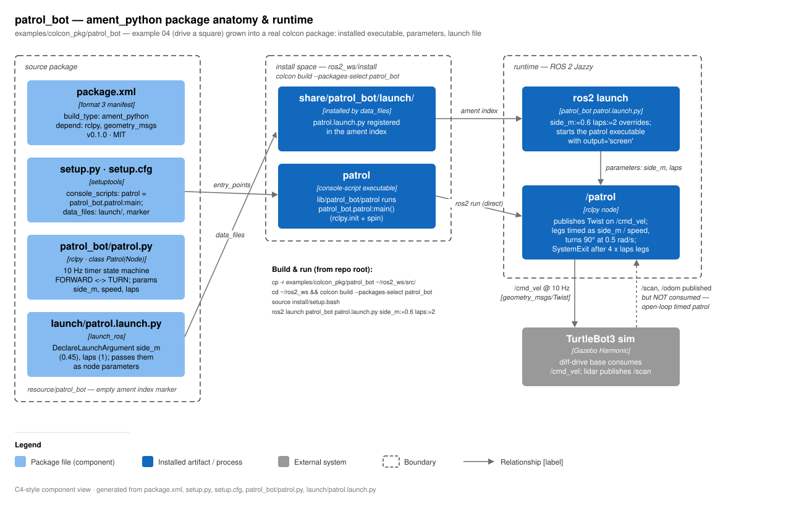

# RoboLLM · patrol_bot technical notes

> **RoboLLM field guide** · Build → Observe → Measure → Learn<br>
> [Home](../../../README.md) · [Examples](../../README.md) · [Documentation](../../../docs/README.md) · [Diagram](docs/patrol_bot-architecture.svg)

`patrol_bot` is the repo's first **real ROS 2 package**: example 04 (drive a
square) grown up into a proper `ament_python` colcon package. Instead of a
standalone script you get an installed executable (`ros2 run patrol_bot
patrol`), ROS parameters (`side_m`, `speed`, `laps`), and a launch file that
declares launch arguments and forwards them as node parameters. The node
drives a square patrol open-loop: a 10 Hz timer runs a `FORWARD <-> TURN`
state machine that publishes `geometry_msgs/Twist` on `/cmd_vel`, timing each
leg from the requested side length and speed, then exits cleanly when the
requested number of laps is done.



## Component walkthrough

- **`package.xml`** — format-3 manifest; `build_type: ament_python`, runtime
  deps `rclpy` + `geometry_msgs`, lint `test_depend`s (copyright/flake8/pep257).
- **`setup.py`** — the wiring that makes it a package:
  `entry_points.console_scripts` maps `patrol = patrol_bot.patrol:main`
  (that is what `ros2 run patrol_bot patrol` executes), and `data_files`
  installs `package.xml` + `launch/*.launch.py` into `share/patrol_bot/`
  and the ament marker into `share/ament_index/resource_index/packages/`.
- **`setup.cfg`** — points `install_scripts` at `$base/lib/patrol_bot`, where
  `ros2 run` looks for executables (not `bin/`).
- **`resource/patrol_bot`** — empty marker file registering the package in the
  ament resource index.
- **`patrol_bot/patrol.py`** — `class Patrol(Node)`, node name `patrol`.
  Declares the three parameters, computes `forward_s = side_m / speed` and
  `turn_s = (pi/2) / 0.5` (90° at a fixed 0.5 rad/s), then a
  `create_timer(0.1, self.tick)` control loop flips between states by clock
  time. When `4 * laps` legs are used up it publishes a zero Twist and raises
  `SystemExit(0)` to leave `rclpy.spin()`. `main()` also republishes a zero
  Twist in its `finally` block so the robot stops on Ctrl-C.
- **`launch/patrol.launch.py`** — `DeclareLaunchArgument` for `side_m`
  (default `0.45`) and `laps` (default `1`), passed via
  `Node(package="patrol_bot", executable="patrol", parameters=[...])` with
  `output="screen"`.

## Package structure

| Path | Role |
|---|---|
| `package.xml` | ament manifest — deps, `build_type: ament_python` |
| `setup.py` | entry point `patrol = patrol_bot.patrol:main`; installs launch + marker |
| `setup.cfg` | scripts go to `lib/patrol_bot` so `ros2 run` finds them |
| `resource/patrol_bot` | empty ament resource-index marker |
| `patrol_bot/__init__.py` | Python package init |
| `patrol_bot/patrol.py` | the `Patrol` node (timer state machine) |
| `launch/patrol.launch.py` | launch file with `side_m` / `laps` arguments |

## Parameters, launch args, topics

| Parameter | Default | Meaning |
|---|---|---|
| `side_m` | `0.45` | square side length (m) |
| `speed` | `0.15` | forward velocity (m/s) |
| `laps` | `1` | how many squares to drive |

Turn rate is **hard-coded** at 0.5 rad/s (not a parameter). Parameters are
read once in `__init__` — changing them at runtime has no effect.

| Launch argument | Default | Note |
|---|---|---|
| `side_m` | `0.45` | forwarded as node parameter |
| `laps` | `1` | forwarded as node parameter |

`speed` is **not** exposed by the launch file; set it with
`ros2 run patrol_bot patrol --ros-args -p speed:=0.2`.

| Topic | Dir | Type | Rate |
|---|---|---|---|
| `/cmd_vel` | publish | `geometry_msgs/Twist` | 10 Hz |

No subscriptions, services, or actions. The robot's `/scan` (and `/odom`)
exist in the sim but are deliberately **not consumed** — the patrol is pure
timed dead-reckoning.

## Build, run, verify

```bash
# build into a colcon workspace (repo root = this repository)
mkdir -p ~/ros2_ws/src
cp -r examples/colcon_pkg/patrol_bot ~/ros2_ws/src/
cd ~/ros2_ws && colcon build --packages-select patrol_bot
source install/setup.bash

# with the TurtleBot3 sim up (sim/launch_turtlebot.sh):
ros2 launch patrol_bot patrol.launch.py side_m:=0.6 laps:=2
# or directly, with any parameter:
ros2 run patrol_bot patrol --ros-args -p side_m:=0.6 -p speed:=0.2
```

Verify: `ros2 topic echo /cmd_vel` shows `linear.x: 0.15` bursts alternating
with `angular.z: 0.5`; the node logs `patrolling: N lap(s), side X m` on
start and `patrol complete` before exiting 0. (Verified: builds with colcon,
`ros2 run patrol_bot patrol` completes a lap — see `examples/README.md`.)

## Gotchas

- **Open-loop**: legs are timed on the ROS clock, no odometry/lidar feedback,
  so squares drift with wheel slip. That is the point — it motivates
  closed-loop examples later.
- ROS `setup.bash` is bash-only; on zsh run
  `bash -c 'source install/setup.bash && ros2 launch ...'`.
- Stopping is two-layered: zero Twist + `SystemExit(0)` from the timer
  callback on completion, plus a zero Twist in `main()`'s `finally` for
  Ctrl-C — otherwise the robot keeps its last velocity.
- After editing the node you must `colcon build` again (no `--symlink-install`
  is used in the documented flow).
