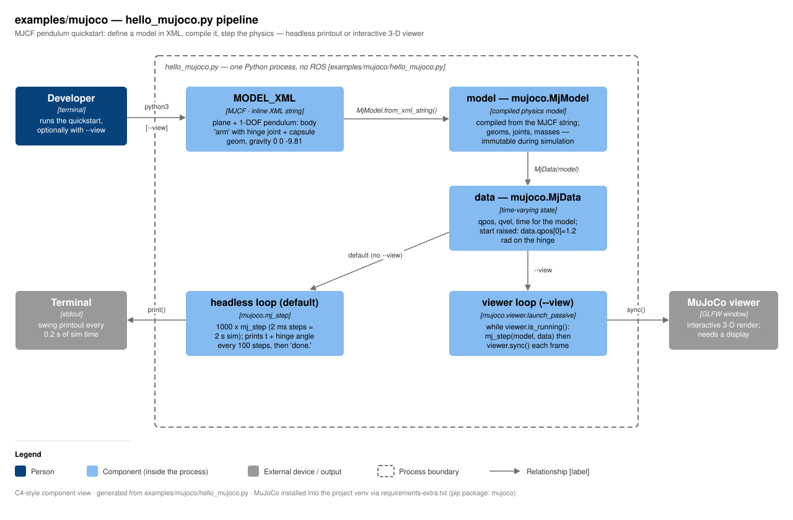

# mujoco — technical notes

`examples/mujoco/` is a single-file MuJoCo quickstart: `hello_mujoco.py` defines
a one-hinge pendulum directly in MJCF (MuJoCo's XML format, as an inline Python
string), compiles it with `MjModel.from_xml_string`, and steps the physics. By
default it runs headless and prints the hinge angle over 2 s of simulated time;
with `--view` it opens MuJoCo's interactive 3-D viewer instead. It is the
CPU-only, learn-the-API companion to the repo's cloud story — the same engine
scales to thousands of GPU-parallel environments via MuJoCo MJX for RL. No ROS
anywhere in this example: it is pure `import mujoco`.



## Component walkthrough

- **`MODEL_XML` (MJCF string).** A ground plane, a light, and a body `arm` at
  height 1 m with a `hinge` joint (axis `0 1 0`) and a 0.5 m capsule geom;
  gravity `0 0 -9.81`. MJCF is MuJoCo's native format (not URDF) — this is the
  smallest useful example of it.
- **`model = mujoco.MjModel.from_xml_string(MODEL_XML)`.** Parses and compiles
  the MJCF into the immutable model description (geoms, joints, masses,
  timestep — the default MJCF timestep is 2 ms).
- **`data = mujoco.MjData(model)`.** The time-varying state (`qpos`, `qvel`,
  `time`). The script sets `data.qpos[0] = 1.2` so the pendulum starts raised
  1.2 rad and has something to do. The model/data split is *the* core MuJoCo
  API idea — one compiled model can drive many independent data instances
  (that is exactly what MJX parallelizes on GPU).
- **Headless loop (default).** `mujoco.mj_step(model, data)` 1000 times
  (= 2.0 s of sim time at 2 ms/step), printing `t` and the hinge angle every
  100 steps, then `done.`.
- **Viewer loop (`--view`).** `mujoco.viewer.launch_passive(model, data)` opens
  a GLFW window; the script owns the physics loop (`mj_step` + `viewer.sync()`
  per frame) while the viewer handles camera/mouse. Needs a display.

## Key files

| File | Role |
|---|---|
| `hello_mujoco.py` | The whole example: MJCF model, compile, headless loop, `--view` viewer loop |
| `../../requirements-extra.txt` | Supplies the `mujoco` pip package (installed into the project venv) |

## Interfaces

No ROS topics, services, or parameters — this is a standalone Python script.

| CLI flag | Effect |
|---|---|
| *(none)* | Headless: 1000 steps, prints angle every 100 steps, exits |
| `--view` | Interactive 3-D viewer via `mujoco.viewer.launch_passive` (display required) |

## Run + verify

```bash
# one-time: mujoco comes from requirements-extra.txt (numpy stays pinned)
.venv/bin/python -m pip install -c constraints.txt -r requirements-extra.txt

.venv/bin/python examples/mujoco/hello_mujoco.py            # prints the swing
.venv/bin/python examples/mujoco/hello_mujoco.py --view     # 3D viewer window
```

Expected headless output (verified with mujoco 3.10.0) — the angle starts at
+1.200 rad and swings back and forth under gravity:

```
t= 0.00s  hinge angle=+1.200 rad
t= 0.20s  hinge angle=+0.690 rad
t= 0.40s  hinge angle=-0.436 rad
...
t= 1.80s  hinge angle=-0.865 rad
done.
```

Exit code 0 and `done.` on the last line = pass. Headless mode needs no
display, no GPU, and no ROS environment, so it doubles as a smoke test that
the `mujoco` wheel is healthy in the venv.

## Gotchas

- **Install with the constraint file.** `mujoco` must not drag numpy to 2.x —
  always `pip install -c constraints.txt` (ROS Jazzy ABI law; see repo
  `CLAUDE.md`).
- **`--view` needs a display** (GLFW). Over SSH/headless it will fail to open a
  window — use the default headless mode there.
- **MJCF ≠ URDF.** MuJoCo's native format is MJCF; the URDFs produced by
  `cad/` and `scan3d/` target Gazebo/PyBullet. (MuJoCo can compile URDF too,
  but this example deliberately teaches MJCF.)
- The `t= 0.00s` first line is printed *after* the first step (t = 0.002 s,
  rounded) — the loop steps first, then prints on `step % 100 == 0`.
- `launch_passive` means the *script* drives time: forget `mj_step` in the
  loop and the viewer shows a frozen scene; forget `viewer.sync()` and nothing
  updates on screen.
- Heavy RL / massively parallel sim belongs on cloud GPU via MuJoCo MJX — this
  laptop (no NVIDIA GPU) is for exactly this kind of small CPU run.
