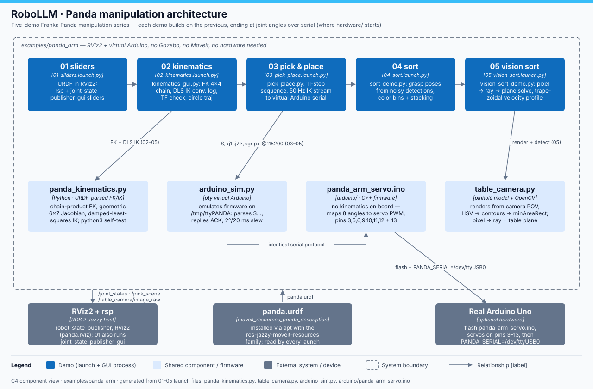

# panda_arm — technical notes

`examples/panda_arm/` is a five-demo progression on the Franka Panda (URDF from
`moveit_resources_panda_description`) that builds the full manipulation pipeline
one layer at a time: joint sliders in RViz2 → FK/IK with the math visible →
pick & place streamed over serial to a **virtual Arduino** on a pty → grasp
poses computed from detections → a camera that genuinely **solves positions
from pixels** with real OpenCV, driven by trapezoidal velocity trajectories.
Everything is RViz2-based (no Gazebo, no MoveIt, no hardware): each demo is a
PyQt5 GUI that publishes `/joint_states` itself and does its own kinematics via
`panda_kinematics.py`. Demos 03–05 end where `../../hardware` starts — target
joint angles over 115200-baud serial to a microcontroller.



## The demos (each builds on the previous)

| # | Launch file | Main script(s) | What it adds | Run |
|---|---|---|---|---|
| 01 | `01_sliders.launch.py` | *(stock nodes only)* | URDF in RViz2: `robot_state_publisher` + `joint_state_publisher_gui` sliders, `panda.rviz` config | `ros2 launch examples/panda_arm/01_sliders.launch.py` |
| 02 | `02_kinematics.launch.py` | `kinematics_gui.py` | FK/IK with the math visible: 4×4 transform chain, geometric Jacobian, DLS IK with per-iteration convergence log, live FK-vs-TF cross-check, 48-waypoint circle trajectory | `ros2 launch examples/panda_arm/02_kinematics.launch.py` |
| 03 | `03_pick_place.launch.py` | `pick_place.py` + `arduino_sim.py` | 11-step pick & place; rad→servo-deg conversion streamed at 50 Hz to the virtual Arduino; serial-monitor GUI shows exact TX/RX bytes | `ros2 launch examples/panda_arm/03_pick_place.launch.py` |
| 04 | `04_sort.launch.py` | `sort_demo.py` + `arduino_sim.py` | Grasp poses computed from detections (truth + ±2 mm / ±1° noise): 3 random cubes, yaw-aligned top-down grasps, color bins, stack-height drop poses | `ros2 launch examples/panda_arm/04_sort.launch.py` |
| 05 | `05_vision_sort.launch.py` | `vision_sort_demo.py` + `table_camera.py` + `arduino_sim.py` | The camera solves positions: synthetic pinhole render → real OpenCV (HSV → contours → `minAreaRect`) → back-project centroid ray onto the table plane; trapezoidal velocity profile | `ros2 launch examples/panda_arm/05_vision_sort.launch.py` |

## Component walkthrough

- **`panda_kinematics.py`** — FK/IK library parsed from the URDF string
  (`base_link='panda_link0'` → `tip_link='panda_hand'`, 7 revolute joints).
  Chain-product FK, geometric 6×7 Jacobian, damped-least-squares IK
  (`dq = Jᵀ(JJᵀ+λ²I)⁻¹e`, λ=0.08, step clipped to ±0.5 rad, joint limits
  clamped) returning a per-iteration log the GUIs display.
- **`arduino_sim.py`** — virtual Arduino: opens a pty pair, symlinks the
  PC-facing end to `/tmp/ttyPANDA`, prints `READY,panda_arm_servo,v1`, parses
  `S,<j1°>,…,<j7°>,<grip°>\n`, replies `ACK,<seq>,<millis>\n`, and slews
  "servos" at 2°/20 ms exactly like the firmware `loop()`.
- **`arduino/panda_arm_servo.ino`** — the matching real firmware (7 servos on
  pins 3,5,6,9,10,11,12 + gripper on 13). The board never does kinematics; the
  PC sends servo degrees `servo_deg = (q−lower)/(upper−lower)×180`, grip
  0=open…60=closed.
- **`table_camera.py`** — pinhole model (640×480, fx=fy=600, cx=320, cy=240;
  camera at (0.46, 0.18, 0.90) looking straight down) that both renders the
  scene and detects in it, so detection solves a genuinely unknown problem:
  pixel → ray `d=[(u−cx)/fx,(v−cy)/fy,1]` → rotate into robot frame →
  intersect plane `z = CUBE_SIZE`. Yaw from `minAreaRect`, folded mod 90°.
- **GUIs (`pick_place.py`, `sort_demo.py`, `vision_sort_demo.py`)** — 50 Hz
  QTimer tick: advance the step sequence, straight-line Cartesian interpolation
  with IK per tick (05 adds `v = min(V_MAX, √(2·A_MAX·d))`, V_MAX=0.25 m/s,
  A_MAX=0.6 m/s²), publish `/joint_states` + scene markers, transmit serial.

## Key files

| File | Role |
|---|---|
| `0{1..5}_*.launch.py` | One launch per demo; all load `panda.urdf` + `panda.rviz` |
| `panda_kinematics.py` | FK / Jacobian / DLS-IK library (self-testing) |
| `kinematics_gui.py` | Demo 02 GUI (node `panda_kinematics_gui`) |
| `pick_place.py` | Demo 03 GUI (node `panda_pick_place`); defines `SerialLink` |
| `sort_demo.py` | Demo 04 GUI (node `panda_sort_demo`); `spawn_cubes`, bins, shared by 05 |
| `vision_sort_demo.py` | Demo 05 GUI; imports scene/serial from `sort_demo`, camera from `table_camera` |
| `table_camera.py` | Pinhole camera + OpenCV detection (self-testing) |
| `arduino_sim.py` | Virtual Arduino on `/tmp/ttyPANDA` |
| `arduino/panda_arm_servo.ino` | Real firmware, identical protocol |
| `panda.rviz` | RViz2 config shared by all demos |

## Interfaces

| Topic | Type | Direction | Demos |
|---|---|---|---|
| `/joint_states` | `sensor_msgs/JointState` | GUI → `robot_state_publisher` | 01 (via `joint_state_publisher_gui`), 02–05 |
| `/pick_scene` | `visualization_msgs/MarkerArray` | GUI → RViz2 (table, cubes, bins, cube attaches to `panda_hand` when grasped) | 03–05 |
| `/table_camera/image_raw` | `sensor_msgs/Image` (bgr8, 640×480) | vision GUI → anyone | 05 |

| Setting | Default | Meaning |
|---|---|---|
| `PANDA_SERIAL` env var | `/tmp/ttyPANDA` | Serial port; set `/dev/ttyUSB0` for a real board |
| Serial protocol | 115200 baud | TX `S,<j1°>,…,<j7°>,<grip°>\n` → RX `ACK,<seq>,<millis>\n` |

## Run + verify

```bash
source /opt/ros/jazzy/setup.bash          # bash, not zsh
ros2 launch examples/panda_arm/05_vision_sort.launch.py   # the full pipeline
# or any of 01_sliders / 02_kinematics / 03_pick_place / 04_sort

# Headless self-tests (still need the ROS env for the URDF / rclpy imports):
python3 examples/panda_arm/panda_kinematics.py   # FK→IK round-trip, prints CONVERGED stats
cd examples/panda_arm && python3 table_camera.py # render→detect vs truth, "SELF-TEST PASSED"
```

Verify 03–05: the arduino-sim terminal logs `servos(deg): …` once a second and
the GUI serial monitor shows `TX S,…` / `RX ACK,…` pairs; in RViz2 the cube
rides the gripper between GRASP and RELEASE.

## Gotchas

- **02 publishes `/joint_states` itself** — its launch deliberately omits
  `joint_state_publisher`; running one alongside makes the arm fight itself.
- 03–05 use a 2 s `TimerAction` so `/tmp/ttyPANDA` exists before the GUI opens
  it. If the port is missing the demo still runs — the GUI header shows the
  serial error instead of `connected:`.
- `table_camera.py`'s self-test does `sys.path.insert(0, '.')` and imports
  `sort_demo` — run it **from inside** `examples/panda_arm/`.
- A cube's yaw is only defined modulo 90° (square symmetry) — detection and
  self-test both compare yaw mod 90°.
- With a real Uno, opening the port DTR-resets the board; the first ~2 s of
  commands land in the bootloader. The demos stream at 50 Hz so it recovers,
  but don't judge the first ACKs.
- Needs `moveit_resources_panda_description` (apt `ros-jazzy-moveit-resources`
  family), PyQt5, pyserial, OpenCV, and the repo-wide numpy 1.26.4 pin.
- GUIs need a display; only the two self-tests are headless-friendly.
