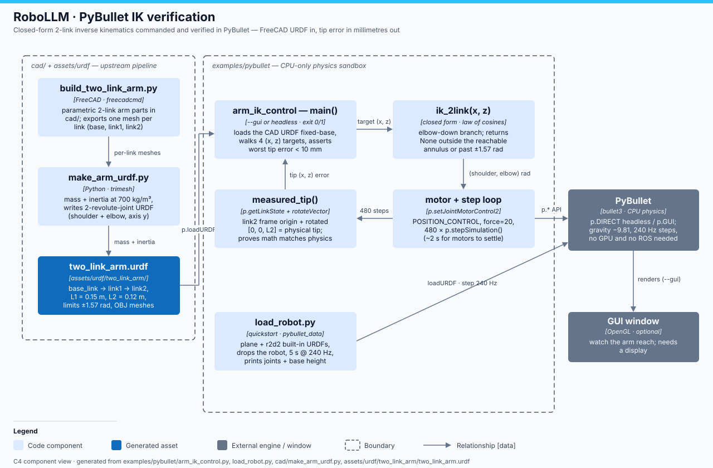

# RoboLLM · PyBullet technical notes

> **RoboLLM field guide** · Build → Observe → Measure → Learn<br>
> [Home](../../README.md) · [Examples](../README.md) · [CAD pipeline](../../cad/README.md) · [Diagram](docs/pybullet-architecture.svg)

`examples/pybullet/` is the repo's CPU-only physics sandbox: two standalone
scripts, no ROS, no GPU. `load_robot.py` is the engine quickstart — load the
built-in R2D2 URDF onto a plane, drop it, step physics at 240 Hz. The main
event is `arm_ik_control.py`: closed-form 2-link inverse kinematics on the arm
you built in FreeCAD (`../../cad`). It computes joint angles analytically (law
of cosines), commands them with PyBullet position motors, then measures the
*real* tip position from the physics engine and asserts math and simulation
agree to better than 10 mm. It is a self-test: prints `PASS`/`FAIL`, exits 0/1.



## Component walkthrough

- **`load_robot.py`** — `p.connect(GUI|DIRECT)`, `pybullet_data` search path,
  `plane.urdf` + `r2d2.urdf` at z = 1 m, prints every joint from
  `p.getJointInfo`, then 5 s of `stepSimulation` (240 Hz) printing base height
  once per second. GUI is the *default*; `--headless` uses `p.DIRECT`.
- **`arm_ik_control.py` — `ik_2link(x, z)`** — analytic IK for the 2-link
  planar arm: target shifted to the shoulder frame, `cos(elbow) =
  (r² − L1² − L2²)/(2·L1·L2)`, elbow-down branch, shoulder from `atan2`.
  Returns `None` when the target is outside the reachable annulus
  `|L1−L2| ≤ r ≤ L1+L2` or beyond the ±1.57 rad URDF joint limits.
- **`fk_2link(shoulder, elbow)`** — the forward check: where the math says the
  tip is (used to derive the formulas; the test uses the physics engine).
- **motor + step loop** — for each of 4 targets, both joints get
  `p.setJointMotorControl2(…, POSITION_CONTROL, targetPosition=q, force=20)`
  and 480 `stepSimulation()` calls (~2 s) let the motors settle.
- **`measured_tip(arm)`** — the URDF has no explicit tip link, so the tip is
  reconstructed from physics: `p.getLinkState(arm, 1)[4:6]` gives the link2
  URDF frame in world, plus `p.rotateVector(orn, [0, 0, L2])`. The per-target
  error (mm) is printed; worst error < 0.01 m ⇒ `PASS`.
- **Unreachable handling** — a far target `(0.5, 0.5)` must return `None`
  (asserted), and any unreachable entry in the target list prints
  `unreachable (correctly rejected)` instead of crashing.

## Key files

| File | Role |
|---|---|
| `load_robot.py` | PyBullet quickstart: URDF loading, gravity, stepping, joint introspection |
| `arm_ik_control.py` | Analytic 2-link IK + physics-verified reaching, self-test (exit 0/1) |
| `../../cad/build_two_link_arm.py` | FreeCAD (via `freecadcmd`) parametric arm parts, per-link meshes |
| `../../cad/make_arm_urdf.py` | Meshes → mass/inertia (trimesh) → `two_link_arm.urdf` |
| `../../cad/verify_arm_pybullet.py` | Sibling check: URDF loads and articulates at all |
| `../../assets/urdf/two_link_arm/two_link_arm.urdf` | The generated arm: `base_link → shoulder → link1 → elbow → link2` |

## Geometry constants (must match the CAD)

| Constant | Value | Meaning |
|---|---|---|
| `SHOULDER_Z` | 0.02 m | shoulder joint height (top of base plate) |
| `L1` | 0.15 m | shoulder → elbow |
| `L2` | 0.12 m | elbow → tip |
| joint limits | ±1.57 rad | both `shoulder` and `elbow` (revolute, axis y) |
| motor force | 20 N·m | `setJointMotorControl2` effort cap |
| settle time | 480 steps | ~2 s at the default 240 Hz |
| pass bar | < 10 mm | worst tip error across all reachable targets |

## Run + verify

```bash
# quickstart (GUI window by default; --headless just prints)
.venv/bin/python examples/pybullet/load_robot.py
.venv/bin/python examples/pybullet/load_robot.py --headless

# IK self-test (headless by default; --gui to watch it reach)
.venv/bin/python examples/pybullet/arm_ik_control.py
.venv/bin/python examples/pybullet/arm_ik_control.py --gui
```

Expected: a table of `target | IK angles | reached | err` rows for the 4
targets, then `worst error X.X mm — PASS: analytic IK matches the simulated
arm` and exit code 0.

If the URDF is missing, generate it first:

```bash
freecadcmd cad/build_two_link_arm.py && .venv/bin/python cad/make_arm_urdf.py
```

## Gotchas

- The URDF is **generated, not committed by hand** — run the two `cad/`
  commands above before the IK script if `assets/urdf/two_link_arm/` is empty.
- `SHOULDER_Z`, `L1`, `L2` are duplicated from `cad/build_two_link_arm.py`; if
  you change the CAD geometry, update the constants or the IK will "fail"
  against a correct simulation.
- The two scripts have **opposite display defaults**: `load_robot.py` opens a
  GUI unless `--headless`; `arm_ik_control.py` is headless unless `--gui`.
- IK returns only the **elbow-down** branch — the mirrored elbow-up solution
  is deliberately not searched, and solutions past ±1.57 rad are rejected
  because the URDF joints stop there.
- The tip must be *reconstructed* (`getLinkState` frame + rotated `[0,0,L2]`);
  `getLinkState` alone gives the link2 frame origin at the elbow, not the tip.
- Position motors are not instant: skipping the 480-step settle loop reads the
  arm mid-swing and inflates the error.
- Use the repo venv (`pip install -c constraints.txt`) — numpy must stay
  1.26.4 on this machine (ROS Jazzy ABI), and `pybullet` is installed there,
  not system-wide.
