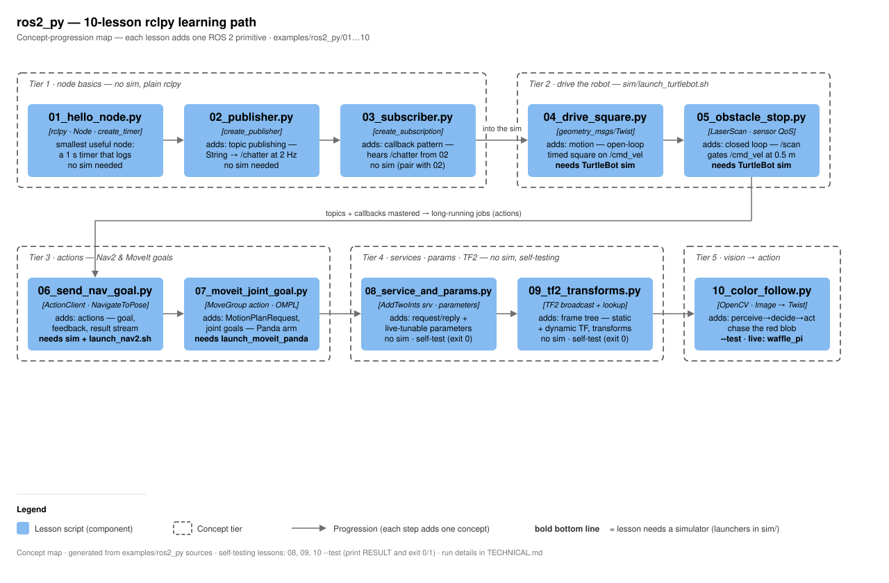

# RoboLLM · ROS 2 Python lessons

> **RoboLLM field guide** · Build → Observe → Measure → Learn<br>
> [Home](../../README.md) · [Examples](../README.md) · [Documentation](../../docs/README.md) · [Diagram](docs/ros2_py-architecture.svg)

`examples/ros2_py/` is the repo's 10-lesson rclpy learning path: ten standalone,
runnable Python scripts that each add exactly one ROS 2 concept, in order — node +
timer, publisher, subscriber, `/cmd_vel` motion, closed-loop `/scan` control, the
action-client pattern (Nav2, then MoveIt), services + parameters, TF2, and finally
a vision→action loop (camera pixels to `Twist`). Lessons 01–03, 08 and 09 need no
simulator at all; 04–07 and live 10 drive the TurtleBot3 / Panda sims launched by
the scripts in `sim/`. Lessons 08, 09 and 10 (`--test`) are self-testing: they
print `RESULT: PASS/FAIL` and exit 0/1, so they double as CPU-only smoke tests.



## Concept walkthrough

- **Tier 1 — node basics (01–03), no sim.** `01_hello_node.py` is the smallest
  useful node: `rclpy.init` → `Node` subclass → `create_timer(1.0, …)` → `spin`.
  `02_publisher.py` adds `create_publisher(String, "/chatter", 10)` at 2 Hz;
  `03_subscriber.py` adds `create_subscription` and the callback pattern (run it
  against 02 in a second terminal).
- **Tier 2 — drive the robot (04–05), TurtleBot sim.** `04_drive_square.py`
  publishes timed `Twist` messages to `/cmd_vel` (open loop — it drifts, on
  purpose). `05_obstacle_stop.py` closes the loop: subscribe `/scan` with
  `qos_profile_sensor_data`, watch the ±15° front cone, stop under 0.5 m,
  10 Hz control timer.
- **Tier 3 — actions (06–07).** `06_send_nav_goal.py` is the low-level version of
  the MCP `navigate_to` tool: an `ActionClient` for `nav2_msgs/NavigateToPose` on
  `navigate_to_pose` — send goal, accepted/rejected, feedback stream, result.
  `07_moveit_joint_goal.py` sends `moveit_msgs/MoveGroup` goals to `move_action`
  with per-joint `JointConstraint`s for the 7 Panda joints (poses: `ready`,
  `home`, `extended`; `plan_only=False` so it plans AND executes).
- **Tier 4 — services · params · TF2 (08–09), no sim.** `08_service_and_params.py`
  runs a server and client node under one executor: `/add_two_ints`
  (`example_interfaces/srv/AddTwoInts`) plus a declared `offset` parameter that
  changes the reply (2+3 → 5, then 105). `09_tf2_transforms.py` broadcasts a
  static `base_link→laser` and a dynamic 20 Hz `map→base_link` transform, then
  looks up `map→laser` and transforms a laser-frame `PointStamped` into map
  coordinates.
- **Tier 5 — vision→action (10).** `10_color_follow.py` splits pure vision
  (`find_red_blob`: HSV threshold with the red hue-wrap handled by two masks) from
  the control law (steer `-1.2·cx`, stop when the blob fills 10 % of the view,
  rotate to search when lost). `--test` verifies the math on synthetic images with
  no ROS; live mode subscribes `/camera/image_raw` and publishes `/cmd_vel`.

## Lesson index

| File | Concept it adds | ROS interfaces used | Sim? | Self-test |
|---|---|---|---|---|
| `01_hello_node.py` | Node subclass, `create_timer`, spin | logger only | no | — |
| `02_publisher.py` | `create_publisher` | `/chatter` `std_msgs/String` | no | — |
| `03_subscriber.py` | `create_subscription` callback | `/chatter` sub | no (pair with 02) | — |
| `04_drive_square.py` | open-loop motion | `/cmd_vel` `geometry_msgs/Twist` | TurtleBot | — |
| `05_obstacle_stop.py` | closed loop, sensor QoS | `/scan` sub + `/cmd_vel` pub | TurtleBot | — |
| `06_send_nav_goal.py` | action client | `navigate_to_pose` `NavigateToPose` | TurtleBot + Nav2 | — |
| `07_moveit_joint_goal.py` | MoveIt planning action | `move_action` `MoveGroup` | MoveIt Panda | — |
| `08_service_and_params.py` | service + parameters | `/add_two_ints` `AddTwoInts`, param `offset` | no | exit 0/1 |
| `09_tf2_transforms.py` | TF2 broadcast/lookup | static + dynamic TF, `PointStamped` | no | exit 0/1 |
| `10_color_follow.py` | vision→action loop | `/camera/image_raw` sub, `/cmd_vel` pub | waffle_pi (live only) | `--test`, exit 0/1 |

## Run + verify

ROS setup is bash-only — from zsh, wrap everything:

```bash
bash -c 'source /opt/ros/jazzy/setup.bash && python3 examples/ros2_py/01_hello_node.py'
# 02 + 03 pair (two terminals), or check with: ros2 topic echo /chatter
```

Sim lessons (each launcher in its own terminal, display needed):

```bash
sim/launch_turtlebot.sh                                        # for 04, 05
.venv/bin/python examples/ros2_py/04_drive_square.py

sim/launch_nav2.sh          # for 06 — set the initial pose in RViz first!
.venv/bin/python examples/ros2_py/06_send_nav_goal.py --x 1.5 --y 0.5

sim/launch_moveit_panda.sh                                     # for 07
.venv/bin/python examples/ros2_py/07_moveit_joint_goal.py --pose ready
```

Headless smoke test (no sim, no display; each prints `RESULT: PASS`, exit 0):

```bash
.venv/bin/python examples/ros2_py/08_service_and_params.py
.venv/bin/python examples/ros2_py/09_tf2_transforms.py
.venv/bin/python examples/ros2_py/10_color_follow.py --test
```

Live lesson 10 needs a camera model: `TURTLEBOT3_MODEL=waffle_pi
sim/launch_turtlebot.sh`, then run 10 without `--test` and drop something red in
front of the robot in Gazebo.

## Gotchas

- **numpy must stay 1.26.4** (ROS Jazzy ABI) — install with
  `pip install -c constraints.txt`; the venv is `--system-site-packages`.
- `/scan` is best-effort: subscribe with `qos_profile_sensor_data` (as 05/10 do)
  or you will silently receive nothing.
- The default `burger` model has no camera — lesson 10 live requires
  `TURTLEBOT3_MODEL=waffle_pi` before launching the sim.
- Lesson 06 hangs at "waiting for Nav2 action server…" until Nav2 is up **and**
  the initial pose has been set in RViz.
- Never name an rclpy callback `handle` — it shadows `Node.handle` (see the
  comment in 08).
- 04 is deliberately open-loop: the square drifts; 05 is the corrected,
  sensor-driven version.
- Red wraps around the HSV hue axis — 10 ORs two `inRange` masks (0–10 and
  170–180); a single mask misses half the reds.
- 05 and 10 publish a zero `Twist` on shutdown so the robot doesn't keep driving
  after Ctrl-C.
