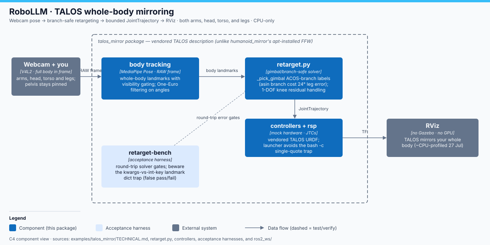

# RoboLLM · TALOS mirroring technical notes

> **RoboLLM field guide** · Build → Observe → Measure → Learn 
> [Home](../../README.md) · [Examples](../README.md) · [Runbook](docs/mirror-run.md) · [Joint inventory](docs/joint-inventory.md)

**Scope:** research/learning stack around a vendored TALOS model; upstream
vendored documentation is intentionally not restyled.

`examples/talos_mirror/` is webcam **whole-body** teleop of the vendored PAL
TALOS full-size humanoid: both arms, head, torso, and both legs (pelvis
pinned), CPU-only and RViz-based (no Gazebo, no GPU, no hardware).

These notes record the failure modes surfaced during the M5 review, together
with the shipped fix or the remaining limitation and the check that makes it
visible.

## Leg asin-branch discontinuity

`_pick_gimbal` must return two solutions whose branch identities remain stable
while the outer one-dimensional search moves between samples. The earlier
ASIN form was correct at an isolated point, but its `pi - x` solution wrapped
at ±pi and silently changed physical branches between adjacent samples. The
residual therefore jumped, manufacturing roots and hiding real ones; the leg
round-trip error reached 24 degrees.

The implementation now derives the inner angle as
`psi ± acos(a_z / hypot(w_y, w_z))`, then solves the outer angle with two
`atan2` terms. Those two ACOS labels remain stable across the search. The
random round-trip section of `retarget-bench` is the regression gate and
requires each arm and leg to remain below one degree.

## Bench kwargs-int-key trap

MediaPipe landmark constants are integers, while Python keyword names are
strings. A helper such as `_pose(LEFT_ELBOW=...)` therefore inserts the literal
string key `"LEFT_ELBOW"`; it does not replace integer key `13`. The intended
test pose stays neutral, so known-answer checks can report misleading results
without exercising the motion they name.

`retarget_bench.py` now accepts overrides only as a positional dictionary,
for example `_pose({LEFT_ELBOW: (...)})`. Each discriminating case also asserts
that its own pose produces a non-trivial expected direction, and mutation-kill
checks prove the mirror-law cases carry signal.

## Diagonal-step 1-DOF knee residual

The arm can sweep humeral yaw because its elbow offset is nearly parallel to
that axis. Applying the same decomposition to a leg sweeps hip pitch against a
thigh vector perpendicular to it, passing through a true gimbal singularity
near a horizontal high step. That produced 24–30 degree errors.

`solve_leg_hip_knee` instead sweeps the outer hip-yaw joint. For every sample,
`_hip_exact_pair` solves roll and pitch exactly from the thigh direction; the
remaining one-dimensional residual is the shin's out-of-plane component. A
24-step bisection is intentionally retained because the 12-step arm setting
amplifies error near hip pitch ±90 degrees. Diagonal left/right step cases and
the random leg round-trip gate expose the remaining numerical residual rather
than treating sagittal-only motion as sufficient.

## Head yaw sign-degeneracy under clamp

Yaw is computed with `atan2(head_dir_y, head_dir_x)`, multiplied by the yaw
gain, and then clamped. Once two different observations saturate at the same
`HEAD_YAW_LIMITS` boundary, the command no longer preserves their angular
magnitude; near the ±pi branch cut a noisy direction can also change the raw
angle's sign before clamping. This is an observability/saturation limitation,
not evidence of extra range in the robot, so the controller stays bounded.

The head-turn acceptance case uses a tight window around the mirror law's
reference command instead of checking only `yaw < 0`: both known bad mirror
mutations keep that sign but produce a different magnitude, often at the
clamp. A future continuity policy would need an unwrapped angle and previous
command as state; the current direct mapper deliberately does not claim that.

## Launcher single-quote bash -c trap

The launcher passes a multi-line script inside one single-quoted
`bash -c '...'` argument so it can source ROS before executing the requested
command. A literal apostrophe anywhere inside that block, including in a shell
comment, terminates the outer quote. The resulting parser error is commonly
reported at a later `fi`, which makes an innocent comment look like a control-
flow defect.

The launcher comments inside that block avoid apostrophes and call out the
constraint next to the unconditional TALOS rebuild. Keep dynamic commands in
the positional argument after `--` (`exec "${@:-bash}"`) instead of
interpolating them into the quoted script. `bash -n docker/ros2-arm` is the
cheap regression check after launcher edits.

## CPU profile (measured, 27 Jul 2026)

`docker exec <container> top -b -d 2 -n 20` (PID-filtered via `pgrep -af`,
cross-checked against `docker stats --no-stream`), steady state, n=20
samples/process. Host was shared with an active browser, so treat absolute
Hz/CPU numbers as approximate and same-run process rankings as the
trustworthy signal (docker stats totals matched summed PIDs within ~1pt in
both runs below).

**Before** -- `ros2-arm talos use_rviz:=false` (mock bring-up + move_group,
idle-hold, no mirror/track):

| process | avg %CPU |
|---|---|
| ros2_control_node (6 JTCs in-process, update_rate was 100 Hz) | 14.00 |
| move_group | 3.12 |
| robot_state_publisher | ~1.5-2.5 (steady-state) |

**Before** -- `ros2-arm mirror synthetic use_rviz:=false` (adds talos_track +
mirror_node, live 50 Hz commands):

| process | avg %CPU |
|---|---|
| mirror_node (python, 50 Hz tick) | 34.91 |
| ros2_control_node (update_rate was 100 Hz) | 21.20 |
| track_node (synthetic 30 Hz tick) | 6.15 |
| move_group (idle -- grep-confirmed zero FK/IK calls from mirror_node/track_node/retarget.py) | 3.50 |
| robot_state_publisher | 1.95 |

`docker stats` totals: 15.06% (talos idle) / 67.10% (mirror synthetic),
matching the summed PIDs within ~1pt in both runs.

**What was cut, by measured impact:**

1. **move_group off by default on the mirror/sweep path**
   (`use_moveit:=false`, wired through `mock_bringup.launch.py` ->
   `mirror.launch.py` / `sweep.launch.py`). move_group's own cost was small
   (~3-3.5%, the cheapest process in the profile) but 100% wasted here:
   neither `track_node` nor `mirror_node` ever calls `/compute_fk` or
   `/compute_ik` (grep-confirmed across `track_node.py`, `mirror_node.py`,
   `retarget.py`, `qp_retarget.py`, `qp_pose_source.py`, `pin_model.py`).
   It also removes one BEST_EFFORT subscriber each off `/joint_states` and
   `/tf`. `talos-check` and `retarget-bench --fk` still need it: the
   `talos` verb keeps `use_moveit:=true` as its default (unchanged), and
   `mirror`/`sweep` accept `use_moveit:=true` to opt back in for `--fk`
   runs against those containers.
2. **`controller_manager.update_rate` dropped from 100 Hz to 60 Hz**
   (`talos_moveit_config/config/ros2_controllers.yaml`, shared by every
   verb). The old value's own comment admitted it was unmeasured headroom.
   Measured real command cadence on this path is 50 Hz (both
   `mirror_rate_hz` and sweep's `rate_hz` default to 50.0); `/joint_states`
   was measured running 92.6-100 Hz against that 50 Hz input, and
   `ros2_control_node`'s CPU rose 14.00% -> 21.20% between idle-hold and
   live-command runs -- the control loop was genuinely firing ~2x per
   command, not just idling faster. 60 Hz keeps headroom above the 50 Hz
   command rate without doubling the loop. `joint_state_broadcaster` has no
   independent output-rate knob (its rate is coupled to
   `controller_manager.update_rate`), so this one change also caps its
   overshoot -- no separate JSB setting exists to tune.
3. **Not touched (measured cheap, left alone):** `track_node` (6.15%,
   already proportionate to its own 30 Hz synthetic tick),
   `robot_state_publisher` (cheapest process in both runs; `/tf` was
   measured at 18-48 Hz, never sustained above the 50 Hz need, so it is
   not overshooting), and each JTC's own `state_publish_rate: 100.0` (a
   different topic than `/joint_states`, not measured in this profile --
   left at its existing value rather than guessed at).
4. **RViz cost (doc-only, not re-measured):** `mirror.launch.py`'s own
   `rviz/mirror.rviz` (plain `RobotModel` + `MarkerArray(/body/markers)` +
   `TF`) was already the lighter of the two shipped RViz configs before
   this pass -- `talos_moveit_config`'s `talos_moveit.rviz` (used by
   `use_rviz:=true` on the `talos` verb) additionally loads
   `moveit_rviz_plugin/MotionPlanning`, which embeds its own
   `PlanningSceneMonitor` client, interactive markers, and a trajectory
   slider on top of whatever GL cost the scene already pays. Both configs
   render on `LIBGL_ALWAYS_SOFTWARE=1` in this container (required on this
   host -- hardware GL raises "GLX drawable fail" here), so neither gets
   hardware-GL frame rates; prefer `mirror.rviz`'s plain display set for
   visualization-only sessions where `MotionPlanning`'s extras are not
   needed.

**mirror_node's own per-tick Python cost** (per-joint OneEuro filter fan-out,
six separate `JointTrajectory` publishes per tick) was the single largest
process in the profile (34.91% avg, >50% of the mirror-synthetic
container's total CPU) but is NOT changed by this pass -- it needs a code
restructuring (batching the 30 per-joint filter updates, coalescing the 6
per-controller publishes, or lowering `mirror_rate_hz`) rather than a
config/launch-level cut, and is out of scope here.

## Stale root-owned install/ masking builds

The container bind-mounts the host `ros2_ws/`. A root process can therefore
leave `build/`, `install/`, `log/`, or `__pycache__/` entries that the host user
cannot replace. A later `colcon build` or even `python -m py_compile` then fails
with a permission error that can be mistaken for a source defect. A stale
`install/` is worse: the live ROS stack can continue importing old code while
source-only tests pass.

The TALOS launcher rebuilds the actively developed packages on every run, and
`diff_replay.py` compares the source and installed Python files before it
reports benchmark results. If ownership is already wrong, stop the container,
restore those generated directories to the host user (or remove and rebuild
them with correct ownership), source the new `install/setup.bash`, and rerun
the parity check. Do not change working source merely to work around generated
file permissions.
