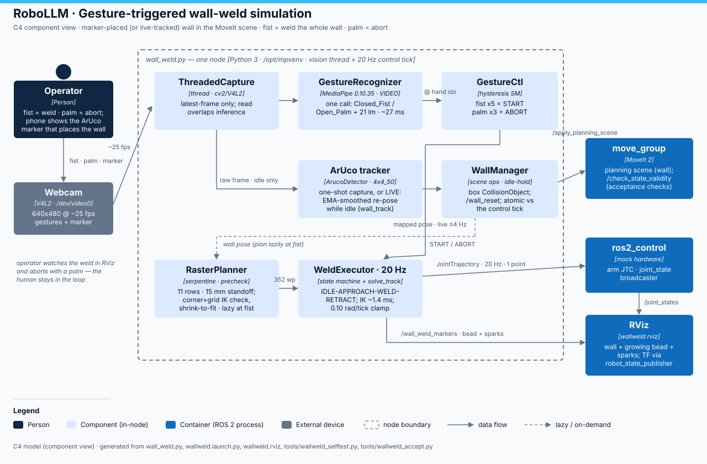

# wall_weld — technical reference

One node (`ros2_ws/src/robot_arm_moveit_config/scripts/wall_weld.py`,
~1250 lines, runs under `/opt/mpvenv/bin/python`) drives the whole demo:
vision thread (camera + GestureRecognizer + ArUco) feeds a 20 Hz control
tick that owns every state transition.

## State machine (control tick, 20 Hz)

`INIT → HOMING → IDLE ⇄ (APPROACH → WELD → RETRACT → HOMING)`, plus
`ABORT_FREEZE (0.3 s) → HOMING` from palm / hand-loss >3 s / 5 consecutive
IK failures. Start requires, atomically under one lock: `state==IDLE`,
a plan, and no respawn hold — the same hold marker capture and `/wall_reset`
must take, so a wall can never be swapped under an in-flight weld (TOCTOU
fix from the adversarial review).

## Components

| Component | What it does |
|---|---|
| `WallManager` | box CollisionObject via `/apply_planning_scene`; `/wall_reset` (std_srvs/Trigger) |
| `RasterPlanner` | serpentine waypoints in wall frame (row_step 0.02, margin 0.02, standoff 0.015), corner + 7×5-grid IK precheck, shrink-to-fit (0.85×, max 4 rounds, floors 0.10×0.06), raises `ValueError` on degenerate geometry — planned **before** the scene moves |
| `WeldExecutor` | per-tick `arm_ik.solve_track` (median ~1.4 ms) + 0.10 rad joint clamp; bead `LINE_STRIP` + spark markers on `/wall_weld_markers` |
| `GestureCtl` | GestureRecognizer, gesture read at the selected hand's result index; fist ×5 → START, palm ×3 → ABORT |
| ArUco capture | `cv2.aruco.ArucoDetector` (class API — the legacy free functions are gone in contrib 5.0); one-shot: 10 stable frames → precheck → respawn; `wall_track:=true`: EMA-smoothed live re-pose ≤ `track_hz`, plan deferred to fist time (`PLAN … why=fist-lazy`) |

## Topics & services

| Interface | Type | Meaning |
|---|---|---|
| `/arm_controller/joint_trajectory` | JointTrajectory (pub, 20 Hz) | single-point streaming commands |
| `/wall_weld_markers` | MarkerArray (pub) | wall outline, growing bead, sparks |
| `/weld_progress` · `/weld_state` · `/weld_event` | Float32 / String / String | progress fraction, state, structured events (`WALL_SPAWNED`, `PLAN`, `START`, `DONE`, `WALL_TRACKED`, `WALL_PLAN_FAILED`…) |
| `/wall_reset` | std_srvs/Trigger (srv) | respawn wall + clear bead (refused unless IDLE) |
| `/apply_planning_scene` · `/check_state_validity` | (clients) | scene ops; acceptance collision checks |

## Key parameters (all launch args)

Wall: `wall_x/y/z/yaw/width/height/thick` (defaults 0.30/0/0.25, 0.35×0.25×0.02).
Raster: `row_step 0.02`, `pass_step 0.01`, `margin 0.02`, `standoff 0.015`,
`weld_speed 0.05`, `travel_speed 0.08`. Gesture: `n_fist 5`, `n_palm 3`,
`gesture_score 0.6`, `hand Any`. Marker windows: `wall_{x,y,z}_{min,max}`,
`yaw_clamp_deg 20`, `marker_s_near/far 0.30/0.08`. Tracking: `wall_track`,
`track_hz 4`, `track_alpha 0.35`, `track_eps_m 0.008`, `track_eps_yaw 0.03`.
Full table: `wallweld.launch.py`.

## Verification tooling

`ros2_ws/tools/wallweld_selftest.py` — offline, 30 checks (planner geometry,
shrink/reject, gesture SM, ArUco API). `ros2_ws/tools/wallweld_accept.py full`
— live monitor run inside the container: completion, bead growth, joint-step
smoothness, `/check_state_validity` sampling vs the wall (101/101 at the
15 mm default). Known-harmless: move_group may segfault during Ctrl-C
teardown (upstream MoveIt race).
