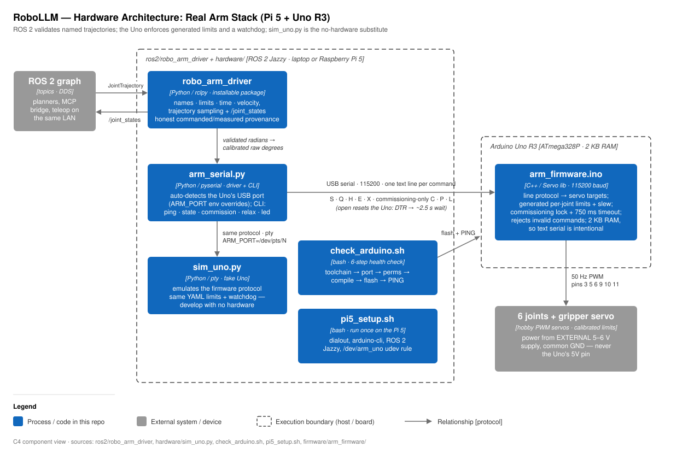

# hardware/ — Technical notes: the real DIY arm stack

This directory is the real-hardware path of RoboLLM: a DIY robot arm built from
an Arduino Uno R3 (servo controller) and a Raspberry Pi 5 or laptop (the ROS 2
brain). The Uno runs a tiny line-based text protocol over USB serial at 115200
baud — it cannot run micro-ROS (AVR, 2 KB RAM), so plain serial is intentional.
All planning and kinematics stay on the host; the Uno just slew-limits servo
targets at 50 Hz. `sim_uno.py` emulates the firmware on a pty so the entire
stack is developable and testable with zero hardware plugged in.



## Component walkthrough

- **`firmware/arm_firmware/arm_firmware.ino`** — the Uno sketch. Drives up to
  6 hobby servos on PWM pins 3, 5, 6, 9, 10, 11 (channels 0–5). Movement is
  slew-rate limited to `MAX_STEP_DEG = 2` per 20 ms tick (100 deg/s) so a big
  command never slams the arm. Per-channel limits live in `MIN_DEG[]` /
  `MAX_DEG[]` (default 0–180 — tighten them for your arm, then `make upload`).
  Boot: 3 fast LED blinks, then prints `READY arm-fw 1.0`.
- **`arm_serial.py`** — host-side pyserial driver + CLI. Auto-detects the port
  by USB VID (genuine Uno + CH340/CP210x clones), falling back to any
  ttyACM/ttyUSB; `ARM_PORT` env overrides (this is how sim_uno plugs in).
  Opening the port DTR-resets the Uno, so the constructor waits ~2.5 s.
  API (the contract every later phase uses, mirroring VLA I/O): `get_state()`
  → measured radians + gripper + timestamps, `set_action(q, grip)`, `home()`,
  `enable()`, `relax()` (e-stop), `ping()`, `led(bool)`. Radians↔degrees and
  per-joint calibration (`JointCalib`: offset/sign/limits) live here and only
  here.
- **`arm_bridge_node.py`** — the ROS 2 node (`arm_bridge`). Subscribes
  `/arm/command` (degrees), sends one batch `set_action` per message,
  publishes `/arm/joint_states` at 10 Hz with the MEASURED state in radians.
  Relaxes servos on shutdown. This is the real-hardware twin of the sim arm
  path in `robot_bridge.py`.
- **`camera_logger.py`** — synchronized (image, state, action) episode
  recorder for Phase B demonstrations: grabs the newest camera frame, reads
  state immediately after, logs both timestamps + the lag so sync quality is
  auditable. `episodes/ep_NNNN/{frames/, record.jsonl, meta.json}`.
- **`acceptance_test.py`** — the Phase A milestone check on real hardware:
  read state → commanded move lands → synced camera grab → lag < 50 ms.
- **`sim_uno.py`** — fake Uno on a pty (`pty.openpty()`, raw mode). Speaks the
  identical protocol including the 100 deg/s slew limit, so motion takes real
  time. Prints its port (e.g. `/dev/pts/3`) and logs every command/reply.
- **`check_arduino.sh`** — 6-step health check for the real board:
  toolchain → port → permissions → compile → flash → PING + LED blink.
- **`pi5_setup.sh`** — run on the Pi 5 (Ubuntu 24.04): dialout group,
  arduino-cli (ARM64), ROS 2 Jazzy, and a udev rule that symlinks the Uno to
  `/dev/arm_uno`.

## Serial protocol — arm-fw 2.0 (115200 baud, one command per line)

v2 replaces the v1 word protocol with the Phase A research protocol (see
`docs/serial_protocol.md` for the full rationale): batch all-joints set,
**measured** state replies with timestamps, and an e-stop. Every
motion/state command returns exactly one `s` line.

| Command | Reply | Meaning |
|---------|-------|---------|
| `S d0..d5 g` | `s …` | set ALL joint targets (deg) + gripper (0–100), one round-trip |
| `Q` | `s …` | read state, no motion |
| `H` | `s …` | go to home pose |
| `E` | `s …` | attach servos (torque on) |
| `X` | `s …` | e-stop: detach servos (safe, hand-movable) |
| `P` | `# pong arm-fw 2.0` | liveness (sim adds `(SIM)`) |
| `L 1` / `L 0` | `# led` | onboard LED — smoke test with no servos wired |
| state reply | `s d0..d5 g t_ms` | **MEASURED** angles (deg), gripper, `millis()` |
| errors / comments | `! …` / `# …` | host logs `!`, ignores `#` |

`readEncoderDeg()` is stubbed to return the slewed commanded position until
real encoders are wired — that stub is the H5 "commanded state" baseline;
swap it before recording datasets.

## Key files

| File | Role |
|------|------|
| `firmware/arm_firmware/arm_firmware.ino` | Uno sketch: protocol + 50 Hz slew-limited servo control |
| `firmware/arm_firmware/Makefile` | `make` compile, `make upload`, `make monitor` (arduino-cli, `PORT=/dev/ttyACM0`) |
| `arm_serial.py` | Python driver + CLI: `ping` \| `joints` \| `set <ch> <deg>` \| `led <0|1>` |
| `arm_bridge_node.py` | ROS 2 bridge node (`/arm/command` → servos, `/arm/joint_states` out) |
| `sim_uno.py` | firmware emulator on a pty — dev with no hardware |
| `check_arduino.sh` | 6-step Uno health check |
| `pi5_setup.sh` | Pi 5 provisioning script |

## Topics and parameters (arm_bridge_node.py)

| Name | Type | Direction | Notes |
|------|------|-----------|-------|
| `/arm/command` | `std_msgs/Float64MultiArray` | sub | target angles in **degrees**, index = channel |
| `/arm/joint_states` | `sensor_msgs/JointState` | pub | 10 Hz, positions in **radians** |
| `port` (param) | string | — | serial device; empty = auto-detect |
| `joint_names` (param) | string[] | — | default `joint0`…`joint5` |
| `enable_on_start` (param) | bool | — | default true (torque on at startup) |

## Run + verify

Dev without hardware (two terminals):

```bash
python3 hardware/sim_uno.py                       # prints e.g. /dev/pts/3
ARM_PORT=/dev/pts/3 python3 hardware/arm_serial.py ping
ARM_PORT=/dev/pts/3 python3 hardware/arm_serial.py set 0 120
```

Real Uno (needs `sudo usermod -aG dialout $USER`, then re-login):

```bash
hardware/check_arduino.sh                         # toolchain→…→PING, all 6 green
```

ROS 2 bridge (laptop or Pi 5; `ARM_PORT` works here too):

```bash
bash -c 'source /opt/ros/jazzy/setup.bash && python3 hardware/arm_bridge_node.py'
ros2 topic pub -1 /arm/command std_msgs/msg/Float64MultiArray \
    "{data: [90, 45, 120, 90, 90, 90]}"
ros2 topic echo /arm/joint_states                 # angles converge over ~1 s
```

Pi deployment: `scp -r hardware/ <user>@<pi-ip>:~/arm/` then
`ssh <user>@<pi-ip> 'bash ~/arm/pi5_setup.sh'`. Same LAN + same
`ROS_DOMAIN_ID` lets the laptop's ROS 2 see the arm topics.

## Gotchas

- **Servo power**: external 5–6 V supply (≥1 A per moving servo), **never** the
  Uno's 5V pin; tie all grounds together (supply ↔ Uno ↔ servos).
- **DTR reset**: opening the serial port reboots the Uno — `ArmSerial` waits
  ~2.5 s; don't "optimize" that away.
- No `/dev/ttyACM*`? Charge-only USB cables have no data lines; check
  `dmesg | tail`. Permission denied → you're not in `dialout`.
- Upload fails while a serial monitor is open — close the IDE monitor first.
- Toolchain is rootless (`arduino-cli` in `~/.local/bin`, core in
  `~/.arduino15`); never `apt install arduino`.
- The Uno R3 can't run micro-ROS — don't try to replace the text protocol.
