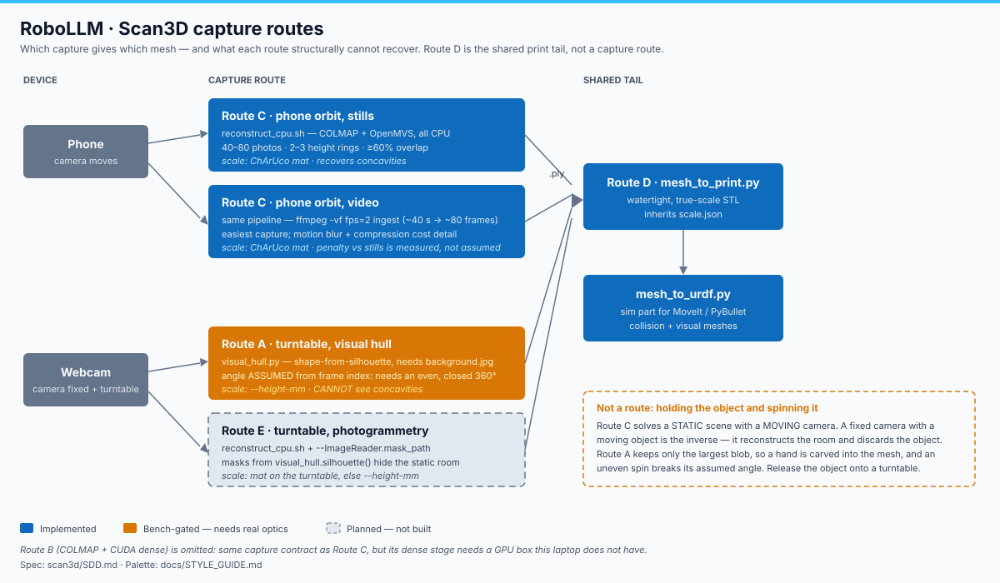

# RoboLLM · Scan3D capture and route specification

> **RoboLLM field guide** · Build → Observe → Measure → Learn<br>
> [Home](../README.md) · [Scan3D README](README.md) · [Technical notes](TECHNICAL.md) · [Documentation](../docs/README.md) · [Style guide](../docs/STYLE_GUIDE.md)

**Status: Planned.** This document is normative. It defines what an operator must
physically do, what each route can and cannot recover, and what evidence closes
each phase. It is written **before** the measurements exist, so that a
disappointing result is reportable rather than negotiable.

Scope: turning a real object into a mesh. The shared 3D-printing tail
(`mesh_to_print.py`, Route D) and URDF export (`mesh_to_urdf.py`) are downstream
of every route here and are not re-specified.



*Source: [`docs/scan3d-routes.svg`](docs/scan3d-routes.svg)*

## 1. Route register

The repository already names routes **A**, **B**, **C** and **D**. **D is the
shared print/CAD tail, not a capture route.** The new turntable-photogrammetry
route is therefore **E**.

| Route | Capture | Camera motion | Reconstructor | Scale source | Status |
|---|---|---|---|---|---|
| **A** | Webcam, turntable | **Fixed** | `visual_hull.py` (shape-from-silhouette) | `--height-mm` only | **Verified** (synthetic); bench-gated on real optics |
| **B** | Phone/webcam orbit | Moving | `reconstruct.sh` (COLMAP + CUDA dense) | ChArUco mat | **Planned** — needs a GPU box |
| **C** | Phone orbit, **stills or video** | Moving | `reconstruct_cpu.sh` (COLMAP + OpenMVS, all CPU) | ChArUco mat | **Code-ready**; bench-gated |
| **D** | — | — | `mesh_to_print.py` → watertight STL | inherits `scale.json` | **Verified** (synthetic) |
| **E** | Webcam, turntable + **masks** | **Fixed** | `reconstruct_cpu.sh` with `--ImageReader.mask_path` | ChArUco mat on the turntable, else `--height-mm` | **Planned** — not built |

### 1.1 What each route cannot do

Stated as limits, not caveats, because each one has already cost time:

- **A cannot see concavities.** A visual hull is the intersection of silhouettes;
  a cup scans as a solid billet. Acceptable for a CAD reference or a collision
  proxy, wrong for printing a cavity.
- **A cannot recover an uneven rotation.** `visual_hull.py` computes the carving
  angle as `th = 2 * np.pi * i / N` — assumed from frame index, never measured.
  A rotation that is uneven, or short of a closed 360°, carves every silhouette
  at the wrong angle and the intersection empties: `carved to nothing —
  silhouettes disagree`.
- **A cannot separate a hand from the object.** `silhouette()` keeps the single
  largest blob, so anything touching the object joins it. **The object must be
  released onto a turntable, never held.**
- **C cannot reconstruct a moving subject.** COLMAP solves Structure-from-Motion
  assuming a *static scene with a moving camera*. Lift an object and turn it in
  front of a fixed camera and the solver recovers the geometry of the room,
  treating the object as a moving outlier to be discarded.
- **C and E cannot match shiny, transparent or plain-white surfaces.** Feature
  matching needs texture. Matte and textured objects reconstruct; specular metal
  and gloss plastic do not.
- **No route can reconstruct an articulated object that changes pose between
  frames.** Every route assumes one rigid body.

### 1.2 Why the robot arm is out of scope for a first scan

The arm violates three limits at once: glossy dark brackets are specular and
textureless, thin linkages and fasteners fall below the dense-stage resolution,
and identical repeated brackets are self-similar geometry that produces false
feature matches. Held in a hand it also flexes between frames, so it is not even
a rigid subject.

It is also unnecessary: `cad/` already produces a URDF from known part geometry,
which is strictly better than a scan — watertight, noise-free, and carrying joint
frames a mesh cannot. Scanning is for objects whose geometry is **not** already
known, which is what the roadmap wants scan3d for (grasp targets).

## 2. Transfer contract

Images must reach `~/Pictures/<object>/` **without recompression**.

| Method | Command | Note |
|---|---|---|
| USB / MTP | mount via `gio`, copy `DCIM/Camera` | Simplest; lossless |
| Android + adb | `adb pull /sdcard/DCIM/Camera/ ~/Pictures/<obj>/` | Scriptable; needs USB debugging |
| Cloud at original quality | provider's "original"/"document" setting | Lossless if and only if originals are preserved |

**Prohibited: chat applications.** LINE, WhatsApp and Telegram outside document
mode re-encode and downscale images. That destroys exactly the high-frequency
detail SIFT keypoints are built from, and the failure appears far downstream as
a sparse model that will not converge — not as an obvious transfer error.

Verify after transfer: file count matches, and dimensions are the camera's native
resolution rather than a downscaled one.

## 3. Capture contract

### 3.1 Common requirements (all routes)

| Requirement | Prevents |
|---|---|
| Bright, even, diffuse light; no glare, no hard shadows | Specular highlights that move between frames and match to nothing |
| Matte, textured object | Featureless surfaces that produce no keypoints |
| Object rigid and unchanged throughout | Non-rigid geometry that no route models |
| Object fully in frame in every usable image | Silhouettes and features truncated at the frame edge |

### 3.2 Route C — phone orbit (stills)

- **40–80 photos.** Below 20 the script warns and the reconstruction usually fails.
- **2–3 height rings** (above, level, below), ~10° steps.
- **≥60% overlap** between consecutive frames.
- **Orbit the object; do not rotate the object.** A moving background breaks
  matching — this is the same constraint as §1.1.
- ChArUco mat visible in most frames for automatic metric scale.

### 3.3 Route C — phone orbit (video)

As §3.2, but one continuous orbit of **~40 seconds**. `reconstruct_cpu.sh`
ingests video through `ffmpeg -vf fps=2`, yielding ~80 frames.

**Expect a worse mesh than stills**, from motion blur and inter-frame
compression, and because phone video is typically 1080p against 12 MP stills.
Move slowly and smoothly. The penalty is real and Phase 2 exists to measure it
rather than assume it.

### 3.4 Routes A and E — webcam turntable

- Object **released onto** a lazy Susan or a plate turned in even steps. Never
  held (§1.1).
- Camera fixed, looking roughly horizontally at the object.
- Plain, contrasting backdrop.
- **`capture.py --background` on the empty scene first.** The background frame is
  what makes clean segmentation possible for Route A, and it is a hard
  prerequisite for Route E's masks.
- Route A: a **full, closed, evenly-stepped 360°**, because the angle is assumed
  (§1.1). `capture.py --turntable 36` at the default 0.7 s interval means one
  revolution in ~25 s at a steady rate.
- Route E: put the ChArUco mat **on the turntable** so it stays static relative
  to the object and still yields metric scale — and keep it inside the mask
  (§4.2). Otherwise fall back to `--height-mm`.

## 4. Route E specification

### 4.1 Why a fixed camera can work at all

Structure-from-Motion constrains *relative* motion. Masking away the static
background leaves only the object, and a rotating object viewed by a fixed camera
is geometrically equivalent to a fixed object viewed by an orbiting camera.
COLMAP then recovers camera poses in the object's frame. This is the standard
turntable-photogrammetry technique.

It is conditional, not guaranteed: it requires a clean mask and a textured
object. A leaky mask readmits static background features, which pin the solution
to a zero-baseline configuration where nothing can be triangulated.

### 4.2 Mask interface

Specified before implementation so the phase cannot quietly redefine success.

- One mask per image at `<mask_path>/<image filename>.png` — the **full image
  filename plus `.png`** (`frame_0007.jpg` → `frame_0007.jpg.png`).
- Identical width and height to its image.
- **Zero-intensity (black) pixels are ignored by COLMAP.** Object → 255,
  background → 0.
- Produced by reusing **`visual_hull.silhouette(frame, bg)`**, which already
  computes precisely this mask from the frame and `background.jpg`. No new
  segmentation is written.
- If the ChArUco mat is being used for scale, the mat must fall inside the mask.

### 4.3 Wiring

`--ImageReader.mask_path` is added to the `feature_extractor` call in
`reconstruct_cpu.sh`, **activated only when a mask directory exists.** The phone
orbit path must remain byte-identical when no masks are present; Phase 4's
acceptance includes re-running Phase 1 and reproducing its result.

### 4.4 Open question this phase must answer

COLMAP masks constrain **sparse SfM only**. OpenMVS `DensifyPointCloud` operates
on the undistorted images and still sees background pixels, so the dense cloud
may carry room geometry that the mask excluded from the sparse model. Whether
Route E additionally needs mesh cropping is unresolved and must be **measured**,
not assumed away.

## 5. Phase acceptance

Every phase reconstructs **the same object**, measured against **the same
calliper readings**, so the routes are directly comparable.

| Phase | Route | Acceptance |
|---|---|---|
| 0 | — | This document plus its SVG exist; SVG parses as XML, carries `<title>`/`<desc>`, needs no external assets |
| 1 | C, stills | **Within ~1–2% of callipers on each measured axis.** Gates scan3d `develop` → `main` |
| 2 | C, video | Reconstruction completes; penalty versus Phase 1 stated as a number |
| 3 | A | Watertight mesh; convex extents match callipers; concavity loss measured and reported |
| 4 | E | Compared against Phase 1; Phase 1 still reproduces with no masks present |
| 5 | — | One JSON summary covering all routes; status docs updated; gate decision recorded |

Phase 1 is the anchor. If it fails, later phases measure nothing and the work
stops to diagnose rather than proceeding.

## 6. Results schema

Phase 5 emits one compact summary, following the repository's evidence pattern
(compare `scripts/learning/b1/dataset_summary.py`): raw scans stay git-ignored
under `assets/scan/`, only the summary is committed.

```json
{
  "schema": "robollm.scan3d.route-comparison.v1",
  "object": "<name>",
  "reference_mm": {"x": 0.0, "y": 0.0, "z": 0.0, "method": "callipers"},
  "routes": {
    "<route>": {
      "input": "stills|video|turntable",
      "images": 0,
      "runtime_s": 0,
      "scale_source": "charuco|height-mm",
      "measured_mm": {"x": 0.0, "y": 0.0, "z": 0.0},
      "error_pct": {"x": 0.0, "y": 0.0, "z": 0.0},
      "watertight": true,
      "recovers_concavities": true,
      "notes": ""
    }
  }
}
```

## 7. Honesty rules

Carried from [`../docs/STYLE_GUIDE.md`](../docs/STYLE_GUIDE.md) because this
document exists to be held to:

- Never promote a synthetic result to physical evidence. Name the environment
  behind every measured number.
- A route performing worse than another is a **result**, not a failure to hide.
  An unmeasured route is the only unacceptable outcome.
- Status labels in this document must match `../docs/PROJECT_STATUS.md`.
