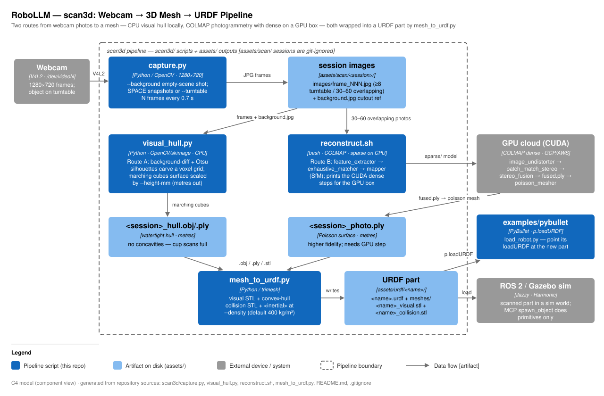

# RoboLLM · Scan3D technical notes

> **RoboLLM field guide** · Build → Observe → Measure → Learn<br>
> [Home](../README.md) · [Run guide](README.md) · [Documentation](../docs/README.md) · [Architecture diagram](docs/scan3d-architecture.svg)

This directory turns a cheap laptop webcam into a 3D scanner whose output is a
simulation-ready robot part. Two reconstruction routes feed one common tail:
**Route A** (`visual_hull.py`) is CPU-only shape-from-silhouette — each
turntable frame is a shadow, and the mesh is the intersection of all shadows —
so it runs on this GPU-free laptop today; **Route B** (`reconstruct.sh`) is
COLMAP photogrammetry, whose sparse Structure-from-Motion step runs locally on
CPU while the dense surface needs CUDA on a cloud GPU box; **Route C**
(`reconstruct_cpu.sh`) removes that GPU dependency — COLMAP sparse plus an
OpenMVS dense/mesh/texture tail, all CPU, all in Docker (`colmap/colmap` +
`openmvs/openmvs-ubuntu` images), and it ingests phone photos or video too
(the Orbiter-rig technique, hand-held). Any route's mesh
goes through `mesh_to_urdf.py`, which wraps it into a URDF link with visual
mesh, convex-hull collision mesh, and computed inertia for PyBullet or a
ROS 2 / Gazebo world.



## Component walkthrough

- **`capture.py`** — OpenCV webcam capture at 1280×720. Three uses:
  `--background` saves one empty-scene `background.jpg` (after 10 warm-up reads
  to settle exposure); default snapshot mode shows a preview and saves a frame
  per SPACE press; `--turntable N` auto-saves N frames every `--interval`
  (default 0.7 s) while you rotate the object a full 360° on a plate.
  Frames land in `../assets/scan/<session>/images/frame_NNN.jpg`.
- **`visual_hull.py`** — Route A, CPU-only, no camera calibration. Per frame it
  computes a silhouette mask: `absdiff` against `background.jpg` + Otsu
  threshold (fallback: Otsu on HSV saturation), morphological open/close, keep
  the largest contour. It estimates the rotation-axis column (median centroid),
  base row, and half-width/height (95th percentiles), then carves a voxel grid
  (`--res`, default 128) with every mask assuming even 360° rotation
  (orthographic hull). Marching cubes (`skimage`) extracts the surface, scaled
  to metres via `--height-mm`. Needs ≥8 usable frames; aborts with a hint if
  the silhouettes carve the grid to nothing.
- **`reconstruct.sh`** — Route B. Runs `colmap feature_extractor`
  (`--ImageReader.single_camera 1`), `exhaustive_matcher`, and `mapper` (sparse
  SfM) locally, writing `colmap.db` + `sparse/` into the session folder, then
  prints the CUDA-only continuation for the GPU box: `image_undistorter` →
  `patch_match_stereo` → `stereo_fusion` (→ `dense/fused.ply`) →
  `poisson_mesher` (→ `<session>_photo.ply`).
- **`mesh_to_urdf.py`** — common tail. Loads any `.obj/.ply/.stl` with trimesh,
  exports `<name>_visual.stl` (original surface) and `<name>_collision.stl`
  (convex hull — fast for physics), and writes `<name>.urdf` with an
  `<inertial>` block (mass, COM, inertia tensor) at `--density` kg/m³
  (default 400; water = 1000). Non-watertight input falls back to the convex
  hull for the mass properties.

## Key files

| File | Role |
|------|------|
| `capture.py` | Webcam capture: snapshots, `--turntable N`, `--background` cutout reference |
| `visual_hull.py` | CPU silhouette carving → watertight `.obj`/`.ply` mesh |
| `reconstruct.sh` | COLMAP photogrammetry: sparse locally, prints GPU dense steps |
| `reconstruct_cpu.sh` | Route C: COLMAP sparse + OpenMVS dense, CPU-only, Docker |
| `mesh_to_urdf.py` | Any mesh → URDF link (visual + convex collision + inertia) |
| `mesh_to_print.py` | Second tail: repair + true-scale + bed-orient → printable STL |
| `scale_mat.py` | ChArUco mat: printable target + metric-scale solver → `scale.json` |

## CLI flags

| Script | Flag | Default | Meaning |
|--------|------|---------|---------|
| `capture.py` | `--camera` | 0 | `/dev/videoN` index |
| `capture.py` | `--session` | `object` | scan name → `assets/scan/<session>/` |
| `capture.py` | `--turntable N` / `--interval` | — / 0.7 s | auto-capture N frames |
| `capture.py` | `--background` | off | save `background.jpg` and exit |
| `visual_hull.py` | `--res` | 128 | voxel grid resolution |
| `visual_hull.py` | `--height-mm` | 100 | real object height, sets scale |
| `mesh_to_urdf.py` | `--name` / `--density` | mesh name / 400 | link name; kg/m³ for inertia |

## Artifacts on disk

| Path | Producer | Notes |
|------|----------|-------|
| `assets/scan/<s>/images/frame_NNN.jpg`, `background.jpg` | `capture.py` | git-ignored (`assets/scan/`) |
| `assets/scan/<s>/<s>_hull.obj` + `.ply` | `visual_hull.py` | Route A mesh, metres |
| `assets/scan/<s>/colmap.db`, `sparse/`, `dense/`, `<s>_photo.ply` | `reconstruct.sh` (+ GPU box) | Route B |
| `assets/scan/<s>/scene_dense.ply`, `scene_mesh.ply`, `<s>_photo.ply` | `reconstruct_cpu.sh` | Route C, CPU |
| `assets/urdf/<name>/<name>.urdf` + `meshes/*.stl` | `mesh_to_urdf.py` | URDF tracked; STLs git-ignored (`assets/**/*.stl`) |

## Run + verify (Route A, this laptop)

```bash
cd scan3d
../.venv/bin/python capture.py --background                 # 1) empty scene
../.venv/bin/python capture.py --turntable 36 --session mug # 2) rotate object 360°
../.venv/bin/python visual_hull.py --session mug --height-mm 95
../.venv/bin/python mesh_to_urdf.py ../assets/scan/mug/mug_hull.obj --name mug
```

`visual_hull.py` prints frame/voxel/mesh stats; `mesh_to_urdf.py` prints
dimensions, mass, and `watertight=True/False`. Try the part with
`examples/pybullet/load_robot.py` (point its `loadURDF` at the new URDF).
Route B: `sudo apt install colmap`, capture 30–60 overlapping snapshots
(snapshot mode, ~70% overlap), then `./reconstruct.sh mug`.

- **`mesh_to_print.py`** — the 3D-print/CAD tail. Largest-component filter →
  degenerate/duplicate face removal → winding+normal fix → `fill_holes`; if
  still open, a voxel remesh (`voxelized(pitch).fill()` + marching cubes,
  scaled by pitch back to mm) guarantees watertightness at `--voxel-mm`
  resolution. Scale is set by `--height-mm` (photogrammetry is scale-free;
  the visual hull is already metric but re-asserting a callipered height
  costs nothing). Output is centred in XY with min-Z on the bed plane.
  Verified on synthetic torture meshes: holes + floating debris → watertight
  solid at exact height; a mesh missing a whole cap becomes a thin watertight
  shell (correct behaviour — coverage can't be invented). Scale source order:
  session `scale.json` → `--height-mm` → hard error (never guesses).
- **`scale_mat.py`** — metric scale without callipers. `make` renders a
  7×5 ChArUco board (DICT_5X5_100, 30 mm squares) centred on A4 @ 300 DPI;
  `solve` reads the COLMAP text model (`sparse_txt/`, exported by
  `reconstruct_cpu.sh` step 3b), detects ChArUco corners per registered image
  (`cv2.aruco.CharucoDetector`), triangulates each corner seen in ≥2 views by
  multi-view DLT on undistorted pixels, then takes the median over all corner
  pairs of known-mm / model-distance → `mm_per_unit` in `scale.json`, with a
  p90 spread stat (>3% ⇒ warn: mat not flat / print not 100% / bad poses).
  `--self-test` proves the math on 6 synthetic cameras with 0.3 px noise
  (recovers a known scale to <0.5%; measured 0.006%). The board self-detects
  24/24 corners from its own rendered image.
- **`poisson_mesh.py`** — optional Screened Poisson mesher (Scene 5).
  `MESHER=poisson ./reconstruct_cpu.sh …` swaps OpenMVS ReconstructMesh for
  Open3D Poisson (depth 9 default) on the dense cloud, in its own auto-built
  Docker image (`poisson.Dockerfile` — Open3D lacks wheels for every host
  Python and needs X11/GL libs even headless). Estimates + orients normals if
  the cloud has none. Density trimming is OFF by default: untrimmed Poisson
  output is watertight (verified: noisy 10k-pt sphere → 64.5 cm³ vs 65.4
  truth) and trimming opens holes; largest-component filtering already
  removes detached hallucinated bubbles. `--trim-quantile 0.02` only when
  hallucinated surface stays attached — mesh_to_print.py closes the holes.

## Gotchas

- A visual hull cannot see concavities — a cup scans as a filled cylinder. Use
  Route B for fidelity.
- Lighting/background beat resolution: bright diffuse light, plain contrasting
  backdrop, matte textured object; always shoot `--background` first.
- `visual_hull.py` assumes the camera stayed put and the rotation was a full,
  even 360° — uneven hand-turning warps the hull.
- COLMAP dense (`patch_match_stereo`) hard-requires CUDA; only sparse runs on
  this laptop. The script prints the exact GPU commands — don't retype them.
  Route C (`reconstruct_cpu.sh`) sidesteps this entirely via OpenMVS.
- Route C phone capture must ORBIT a static object (camera moves); the
  turntable style of Routes A/B breaks its feature matching — static
  backgrounds match across frames and COLMAP reconstructs the room.
- The MCP `spawn_object` tool spawns primitive shapes only (box/sphere/
  cylinder via `gazebo_world.py`); a scanned URDF part goes into a sim by
  loading it in PyBullet or including it in a Gazebo/ROS 2 world yourself.
- `mesh.convex_hull` does **not** inherit density — `mesh_to_urdf.py` re-sets
  it before computing hull mass; keep that if you edit the script.
- Scans are git-ignored (large/personal), and `assets/**/*.stl` in `.gitignore`
  also catches the URDF part's STL meshes — only the `.urdf` itself gets
  committed; re-run `mesh_to_urdf.py` to regenerate the meshes after a clone.
