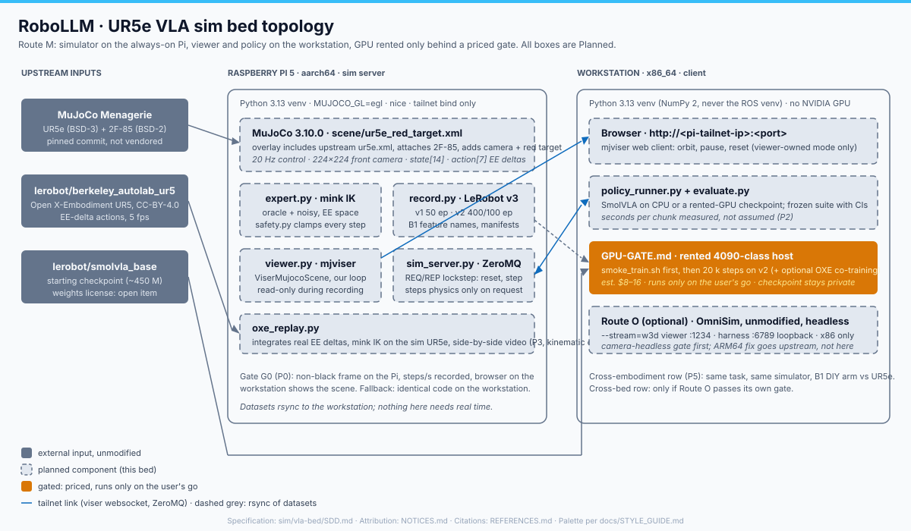

# RoboLLM · UR5e VLA sim bed specification

> **RoboLLM field guide** · Build → Observe → Measure → Learn<br>
> [Home](../../README.md) · [Bed README](README.md) · [References](REFERENCES.md) · [Notices](NOTICES.md) · [B1 runbook](../../examples/mujoco/B1.md) · [Documentation](../../docs/README.md) · [Style guide](../../docs/STYLE_GUIDE.md)

**Status: Planned; Phase 0 Verified** on the Pi and the workstation, 3 Sep 2026 (evidence in `results/p0/`). This document is normative. It defines the simulation
bed, where each process runs, what every interface carries, what evidence
closes each phase, and what the bed structurally cannot show. It is written
**before** any of it exists, so that a disappointing measurement is reportable
rather than negotiable.

Scope: a UR5e in simulation, served from the Raspberry Pi and viewed and driven
from the workstation, used to record LeRobot datasets, fine-tune SmolVLA, and
evaluate it closed-loop. The physical arm, `scan3d`, and the B1 DIY-arm bench
are not re-specified; this bed reuses B1's code and changes only the embodiment
and the action space.



*Source: [`docs/vla-bed-topology.svg`](docs/vla-bed-topology.svg)*

## 0. Vocabulary

| Term | Meaning in this document |
|---|---|
| **Pi** | Raspberry Pi 5, `aarch64`, Debian 13, 16 GB RAM, 4 cores, always on; already hosts the physical arm's ROS 2 side. Reached over the tailnet or LAN (`ssh pi-tailscale` / `pi-lan`). |
| **Workstation** | The x86_64 desktop (Kali, i3-9100, 31 GB RAM, Intel UHD 630, no NVIDIA GPU). Runs the browser, the policy, training-data staging, and Route O. |
| **Route M** | The primary bed: MuJoCo physics + MuJoCo Menagerie UR5e + mjviser browser viewer. |
| **Route O** | Optional second bed: an unmodified OmniSim build on the workstation. |
| **EE** | End effector: the tool frame at the UR5e wrist, or the 2F-85 fingertip frame once the gripper is attached. |
| **Frozen suite** | B1's evaluation method: seeded goal families, fixed episode count, success rate with a confidence interval, per-family breakdown. |
| **Lockstep** | The simulation advances only when the client asks for a step. Wall-clock latency never changes what the policy sees. |
| Status words | **Planned / Code-ready / Bench-gated / Verified** exactly as defined in [`../../docs/STYLE_GUIDE.md`](../../docs/STYLE_GUIDE.md). Phase 0 is Verified on both machines (3 Sep 2026); everything after it is Planned. |

## 1. Questions this bed answers

| # | Question | Closed by |
|---|---|---|
| **Q-A** | Can the simulator run on the Pi as an always-on server, with the viewer and the policy on the workstation, without forking anything? | Phase 0 gate G0 and Phase 1 |
| **Q-B** | Can this hardware (no NVIDIA GPU anywhere) record LeRobot datasets, fine-tune SmolVLA on a rented GPU, and evaluate it closed-loop in the same bed, using B1's existing code? | Phases 2, 4, 5 |
| **Q-C** | Does the Open X-Embodiment (OXE) UR5 dataset transfer into this bed: can a real episode be replayed kinematically on the simulated UR5e, and can it be co-trained with simulated demonstrations? | Phase 3, optional Phase 4 co-training run |
| **Q-D** | Does OmniSim add anything measurable over MuJoCo for this task (camera realism, step cost, tooling), given it runs only on x86? | Route O, optional |

## 2. Route register

| Route | Physics | Embodiment | Viewer | Server host | Status | Why it is here |
|---|---|---|---|---|---|---|
| **M** | MuJoCo 3.10.0 | Menagerie `universal_robots_ur5e` + `robotiq_2f85` | mjviser (browser) | Pi | **Phase 0 Verified** (3 Sep 2026); P1–P5 Planned | Native `aarch64` wheels run on the Pi at 26.9× real time (measured 3 Sep 2026); pure-Python viewer; same engine as B1 |
| **O** | OmniSim v8.1.x (Newton on Warp, CPU) | OmniSim UR5e PROTO | OmniSim `--stream=w3d` (browser) | Workstation only | **Planned, optional** | Vendor asked for feedback; a second simulator is a real cross-bed measurement |

### 2.1 Evaluated and rejected (kept so nobody re-evaluates them)

| Candidate | Reason |
|---|---|
| OmniSim on the Pi | Its Qt installer hard-codes an x86-64 download; Qt ships `linux_arm64` only from 6.7.0. Patchable (see §12), but Newton-on-Warp CPU physics measured 27.6 s to first step and 0.86 s+ per harness step on the workstation (1 Sep 2026); the Pi is slower still. |
| Gazebo Harmonic `-s`/`-g` split | Remote GUI is unreliable (gz-sim issue #2698, empty window on remote server); ogre2 on llvmpipe on the Pi; MoveIt-shaped stack the bed does not need. |
| robosuite / LIBERO as the primary bed | robosuite pins `mujoco<3.10`, which conflicts with `requirements/smolvla.txt` (`mujoco==3.10.0`); LIBERO is Franka-only. LIBERO stays as an optional calibration run in its own venv (§8, P2b). |
| Isaac Lab, Genesis, mjlab | GPU-only. |
| PyBullet | Unmaintained viewer/server split; no maintained UR5e + gripper model of Menagerie quality. |

## 3. Relationship to B1

B1 (`examples/mujoco/`) is the DIY seven-joint arm in MuJoCo with a red-target
reaching task, a scripted oracle and noisy expert, a LeRobot recorder, a frozen
evaluation suite, and a guarded GPU workflow. This bed **reuses all of that
code** and changes exactly two things:

| | B1 | This bed |
|---|---|---|
| Embodiment | `robollm_diy_arm` (inline MJCF, 6 hinge + 1 slide) | UR5e + Robotiq 2F-85 from Menagerie, unmodified, at a pinned commit |
| Action space | 7 joint position targets, slew-limited | **EE deltas** `[dx, dy, dz, droll, dpitch, dyaw, gripper]` in the robot base frame, clamped per step |
| Expert | straight-line joint interpolation toward the oracle posture | mink differential IK toward the target pose |
| Everything else | task contract, recorder, dataset manifests, `train.py`, evaluator, safety-wrapper pattern | **identical** |

Why EE deltas: it is the action convention of `lerobot/berkeley_autolab_ur5`
(§6.3), so simulated demonstrations and real UR5 episodes become
action-compatible. That is what makes the OXE part of Q-C real instead of
nominal. Joint positions remain in the observation, so a joint-space variant is
a recorder flag, not a redesign.

The cross-embodiment row this creates: **same task, same simulator, two arms**
(B1's DIY arm and this UR5e). That is a cleaner comparison than "same task, two
simulators", which Route O adds only if it passes its own gate.

## 4. Deployment topology

| Process | Host | Binds | Talks to | Notes |
|---|---|---|---|---|
| `scene/build_scene.py` overlay | Pi | — | — | loads Menagerie's `scene.xml` and `2f85.xml` unchanged with `MjSpec`, attaches the gripper at `attachment_site`, adds the fixed front camera and the mocap red target; adopts the gripper's elliptic cone / impratio 10 |
| `expert.py` + `record.py` | Pi | — | MuJoCo in-process | Recording never crosses the network; datasets are `rsync`ed to the workstation afterwards |
| `viewer.py` (mjviser `ViserMujocoScene`) | Pi | tailnet IP, one free TCP port (**not 8080**, taken by nginx) | browser on the workstation | Viewer only; the physics loop is ours |
| `sim_server.py` (ZeroMQ REQ/REP) | Pi | tailnet IP, one free TCP port | `policy_runner.py` | Needed only for closed-loop evaluation (P5) |
| `policy_runner.py` + `evaluate.py` | Workstation | — | `sim_server.py` | SmolVLA on CPU, or a checkpoint trained on the rented GPU |
| Browser | Workstation (or any tailnet device) | — | `viewer.py` | `http://<pi-tailnet-ip>:<port>` |
| Route O: OmniSim headless | Workstation | 1234 (viewer + extern controller), 6789 loopback (harness) | browser, controller | Unmodified build, x86 only |

**Network rules.** Neither viser nor the ZeroMQ server authenticates. Both bind
to the Pi's tailnet address only, never `0.0.0.0`, never a Funnel route. Ports
are chosen with `ss -ltnp` on the Pi at Phase 0 and recorded in
[`NOTICES.md`](NOTICES.md) next to the version pins. Whether viser honours a
non-default `host=` is itself a Phase 0 check.

**Resources (measured or estimated, environment named).**

| Quantity | Value | Basis |
|---|---|---|
| Pi RAM free | 11 GB of 16 GB | measured, Pi, 2 Sep 2026 |
| Pi disk free | 81 GB on the SD card | measured, Pi, 2 Sep 2026; the exFAT Seagate is not used for venvs (no symlinks) |
| Pi containers already running | 22 (n8n, monitoring, Excalidraw, ROS 2, databases) | measured, Pi, 2 Sep 2026; the bed runs under `nice` |
| Route M install | ~0.6 GB venv + 46 MB sparse Menagerie clone | measured, Pi, 3 Sep 2026 |
| Route O install | 4.5 GB, 1.76 GB RSS, ~1 core | measured, workstation, 1 Sep 2026 |
| MuJoCo physics, UR5e + 2F-85 (nq 14, 59 geoms), Pi | **13,444 steps/s = 26.9× real time**; 224×224 EGL render 18.1 fps; cold start 1.8 s | measured, Pi 5 (`nice -n 10`, EGL on Mesa V3D), 3 Sep 2026, `results/p0/santapong-dev/bench.json` |
| Same, workstation | 35,518 steps/s = 71× real time; render 102 fps; cold start 0.58 s | measured, i3-9100 + UHD 630 EGL, 3 Sep 2026, `results/p0/santapong/bench.json` |
| Viewer from the workstation | scene at 1.00× real time, 60 fps in the browser, ~2.8 MB page, WebGL on the workstation's Intel GPU | measured, 3 Sep 2026, `results/p0/santapong-dev/viewer-from-workstation.jpg` |
| SmolVLA CPU inference | **unmeasured**; one public report ≈ 10 s per chunk on a laptop | Phase 2 reports seconds per chunk on the workstation |

**Fallback, recorded in advance:** if G0 fails on the Pi after both renderer
options, every process above runs on the workstation unchanged. The Pi has no
role in that case, and Q-A is answered "no" with the failing line quoted.

## 5. Component register

| Component | File (planned) | Status | Depends on |
|---|---|---|---|
| Pi environment | `sim/vla-bed/requirements.txt`, `scripts/pi_setup.sh` | **Verified** (Pi, 3 Sep 2026) | Python 3.13 venv, pins in §11 |
| Menagerie checkout | git-ignored `sim/vla-bed/assets/mujoco_menagerie/` at the pinned commit (sparse: UR5e + 2F-85 only) | **Verified** (both machines) | `scripts/pi_setup.sh` |
| Scene overlay | `sim/vla-bed/scene/build_scene.py` — composes Menagerie's `scene.xml` + `2f85.xml` in memory with `MjSpec.attach` at `attachment_site`, adds the `front` camera and the mocap red target; `--export` writes a git-ignored compiled XML for inspection | **Verified** (both machines) | Menagerie UR5e + 2F-85 |
| Expert | `sim/vla-bed/expert.py` (oracle + noisy, mink IK) | Planned | mink, scene |
| Safety wrapper | `sim/vla-bed/safety.py` | Planned | scene limits |
| Recorder | `sim/vla-bed/record.py` (reuses `examples/mujoco/arm_dataset.py::dataset_features` shape and `reaching_dataset.py` manifests) | Planned | LeRobot 0.6.0 |
| Viewer | `sim/vla-bed/viewer.py` | **Verified** (Pi → workstation browser, 3 Sep 2026) | mjviser |
| Sim server | `sim/vla-bed/sim_server.py` | Planned | pyzmq |
| Policy runner + evaluator | `sim/vla-bed/policy_runner.py`, `evaluate.py` (reuses `examples/mujoco/evaluate_reaching.py` suite logic) | Planned | LeRobot, ZeroMQ |
| OXE replayer | `sim/vla-bed/oxe_replay.py`, `configs/oxe_ur5_map.yaml` | Planned | `lerobot/berkeley_autolab_ur5`, mink |
| GPU gate | `sim/vla-bed/GPU-GATE.md`, `configs/training/vla_bed_smolvla.json` | Planned | pattern of `examples/mujoco/B1-GPU-GATE.md` |
| Phase 0 gate | `sim/vla-bed/p0_gate.py` → `results/p0/<host>/{frame.png,bench.json}` | **Verified** | scene, PIL |
| Route O world + controller | `sim/vla-bed/route_o/` | Planned, optional | OmniSim unmodified |

## 6. Interfaces

### 6.1 Observation and action (LeRobot features)

Feature names are B1's, so `scripts/learning/b1/gpu/train.py` needs only a new
config file. Shapes change; SmolVLA re-initialises its state and action
projection layers for the new sizes when fine-tuning, which is expected.

| Feature | dtype / shape | Names | Note |
|---|---|---|---|
| `observation.images.front` | video, `(224, 224, 3)` | height, width, channels | fixed camera, front-left of the base, looking at the workspace; identical intrinsics in every episode |
| `observation.state` | float32 `(14,)` | `ee_x ee_y ee_z ee_qw ee_qx ee_qy ee_qz gripper q1 … q6` | EE pose in the base frame, gripper opening in [0, 1], six joint angles in radians |
| `action` | float32 `(7,)` | `dx dy dz droll dpitch dyaw gripper` | per-control-step deltas in the base frame; gripper command in [-1, 1] (−1 open, +1 close, 0 hold) |
| `observation.camera_lag_ms` | float32 `(1,)` | camera_lag_ms | kept from B1; zero unless a lag variation is active |

Control rate **20 Hz** (physics substeps inside). Episode cap **100 frames**.

### 6.2 Action limits (the safety wrapper contract)

No action reaches the simulator unless it passes every row. The wrapper is the
analogue of B1's slew limit and is part of the recorded dataset's provenance.

| Check | Limit | Basis |
|---|---|---|
| Finite | all seven values finite | hard |
| Translation per step | `|dx|,|dy|,|dz| ≤ 0.010 m` (= 0.20 m/s at 20 Hz) | estimated; Phase 1 tunes and records the final value |
| Rotation per step | `|droll|,|dpitch|,|dyaw| ≤ 0.05 rad` | estimated; Phase 1 tunes |
| Workspace box | resulting EE target inside a box fixed in the base frame (recorded in the scene file) | hard |
| Joint limits | mink's configuration limits; a step whose IK solution leaves the limits is rejected, not clipped | hard |
| Gripper | command clipped to [-1, 1] | hard |

A rejected action raises in the recorder (a bug in the expert) and counts as a
failed step in evaluation (a policy fault, recorded per episode).

### 6.3 OXE alignment (`lerobot/berkeley_autolab_ur5`)

| | Real dataset (TFDS card, LeRobot v3.0 conversion) | This bed |
|---|---|---|
| Rate | 5 fps | 20 Hz; a real action of Δ maps to four steps of Δ/4 |
| Action | `[Δx, Δy, Δz, Δroll, Δpitch, Δyaw, gripper]`, base frame, Δxyz ∈ ±0.02 m, Δrpy ∈ ±1/15 rad, gripper ∈ {−1, 0, +1} | same order and frame; same gripper coding |
| State | `[x, y, z, qx, qy, qz, qw, gripper_is_closed]` per the TFDS card; the LeRobot copy names them `motor_0…7` | EE pose + gripper are the first eight of ours; quaternion order is **confirmed at Phase 3** from the data, not assumed |
| Cameras | three at 480×640 | one at 224×224; replay uses state only |

Phase 3 commits `configs/oxe_ur5_map.yaml` with the verified index and
quaternion mapping. Until then the mapping is a hypothesis.

### 6.4 ZeroMQ lockstep contract

REQ/REP, msgpack-encoded dictionaries, one outstanding request at a time. The
server steps physics **only** inside a `step` request.

| Request | Reply |
|---|---|
| `{"cmd": "reset", "seed": int, "family": int, "variation": str}` | `{"obs": {...}, "t": 0}` |
| `{"cmd": "step", "action": [7 floats]}` | `{"obs": {...}, "success": bool, "done": bool, "fault": str or null, "t": int}` |
| `{"cmd": "info"}` | pins, scene hash, limits from §6.2, `steps_per_control` |
| `{"cmd": "close"}` | `{"ok": true}` |

`obs` carries `image` as raw `uint8` bytes of shape `(224, 224, 3)` plus
`state` as 14 floats. A request that fails validation returns
`{"error": code, "message": str}` with HTTP-style semantics: the episode is
not advanced.

### 6.5 Viewer

mjviser in library mode: `ViserMujocoScene(server, model)` updated from our own
loop after every control step. Viewers can pause, resume and reset from the
browser only when the bed is in **viewer-owned** mode (Phase 0–1); during
recording and evaluation the browser is read-only, so a stray click cannot
alter a dataset.

## 7. Task contract

Carried from B1 **verbatim** so the two embodiments are comparable
(`examples/mujoco/B1.md`, constants in `examples/mujoco/reaching.py`):

- Instruction: `touch the red target`.
- Input: front RGB image, the state vector of §6.1, and camera lag. The target
  coordinates and the expert's privileged solution never enter observations.
- Output: seven finite action values at 20 Hz inside the limits of §6.2.
- Success: EE distance to the target at or below **3 cm** (`SUCCESS_DISTANCE_M`)
  for **5 consecutive frames** (`SUCCESS_FRAMES`).
- Data: five seeded reachable goal families with initial-state and spatial
  target jitter, balanced per family, at most 100 frames per episode. Two
  recipes, as in B1: **v1** (oracle, 40 train / 10 evaluation) preserved as the
  reproduction anchor, and **v2** (noisy expert, 400 / 100) as the training set.
  The noisy expert's noise scale is re-tuned for EE space in Phase 1 and the
  chosen value is recorded here.

**Optional grasp variant (after P5):** `lift the red cube` using the 2F-85.
Not part of the gates below; it exists so the gripper is not decorative.

## 8. Phases and gates

Every phase names its machine. A phase without a number is not done.

| Phase | What | Gate / evidence | Time box | On fail |
|---|---|---|---|---|
| **P0** | Pi venv with the §11 pins; Menagerie at the pinned commit; overlay scene with camera; `MUJOCO_GL=egl` render; viewer on a free port bound to the tailnet IP; fill pins and ports into `NOTICES.md` | **G0 — Verified 3 Sep 2026.** Pi: EGL worked first try; `results/p0/santapong-dev/` (frame mean 75.8, std 32.5, 33 red pixels; 13,444 steps/s; 18.1 fps). Workstation: `results/p0/santapong/`. Browser on the workstation showed the running scene from the Pi (`viewer-from-workstation.jpg`). OSMesa fallback was not needed | ½ session (used) | — |
| **P1** | Port the task: red target, oracle and noisy expert through mink in EE space, safety wrapper, limits tuned | Oracle success 100 % over 5 families × 20 seeds on the Pi; limits of §6.2 finalised; viewer shows it | 1 session | — |
| **P2** | Record v1 and v2 on the Pi; `--validate`; `rsync` to the workstation; SmolVLA-base CPU seconds-per-chunk measured on the workstation | Manifests `valid: true`; frame counts and chunk-padding % reported like B1; CPU s/chunk recorded | 1–2 sessions | — |
| **P2b** (optional) | LIBERO-spatial calibration of the evaluation plumbing in a separate venv, N = 10 per task, against the SmolVLA paper's reported numbers | Within the paper's range, or the deviation explained | overnight CPU | Skip; not on the critical path |
| **P3** | OXE replay: 3–5 episodes of `lerobot/berkeley_autolab_ur5` loaded by episode index, EE deltas integrated, mink IK on the sim UR5e, side-by-side video | Max EE tracking error per episode reported; `configs/oxe_ur5_map.yaml` committed with the verified mapping | 1 session | P4 does not depend on it |
| **P4** | `GPU-GATE.md` priced go/no-go; `smoke_train.sh` first; 20 k-step fine-tune on v2; optional second run co-trained with OXE-UR5 | Checkpoint, training curve, cost line; **checkpoint not published** until the weights-license item in §12 closes | user's go, est. $8–16 | — |
| **P5** | `sim_server.py` on the Pi; policy on the workstation; frozen suite with confidence intervals; cross-embodiment check against the B1 DIY-arm checkpoint | Success rate with CI per family; report under `sim/vla-bed/results/` in the §9 schema | 1 session | — |
| **O0–O2** (optional) | OmniSim unmodified on the workstation: headless camera gate, UR5e world, same schema; issues A–E filed; ARM64 fix offered upstream | G0-style frame test; step cost from OmniSim's `/capabilities` | ≤ 2 sessions total | Drop Route O; issues are still filed |

P0 is the anchor. If it fails on both machines the bed stops and this document
records why, rather than proceeding on a different simulator by drift.

## 9. Results schema

One compact summary per phase, committed; raw datasets, frames and checkpoints
stay git-ignored.

```json
{
  "schema": "robollm.vla-bed.phase-summary.v1",
  "phase": "P5",
  "route": "M",
  "host": {"server": "pi5-aarch64", "client": "kali-x86_64"},
  "pins": {"mujoco": "3.10.0", "mjviser": "0.0.14", "mink": "1.3.0", "lerobot": "0.6.0", "menagerie": "<sha>"},
  "task": "touch the red target",
  "embodiment": "ur5e+2f85",
  "episodes": 0,
  "success_rate": 0.0,
  "ci95": [0.0, 0.0],
  "per_family": {"0": 0.0, "1": 0.0, "2": 0.0, "3": 0.0, "4": 0.0},
  "faults": {"limit_reject": 0, "timeout": 0, "nonfinite": 0},
  "timing": {"sim_steps_per_s": 0.0, "policy_s_per_chunk": 0.0},
  "notes": ""
}
```

## 10. Limits (what this bed cannot show)

- **Nothing here is physical evidence.** A UR5e in MuJoCo says nothing about the
  DIY arm on the bench, and the two must never be reported in one number.
- **OXE replay is kinematic.** The real episode's scene, objects and cameras do
  not exist in the bed. Replay checks the embodiment bridge; it is not a task.
- **CPU inference is not real time.** Lockstep hides latency from the policy;
  wall-clock numbers are reported separately and are not a claim about
  deployment speed.
- **No MoveIt, no ROS 2 in the loop.** The bed is a Python process on the Pi;
  the physical arm's ROS 2 path is a separate, later integration.
- **The Pi is slower than the workstation.** Hosting there is a design choice
  (always on, sim/real symmetry), not a performance claim.
- **Route O is x86-only** and its camera path is unverified headless.

## 11. Cost ledger and pins

| Item | Cost | Basis |
|---|---|---|
| Rented GPU for P4 (one run) | est. **$8–16** | B1-GPU-GATE estimate for a 20 k-step SmolVLA fine-tune on a 4090-class host; a co-training run roughly doubles it |
| Hardware | none | — |
| Pi disk | < 2 GB | estimated |
| OXE download | 15.5 GB if taken whole; **selected episodes only** for P3 | dataset card |

Pins (from `pip index` on the workstation, 3 Sep 2026; frozen at P0 into
`requirements.txt` and `NOTICES.md`):

| Package | Pin | Why this one |
|---|---|---|
| `mujoco` | 3.10.0 | matches `requirements/smolvla.txt`; `aarch64` cp313 wheel resolves on the Pi (measured 2 Sep 2026) |
| `mjviser` | 0.0.14 | pure Python; v0.0.x, so pinned exactly |
| `viser` | 1.1.0 | pulled by mjviser |
| `mink` | 1.3.0 | latest at time of writing |
| `pyzmq` | 27.2.0 | `aarch64` wheels available |
| `lerobot[smolvla]` | 0.6.0 | repo pin; Python 3.13 venv (3.14 is unsupported) |
| MuJoCo Menagerie | `e4049d0` (2026-09-01) | confirmed at P0 (3 Sep 2026) |
| `msgpack` | 1.2.2 | ZeroMQ payloads (P5) |
| `numpy`, `pillow` | ≥2.0, ≥10 (resolved 2.5.2, 12.3.0 on 3 Sep 2026) | floating on purpose; frozen only if a phase needs it |

## 12. Provenance and attribution

Principle: **use upstream unmodified at a pinned version, keep adaptations in
our own files, cite everything, redistribute nothing that is not needed.** The
full table with copyright lines is [`NOTICES.md`](NOTICES.md); the BibTeX is
[`REFERENCES.md`](REFERENCES.md). The rules that shape the design:

- **RoboLLM is Apache-2.0** (root `LICENSE`, `NOTICE`), added 3 Sep 2026.
- **OmniSim** (Apache-2.0; `NOTICE`, `TRADEMARKS.md`, `CITATION.cff`; DCO, no
  CLA). Route M copies no OmniSim code. Route O runs an unmodified build.
  Permitted wording without permission: "compatible with OmniSim", "runs on
  OmniSim". The ARM64 build fix is contributed **upstream** as an issue and a
  `Signed-off-by` PR (their CONTRIBUTING asks for a measurement, not a
  screenshot; a build-only patch's measurement is the Pi build log and
  `doctor` READY). If any OmniSim file is ever adapted: keep its header, add a
  modification notice, ship their LICENSE and NOTICE, use none of their names
  or the orb mark on our artefacts, and never copy their NOTICE carve-outs
  (Code2000 fonts, the OmniLink typeface, brand artwork).
- **MuJoCo Menagerie models** are BSD (UR5e: BSD-3, ROS-Industrial Consortium;
  2F-85: BSD-2, ROS-Industrial). They are **not vendored**: the overlay
  `<include>`s the upstream files from a git-ignored checkout, so nothing is
  redistributed. If vendoring ever becomes necessary, the model's own `LICENSE`
  is copied beside it, following `examples/talos_mirror/ros2_ws/src/VENDORED.md`.
- **`lerobot/berkeley_autolab_ur5`** is CC-BY-4.0. Replay videos and any
  checkpoint co-trained on it are derivatives and carry the attribution.
- **SmolVLA weights** (`lerobot/smolvla_base`) carry **no license tag** on the
  model card, while the base VLM (SmolVLM2-500M) and the LeRobot code are
  Apache-2.0. Open item: ask on the model card or a LeRobot issue. Until it
  closes, fine-tuned checkpoints are used for research and **not published**.
- **mink, viser, mjviser, LeRobot, MuJoCo** are Apache-2.0 pip dependencies;
  each is cited.

## 13. Honesty rules

Carried from [`../../docs/STYLE_GUIDE.md`](../../docs/STYLE_GUIDE.md) because
this document exists to be held to:

- Never promote a simulated result to physical evidence. Name the machine
  behind every measured number.
- A route or embodiment performing worse is a **result**, not a failure to
  hide. An unmeasured route is the only unacceptable outcome.
- Status labels here must match `../../docs/PROJECT_STATUS.md` once phases
  start landing.
