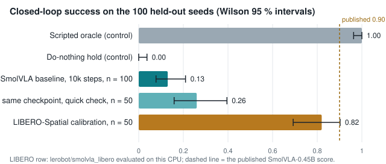
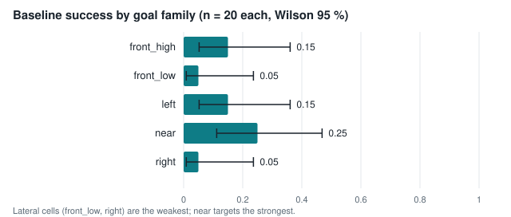
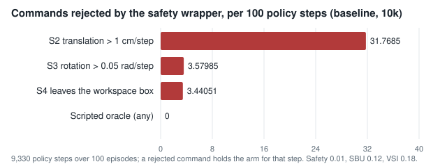
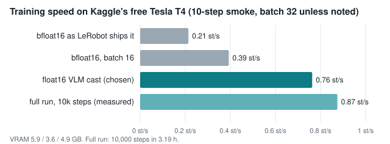
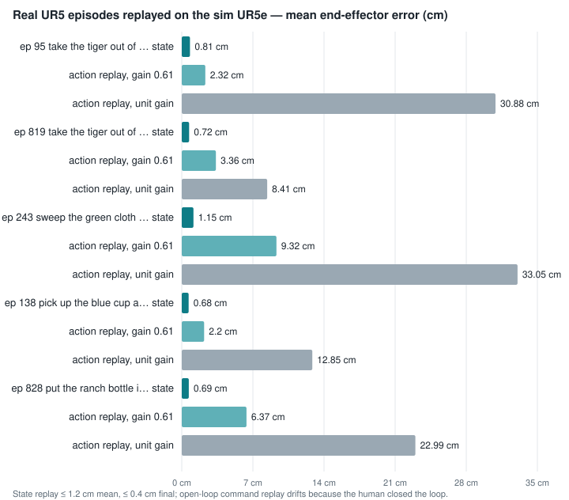
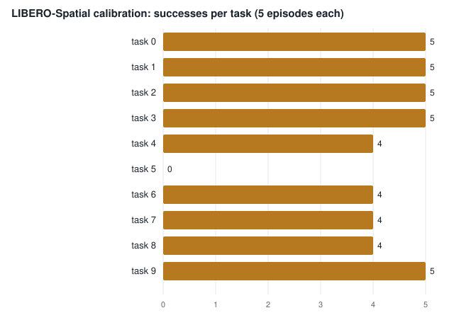

# UR5e VLA bed — experiment report (2026-09-04)

Status of the experiment branch `experiment/ur5e-vla-bed` at report time: Phases 0–3 verified,
LIBERO calibration done, Phase 4 baseline trained on a free Kaggle T4 and its evaluation
in progress (learning curve and variations pending). **Money spent: $0.00.**
Kaggle GPU quota used ≈ 12 h of 30 (smokes 0.3 h, training 3.9 h, evaluation ≈ 8 h).
Every number below comes from a committed JSON under `results/` or from the Kaggle logs
transcribed in `results/p5/kaggle/eval-v2-partial.json`.

## 0. Live progress of the evaluation run

Updated 2026-09-04 15:10 ICT · santapongsondhi/vla-bed-eval v2 · started ≈ 08:25 ICT (container clock; submitted 07:47 ICT) · 6.77 h elapsed · **ETA ≈ 16:12 ICT (± 15 min)**

- done: 010000 nominal (13 %)
- done: 010000 blank-image probe (0 %)
- done: 010000 gain-0.61 probe (28 %)
- done: 007500 nominal (20 %)
- done: 005000 nominal (13 %)
- done: 002500 nominal (9 %)
- running: 010000 camera_shift
- queued: 010000 lighting (will be cut by the 7.5 h budget)
- queued: 010000 target_relocation (will be cut by the 7.5 h budget)
- expected: 010000 camera_shift at ≈ 16:08 ICT
- expected: finish + pack at ≈ 16:12 ICT

## 1. What was measured, in one table

| Measurement | Result | Interval / uncertainty | Where |
|---|---|---|---|
| Scripted expert on the 100 held-out seeds (control) | 1.00 success, 25.8 frames, zero faults | Wilson [0.963, 1.00] | `results/p5/santapong/oracle/` |
| Do-nothing policy (control) | 0.00 | [0.00, 0.037] | `results/p5/santapong/hold/` |
| Same two controls on the Raspberry Pi | identical episode rows (0 mismatches over 200 episodes) | — | `results/p5/santapong-dev/` |
| LIBERO-Spatial calibration, `lerobot/smolvla_libero`, 10 × 5 episodes, CPU | **41/50 = 0.82**; per task 5, 5, 5, 5, 4, 0, 4, 4, 4, 5 of 5; 7.0 h | Wilson [0.692, 0.902]; published 0.90 inside | `results/p2b/full/eval_info.json` |
| SmolVLA-base inference on this CPU | ≈36 s per 50-action chunk, 3.5 GB peak RSS | — | `results/p2/santapong/cpu_bench.json` |
| Kaggle T4 training speed (smoke) | float16 VLM **0.763** steps/s vs bfloat16 0.214 | 10 steps each | `results/p5/kaggle/eval-v2-partial.json` |
| Baseline training (`baseline`, 10k steps, batch 32) | 0.8745 steps/s, 3.19 h, 4.87 GB VRAM, 4 checkpoints | — | Kaggle `vla-bed-train` v1 |
| **Baseline checkpoint 10k, nominal, n = 100** | **success 0.13**, progress 0.29, safety 0.01, SBU 0.12, VSI 0.18, 93.3 frames | Wilson [0.078, 0.210] | Kaggle `vla-bed-eval` v2 |
| Same checkpoint, quick check, n = 50 | success 0.26, progress 0.43 | [0.159, 0.396] | Kaggle `vla-bed-train` v1 |
| **Learning curve, nominal, n = 100 per checkpoint** | 2.5k: 0.09 (progress 0.23, safety 0.00); 5k: 0.13 (progress 0.32, safety 0.00); 7.5k: 0.20 (progress 0.32, safety 0.00); 10k: 0.13 (progress 0.29, safety 0.01) | Wilson 2.5k [0.048, 0.162]; 5k [0.078, 0.210]; 7.5k [0.133, 0.289]; 10k [0.078, 0.210] | Kaggle `vla-bed-eval` v2 |
| **Gain probe: same checkpoint, every command × 0.61, n = 100** | **success 0.28**, progress 0.42, safety 0.86, rejections S4 135 / S3 3 / S2 0 | Wilson [0.201, 0.375] | Kaggle `vla-bed-eval` v2 |
| **Vision probe: same checkpoint, camera blanked, n = 100** | success 0.00, progress 0.01, all episodes time out; 66 rejections | Wilson [0, 0.037] | Kaggle `vla-bed-eval` v2 |
| Rejected commands, baseline 10k (per 100 policy steps) | S2 31.8, S3 3.6, S4 3.4 | over 9,330 steps | same |
| Real UR5 replay on the sim UR5e (5 OXE episodes) | state tracking 0.7–1.2 cm mean, ≤ 0.4 cm final; command replay 2.2–9.3 cm with the measured 0.61 gain | alignment Rz 90° + 0.284 m | `results/p3/santapong/summary.json` |
| Datasets recorded | v2: 400 train / 100 held-out episodes, 11,506 + 2,917 frames, 100 % expert success | — | `results/p2/santapong/` |

## 2. Charts

## 3. Reading the results

- **The pipeline is closed.** Record on the workstation → fine-tune SmolVLA on a free T4 →
  evaluate every step through the bed's own controller and safety wrapper, with the
  scripted expert at 100 % and the do-nothing policy at 0 % as controls. That is SDD Q-B,
  answered without spending money.
- **The baseline learns, but not much yet.** 13 % success on the 100 held-out seeds after
  10k steps (interval 8–21 %), progress 0.30, best on near targets (25 %), worst on the
  lateral cells (5 %). Twelve of the thirteen successes touched the safety wrapper on the way.
- **An earlier checkpoint scores higher.** The 7.5k checkpoint reaches 20 % [13–29 %] against the final checkpoint's 13 %; the intervals overlap, so this is not a proven decline, but the R11 rule picks by closed-loop success and would select 7.5k today. Both checkpoints reject about a third of their steps at S2, so the action-scale problem is not a late-training artefact.
- **The safety wrapper is doing real work.** About a third of the policy's commands exceed
  the 1 cm-per-step limit the demonstrations respected; the arm holds for those steps. The
  policy predicts larger steps than it was trained on — a scale/normalisation question to
  check before the next run (the labels' std is 0.007 m; the model's outputs are unclipped).
- **The two probes explain the number.** Blank the camera and success falls to 0 of 100 (the policy
  uses vision, R6). Execute every command at 61 % of what the policy asks — the real UR5's measured
  realisation — and success doubles to 28 % with 86 % safe episodes and no per-step rejections: the
  policy's steps are about 1.6× its training labels, the wrapper's holds were the bottleneck, and
  the controller-amplification effect of R11 is visible. Fixing the action scale is the next change.
- **Repeated suites of one checkpoint differ.** 26 % on a 50-episode check versus 13 % on the
  100-episode suite: SmolVLA samples its action chunk from noise, so a suite is a sample of
  the policy, not a deterministic property. The evaluator now seeds that noise per episode.
- **The evaluator is calibrated.** On LIBERO-Spatial it reproduces the published SmolVLA score
  within its interval (82 % measured, 90 published), so the low bed number is a property of
  the trained policy, not of the measuring instrument.

## 4. Pending when this report was written

- variation camera_shift on 010000 (running; fits the 7.5 h budget)
- lighting and target_relocation (cut by the 7.5 h budget; next Kaggle session)

Each pending suite is 100 episodes ≈ 1.1 h on Kaggle's CPU; the run is bounded at 7.5 h and
drops the tail. The next report regenerates from the packed JSONs once they are imported
(`gpu/kaggle_import.sh`).

Generated by `sim/vla-bed/report.py` from the committed results.
