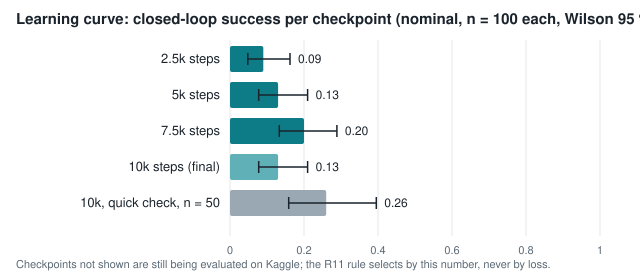
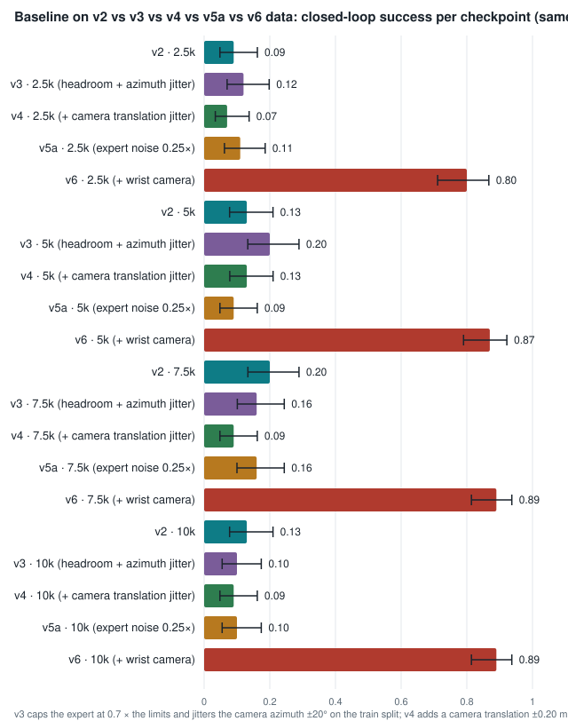
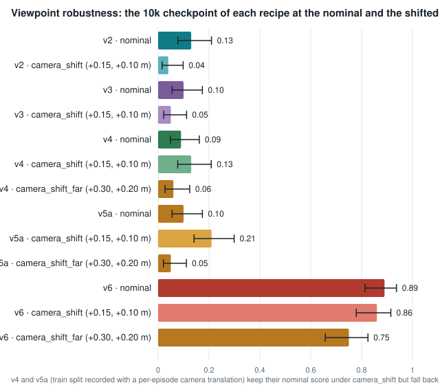
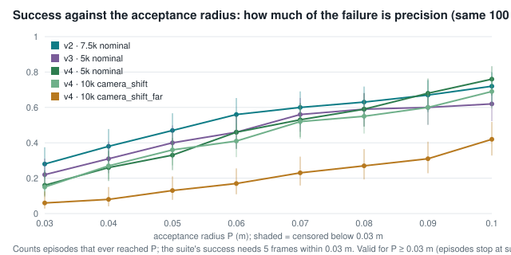

# UR5e VLA bed — experiment report (2026-09-06)

Status of the experiment branch `experiment/ur5e-vla-bed` at report time: Phases 0–3 verified,
LIBERO calibration done, Phase 4 baseline trained on a free Kaggle T4 and evaluated closed-loop: 7 of 9 suites ran inside the 7.5 h budget (lighting and target_relocation deferred to the next session); packed JSONs not yet imported. **Money spent: $0.00.**
Kaggle GPU quota used ≈ 19 h in the week of 29 Aug (smokes, v2 training, three evaluation/probe sessions, v3 training) and ≈ 4.6 h in the week of 5 Sep (v4 training 3.0 h, evaluation 1.6 h); weekly cap 30 h.
Every number below comes from a committed JSON under `results/` or from the Kaggle logs
transcribed in `results/p5/kaggle/eval-v2-partial.json`.

## 0. Evaluation run: finished

santapongsondhi/vla-bed-eval v2 finished at 2026-09-04 16:14 ICT after 7.81 h · 7 suites ran; cut by the 7.5 h budget: 010000 lighting, 010000 target_relocation

- done: 010000 nominal (13 %)
- done: 010000 blank-image probe (0 %)
- done: 010000 gain-0.61 probe (28 %)
- done: 007500 nominal (20 %)
- done: 005000 nominal (13 %)
- done: 002500 nominal (9 %)
- done: 010000 camera_shift (4 %)
- output: vla-bed-baseline-eval.zip (JSON results only) in the notebook's Output tab; sha256 4118f3f7…8645e9737; import with gpu/kaggle_import.sh

## 1. What was measured, in one table

| Measurement | Result | Interval / uncertainty | Where |
|---|---|---|---|
| Scripted expert on the 100 held-out seeds (control) | 1.00 success, 25.8 frames, zero faults | Wilson [0.963, 1.00] | `results/p5/santapong/oracle/` |
| Do-nothing policy (control) | 0.00 | [0.00, 0.037] | `results/p5/santapong/hold/` |
| Same two controls on the Raspberry Pi | identical episode rows (0 mismatches over 200 episodes) | — | `results/p5/santapong-dev/` |
| LIBERO-Spatial calibration, `lerobot/smolvla_libero`, 10 × 5 episodes, CPU | **41/50 = 0.82**; per task 5, 5, 5, 5, 4, 0, 4, 4, 4, 5 of 5; 7.0 h | Wilson [0.692, 0.902]; published 0.90 inside | `results/p2b/full/eval_info.json` |
| SmolVLA-base inference on this CPU | ≈36 s per 50-action chunk, 3.5 GB peak RSS | — | `results/p2/santapong/cpu_bench.json` |
| Kaggle T4 training speed (smoke) | float16 VLM **0.763** steps/s vs bfloat16 0.214 | 10 steps each | `results/p5/kaggle/eval-v2-partial.json` |
| Baseline training (`baseline`, 10k steps, batch 32) | 0.8745 steps/s, 3.19 h, 4.87 GB VRAM, 4 checkpoints | — | Kaggle `vla-bed-train` v1 |
| **Baseline checkpoint 10k, nominal, n = 100** | **success 0.13**, progress 0.29, safety 0.01, SBU 0.12, VSI 0.18, 93.3 frames | Wilson [0.078, 0.210] | Kaggle `vla-bed-eval` v2 |
| Same checkpoint, quick check, n = 50 | success 0.26, progress 0.43 | [0.159, 0.396] | Kaggle `vla-bed-train` v1 |
| **Learning curve, nominal, n = 100 per checkpoint** | 2.5k: 0.09 (progress 0.23, safety 0.00); 5k: 0.13 (progress 0.32, safety 0.00); 7.5k: 0.20 (progress 0.32, safety 0.00); 10k: 0.13 (progress 0.29, safety 0.01) | Wilson 2.5k [0.048, 0.162]; 5k [0.078, 0.210]; 7.5k [0.133, 0.289]; 10k [0.078, 0.210] | Kaggle `vla-bed-eval` v2 |
| **Gain probe: same checkpoint, every command × 0.61, n = 100** | **success 0.28**, progress 0.42, safety 0.86, rejections S4 135 / S3 3 / S2 0 | Wilson [0.201, 0.375] | Kaggle `vla-bed-eval` v2 |
| **Vision probe: same checkpoint, camera blanked, n = 100** | success 0.00, progress 0.01, all episodes time out; 66 rejections | Wilson [0, 0.037] | Kaggle `vla-bed-eval` v2 |
| **Variation camera_shift, 10k checkpoint, n = 100** | **success 0.04**, progress 0.12, VSI 0.23, 268 self-collision steps measured, rejections S2 1556 / S3 574 / S4 742 | Wilson [0.016, 0.098] | Kaggle `vla-bed-eval` v2 |
| **Checkpoint selection (R11: by closed-loop success)** | selected **7.5k** at 0.20; checkpoints inside the best interval: 7.5k | — | Kaggle `vla-bed-eval` v2 |
| Rejected commands, baseline 10k (per 100 policy steps) | S2 31.8, S3 3.6, S4 3.4 | over 9,330 steps | same |
| Real UR5 replay on the sim UR5e (5 OXE episodes) | state tracking 0.7–1.2 cm mean, ≤ 0.4 cm final; command replay 2.2–9.3 cm with the measured 0.61 gain | alignment Rz 90° + 0.284 m | `results/p3/santapong/summary.json` |
| Datasets recorded | v2: 400 train / 100 held-out episodes, 11,506 + 2,917 frames, 100 % expert success | — | `results/p2/santapong/` |

## 2. Charts

## 3. Reading the results

- **The pipeline is closed.** Record on the workstation → fine-tune SmolVLA on a free T4 →
  evaluate every step through the bed's own controller and safety wrapper, with the
  scripted expert at 100 % and the do-nothing policy at 0 % as controls. That is SDD Q-B,
  answered without spending money.
- **The baseline learns, but not much yet.** 13 % success on the 100 held-out seeds after
  10k steps (interval 8–21 %), progress 0.30, best on near targets (25 %), worst on the
  lateral cells (5 %). Twelve of the thirteen successes touched the safety wrapper on the way.
- **An earlier checkpoint scores higher.** The 7.5k checkpoint reaches 20 % [13–29 %] against the final checkpoint's 13 %; the intervals overlap, so this is not a proven decline, but the R11 rule picks by closed-loop success and would select 7.5k today. Both checkpoints reject about a third of their steps at S2, so the cap problem is not a late-training artefact.
- **The safety wrapper is doing real work.** About a third of the policy's commands exceed
  the 1 cm-per-step limit the demonstrations respected; the arm holds for those steps. The
  training labels sit exactly on that limit (84 % of label steps saturate at 0.010 m per axis,
  audit of 4 Sep 2026), so a regressor's symmetric spread is rejected one-sidedly; the next
  dataset (v3) records with headroom below the limits.
- **The two probes explain the number.** Blank the camera and success falls to 0 of 100 (the policy
  uses vision, R6). Execute every command at 61 % of what the policy asks — the real UR5's measured
  realisation — and success doubles to 28 % with 86 % safe episodes and no per-step rejections: the
  wrapper's holds were the bottleneck (labels on the cap, so any spread crosses it), and the
  controller-amplification effect of R11 is visible. Headroom in the data is the next change.
- **A shifted camera breaks it.** With the camera moved, success falls from 13 % to 4 % [2–10 %], progress from 0.29 to 0.12, and the arm self-collides in 268 steps where the nominal suite had none; the wrapper rejects far more workspace exits (S4 742 vs 321). A policy trained on one camera pose learned the picture, not the geometry — the diversity rule (R10) applies before any more demonstrations are recorded.
- **Repeated suites of one checkpoint differ.** 26 % on a 50-episode check versus 13 % on the
  100-episode suite: SmolVLA samples its action chunk from noise, so a suite is a sample of
  the policy, not a deterministic property. The evaluator now seeds that noise per episode.
- **The evaluator is calibrated.** On LIBERO-Spatial it reproduces the published SmolVLA score
  within its interval (82 % measured, 90 published), so the low bed number is a property of
  the trained policy, not of the measuring instrument.

## 3a. Session A — probes on the existing checkpoints (Kaggle, transcribed)

Suites now take 8–15 min per 100 episodes (was 65): the camera is rendered only when the policy is queried and two workers share the seeds.

| Magnitude probe (open loop, 500 training frames) | pred / label L∞ | labels on the cap | predicted over the cap | given label on cap | direction cosine |
|---|---|---|---|---|---|
| 7.5k | 0.9795 | 79 % | 34 % | 43 % | 0.7468 |
| 10k | 0.9833 | 79 % | 31 % | 39 % | 0.7523 |

| Closed-loop suite (7.5k unless stated) | success | Wilson 95 % | safety | rejected steps | cmd L∞ mean | progress |
|---|---|---|---|---|---|---|
| nominal, n = 100 | **0.24** | [0.167, 0.332] | 0.00 | 42 % | 0.0084 | 0.40 |
| nominal + clip, n = 100 | **0.19** | [0.125, 0.278] | 0.53 | 14 % | 0.0073 | 0.38 |
| nominal + clip (10k), n = 100 | **0.17** | [0.109, 0.255] | 0.52 | 13 % | 0.0073 | 0.35 |
| nominal + gain 0.61, n = 100 | **0.17** | [0.109, 0.255] | 0.86 | 2 % | 0.0045 | 0.39 |
| nominal + ensemble/5, n = 100 | **0.18** | [0.117, 0.267] | 0.02 | 32 % | 0.0074 | 0.34 |
| lighting, n = 100 | **0.11** | [0.063, 0.186] | 0.00 | 36 % | 0.0080 | 0.31 |
| target_relocation, n = 100 | **0.07** | [0.034, 0.137] | 0.00 | 37 % | 0.0082 | 0.26 |
| nominal + VLM float16, n = 20 | **0.05** | [0.009, 0.236] | 0.00 | 37 % | 0.0081 | 0.25 |

| Paired on the same 100 seeds | A → B | diff [paired bootstrap 95 %] | discordant (A fail/B ok vs A ok/B fail) | McNemar p | verdict |
|---|---|---|---|---|---|
| 007500 nominal vs 007500 clip | 0.24 → 0.19 | -0.05 [-0.16, +0.05] | 12 vs 17 | 0.458 | not separable at n = 100 |
| 007500 nominal vs 007500 gain 0.61 | 0.24 → 0.17 | -0.07 [-0.16, +0.02] | 8 vs 15 | 0.21 | not separable at n = 100 |
| 007500 nominal vs 007500 ensemble replan 5 | 0.24 → 0.18 | -0.06 [-0.15, +0.03] | 8 vs 14 | 0.286 | not separable at n = 100 |
| 007500 nominal vs 007500 lighting | 0.24 → 0.11 | -0.13 [-0.22, -0.04] | 6 vs 19 | 0.0146 | A better |
| 007500 nominal vs 007500 target_relocation | 0.24 → 0.07 | -0.17 [-0.26, -0.08] | 4 vs 21 | 0.000911 | A better |
| 007500 clip vs 010000 clip | 0.19 → 0.17 | -0.02 [-0.08, +0.04] | 4 vs 6 | 0.754 | not separable at n = 100 |

- **No magnitude bias (ratio 0.98); the cap explains the rejections but not the failures: clipping (0.19), gain 0.61 (0.17) and the linear temporal ensemble (0.18) are all inside the noise of the 7.5k nominal suite (0.24), paired McNemar p 0.21-0.46. lighting (0.11, p 0.015) and target_relocation (0.07, p 0.0009) are significantly worse than nominal. The v3 data fix (headroom + viewpoint jitter) is the next lever; inference-side tricks are not.**

## 3c. Session C — baseline trained on v3 (headroom 0.7 + camera jitter), frozen suite (transcribed)

| Suite (v3 checkpoint) | success | Wilson 95 % | safety | progress | rejected steps | cmd L∞ mean | v2 same suite |
|---|---|---|---|---|---|---|---|
| 10k nominal | **0.10** | [0.055, 0.174] | 0.70 | 0.28 | 6 % | 0.0058 | 0.13 |
| 10k nominal + camera blanked | **0.00** | [0.000, 0.037] | 0.00 | 0.01 | 35 % | 0.0059 | 0.00 |
| 10k nominal + gain 0.61 | **0.22** | [0.150, 0.311] | 1.00 | 0.35 | 0 % | 0.0037 | 0.28 |
| 7.5k nominal | **0.16** | [0.101, 0.244] | 0.63 | 0.32 | 5 % | 0.0058 | 0.20 |
| 5k nominal | **0.20** | [0.133, 0.289] | 0.72 | 0.33 | 4 % | 0.0059 | 0.13 |
| 2.5k nominal | **0.12** | [0.070, 0.198] | 0.46 | 0.27 | 12 % | 0.0060 | 0.09 |
| 10k camera_shift | **0.05** | [0.022, 0.112] | 0.64 | 0.13 | 10 % | 0.0060 | 0.04 |
| 10k lighting | **0.10** | [0.055, 0.174] | 0.80 | 0.24 | 3 % | 0.0058 | 0.11 (7.5k) |
| 10k target_relocation | **0.14** | [0.085, 0.221] | 0.73 | 0.28 | 5 % | 0.0058 | 0.07 (7.5k) |

Selected checkpoint (R11): **5k** at 0.20; inside the best interval: 5k, 7.5k. Training: 0.8422 steps/s, 3.31 h.

- **Headroom removed the wrapper's interventions (over-cap steps 0 %, rejected steps 4-6 % instead of 32-45 %, safety 0.46-0.72 instead of 0.00) but did not move closed-loop success: the v3 learning curve 0.12 / 0.20 / 0.16 / 0.10 sits in the same band as v2's 0.09 / 0.13 / 0.20 / 0.13, and the selected checkpoint (5k) scores 0.20, exactly v2's best. The camera azimuth jitter did not help the camera_shift variation (0.05 vs 0.04): that variation translates the camera without re-aiming it, a perturbation the jitter never showed. lighting 0.10 and target_relocation 0.14 are within noise of nominal. The policy's ceiling with 400 demonstrations is precision, not the safety cap; the paired comparison on identical seeds (after the zips are imported) is the formal statement.**

## 3d. Session E — baseline trained on v4 (v3 + camera translation jitter), frozen suite (transcribed)

| Suite (v4 checkpoint) | success | Wilson 95 % | safety | progress | rejected steps | cmd L∞ mean | v3 same suite |
|---|---|---|---|---|---|---|---|
| 10k nominal | **0.09** | [0.048, 0.162] | 0.73 | 0.28 | 5 % | 0.0058 | 0.10 |
| 10k nominal + camera blanked | **0.00** | [0.000, 0.037] | 0.01 | 0.01 | 25 % | 0.0054 | 0.00 |
| 10k nominal + gain 0.61 | **0.20** | [0.133, 0.289] | 0.99 | 0.34 | 0 % | 0.0036 | 0.22 |
| 7.5k nominal | **0.09** | [0.048, 0.162] | 0.65 | 0.24 | 6 % | 0.0059 | 0.16 |
| 5k nominal | **0.13** | [0.078, 0.210] | 0.56 | 0.29 | 8 % | 0.0061 | 0.20 |
| 2.5k nominal | **0.07** | [0.034, 0.137] | 0.74 | 0.25 | 4 % | 0.0061 | 0.12 |
| 10k camera_shift | **0.13** | [0.077, 0.209] | 0.73 | 0.27 | 5 % | 0.0059 | 0.05 |
| 10k camera_shift_far | **0.06** | [0.027, 0.124] | 0.62 | 0.12 | 8 % | 0.0058 | not run |
| 10k lighting | **0.07** | [0.034, 0.137] | 0.45 | 0.17 | 9 % | 0.0059 | 0.10 |
| 10k target_relocation | **0.09** | [0.048, 0.162] | 0.64 | 0.24 | 4 % | 0.0059 | 0.14 |

Selected checkpoint (R11): **5k** at 0.13; inside the best interval: 5k, 7.5k, 10k. Training: 0.9348 steps/s, 2.98 h; evaluation 1.58 h.

- **The camera-translation jitter did what it was designed for: the same 10k policy scores 0.13 [0.08, 0.21] under camera_shift (+0.15, +0.10 m) against 0.05 for v3 and 0.04 for v2 on the identical seeds — paired v3 → v4 +0.08 [+0.01, +0.15] (11 vs 3 discordant, McNemar p = 0.057), v2 → v4 +0.09 [+0.02, +0.16] (p = 0.022), progress +0.14 [+0.08, +0.21] — and its camera_shift score is not separable from its own nominal 0.09 (p = 0.34): inside the jittered range the policy is viewpoint-invariant. Outside that range (camera_shift_far, +0.30/+0.20 m) it drops to 0.06 with progress 0.12: the invariance does not extrapolate, matching Cai et al. 2603.26757. Nominal success did not improve (5k 0.13 vs v3 5k 0.20, paired −0.07 [−0.17, +0.03], p = 0.23; every v3-vs-v4 nominal pair inside the noise of n = 100); lighting 0.07 and target_relocation 0.09 are likewise within noise. Safety unchanged (0 % over the cap, 4–9 % S4 rejections); gain 0.61 again beats nominal on 10k (+0.11 [+0.04, +0.18], p = 0.0074).**

## 3e. Precision curves — success against the acceptance radius (re-analysis of the committed rows, no GPU)

| Suite (n = 100) | suite success | P = 0.03 | 0.04 | 0.05 | 0.06 | 0.08 | 0.10 m | power-law r² |
|---|---|---|---|---|---|---|---|---|
| v3 10k camera_shift_far | 0.04 | **0.05** | 0.11 | 0.13 | 0.18 | 0.26 | 0.38 | 0.9012 |
| v4 2.5k nominal | 0.07 | **0.14** | 0.23 | 0.34 | 0.43 | 0.54 | 0.64 | 0.9799 |
| v4 5k nominal | 0.13 | **0.16** | 0.26 | 0.33 | 0.46 | 0.59 | 0.76 | 0.9106 |
| v4 7.5k nominal | 0.09 | **0.11** | 0.24 | 0.35 | 0.40 | 0.59 | 0.74 | 0.9305 |
| v4 10k camera_shift | 0.13 | **0.15** | 0.27 | 0.36 | 0.41 | 0.55 | 0.69 | 0.9457 |
| v4 10k camera_shift_far | 0.06 | **0.06** | 0.08 | 0.13 | 0.17 | 0.27 | 0.42 | 0.859 |
| v4 10k lighting | 0.07 | **0.08** | 0.16 | 0.23 | 0.27 | 0.39 | 0.55 | 0.9069 |
| v4 10k nominal | 0.09 | **0.12** | 0.27 | 0.34 | 0.46 | 0.61 | 0.71 | 0.9616 |
| v4 10k nominal gain 0.61 | 0.20 | **0.22** | 0.34 | 0.44 | 0.48 | 0.62 | 0.74 | 0.9563 |
| v4 10k target_relocation | 0.09 | **0.13** | 0.21 | 0.29 | 0.39 | 0.55 | 0.67 | 0.937 |
| v2 7.5k lighting | 0.11 | **0.15** | 0.30 | 0.40 | 0.51 | 0.59 | 0.66 | 0.9956 |
| v2 7.5k nominal | 0.24 | **0.28** | 0.38 | 0.47 | 0.56 | 0.63 | 0.72 | 0.9848 |
| v2 7.5k nominal clip | 0.19 | **0.31** | 0.39 | 0.46 | 0.56 | 0.72 | 0.75 | 0.9576 |
| v2 7.5k nominal ensemble | 0.18 | **0.22** | 0.29 | 0.41 | 0.51 | 0.65 | 0.71 | 0.9675 |
| v2 7.5k nominal gain 0.61 | 0.17 | **0.21** | 0.38 | 0.50 | 0.61 | 0.71 | 0.77 | 0.9953 |
| v2 7.5k target_relocation | 0.07 | **0.11** | 0.28 | 0.38 | 0.45 | 0.61 | 0.68 | 0.9874 |
| v2 10k nominal clip | 0.17 | **0.33** | 0.42 | 0.47 | 0.54 | 0.67 | 0.73 | 0.9659 |
| v3 2.5k nominal | 0.12 | **0.17** | 0.23 | 0.33 | 0.42 | 0.57 | 0.63 | 0.9676 |
| v3 5k nominal | 0.20 | **0.22** | 0.31 | 0.40 | 0.46 | 0.59 | 0.62 | 0.9781 |
| v3 7.5k nominal | 0.16 | **0.20** | 0.28 | 0.40 | 0.47 | 0.56 | 0.66 | 0.9761 |
| v3 10k camera_shift | 0.05 | **0.05** | 0.11 | 0.17 | 0.21 | 0.41 | 0.55 | 0.8643 |
| v3 10k lighting | 0.10 | **0.13** | 0.17 | 0.28 | 0.39 | 0.51 | 0.65 | 0.9372 |
| v3 10k nominal | 0.10 | **0.16** | 0.23 | 0.39 | 0.46 | 0.61 | 0.66 | 0.9789 |
| v3 10k nominal gain 0.61 | 0.22 | **0.23** | 0.35 | 0.43 | 0.49 | 0.54 | 0.66 | 0.9643 |
| v3 10k target_relocation | 0.14 | **0.16** | 0.27 | 0.35 | 0.41 | 0.58 | 0.66 | 0.9493 |
| v2 10k camera_shift_far | 0.03 | **0.04** | 0.06 | 0.12 | 0.15 | 0.21 | 0.26 | 0.9568 |

- **Success at tolerance P counts an episode whose min_error_m ever dipped to P; the suite's own success needs five consecutive frames within 0.03 m, so the P = 0.03 m point is >= the suite's success rate (the gap = episodes that reached the radius and did not hold it). Episodes stop once they succeed, so min_error_m is right-censored at 0.03 m and the curve is valid for P >= 0.03 m only; larger P answers how much a wider acceptance radius would help.**
- **Reading: every recipe's success climbs steeply with the radius (three- to fourfold from 0.03 to 0.06 m, ≈ 0.7 at 0.10 m), so the failures are misses by a few centimetres, not wrong directions — a precision ceiling, as the Curse of Precision (2607.23108) predicts for a single third-person RGB camera; camera_shift_far is the exception (flatter: directional errors). The 1/(P − c) form never beats the plain power law on this range (c pins to 0), so these eight points describe the curve without establishing a law.**

## 3f. P5 — the bed served over ZeroMQ (Pi simulator, workstation client)

| Suite through the wire | n | success | Wilson 95 % | safety | progress | policy call | requests | wire time | wall | in-process rows |
|---|---|---|---|---|---|---|---|---|---|---|
| baseline-v3/005000 (smolvla) | 20 | **0.15** | [0.052, 0.360] | 0.55 | 0.40 | 31.8 s | 2038 | 51 s | 94 min |  |
| hold (hold) | 100 | **0.00** | [0.000, 0.037] | 1.00 | 0.01 | 0.0 s | 20202 | 930 s | 16 min | 0 field mismatches |
| oracle (oracle) | 100 | **1.00** | [0.963, 1.000] | 1.00 | 1.00 | 0.0 s | 10522 | 257 s | 4 min | 0 field mismatches |

- **The split works: the oracle and hold suites reproduce the in-process rows field for field, a request round trip (Pi physics or render + transfer) costs ≈ 25 ms without rendering and ≈ 46 ms with, and in the policy suite that round trip is 0.9 % of the wall time — the ≈ 32 s CPU policy call is the whole budget. SDD question Q-A is answered.**

## 3b. Imported Kaggle probe results (session A, per-episode files)

| Magnitude probe (open loop, training frames) | rows | pred / label L∞ | labels on the cap | predicted over the cap | given label on cap | direction cosine |
|---|---|---|---|---|---|---|
| baseline/007500 | 4296 | 0.9795 | 79 % | 34 % | 43 % | 0.7468 |
| baseline/010000 | 4296 | 0.9833 | 79 % | 31 % | 39 % | 0.7523 |

Files under `results/p5/8ac6124fd05b` are the v2 baseline (eval v2), `7a90b7940018` the v2 probe session, `a85e64a183e5` the v2 far-shift probe, `9f5dbf4dd492` the v3 baseline, `06f90d52039b` the v3 far-shift probe, `145880075d6f` the v4 baseline; names of the form `vX … vs vY …` pair two datasets on identical seeds.

| Paired comparison (same 100 seeds) | A → B success | diff [paired bootstrap 95 %] | discordant (A fail/B ok vs A ok/B fail) | McNemar p | verdict |
|---|---|---|---|---|---|
| v3 vs v4 nominal 2500 (baseline/002500 nominal g1.0 → baseline/002500 nominal g1.0) | 0.12 → 0.07 | -0.05 [-0.13, +0.03] | 5 vs 10 | 0.302 | not separable at n = 100 |
| v2best 7500 vs v4best 5000 (baseline/007500 nominal g1.0 → baseline/005000 nominal g1.0) | 0.20 → 0.13 | -0.07 [-0.16, +0.02] | 8 vs 15 | 0.21 | not separable at n = 100 |
| v3 vs v4 nominal 5000 (baseline/005000 nominal g1.0 → baseline/005000 nominal g1.0) | 0.20 → 0.13 | -0.07 [-0.17, +0.03] | 9 vs 16 | 0.23 | not separable at n = 100 |
| v3 vs v4 nominal 7500 (baseline/007500 nominal g1.0 → baseline/007500 nominal g1.0) | 0.16 → 0.09 | -0.07 [-0.15, +0.01] | 5 vs 12 | 0.143 | not separable at n = 100 |
| v2 vs v3 camera shift far (baseline/010000 camera_shift_far g1.0 → baseline/010000 camera_shift_far g1.0) | 0.03 → 0.04 | +0.01 [-0.04, +0.06] | 4 vs 3 | 1 | not separable at n = 100 |
| v2 vs v4 camera shift (baseline/010000 camera_shift g1.0 → baseline/010000 camera_shift g1.0) | 0.04 → 0.13 | +0.09 [+0.02, +0.16] | 11 vs 2 | 0.0225 | B better |
| v2 vs v4 camera shift far (baseline/010000 camera_shift_far g1.0 → baseline/010000 camera_shift_far g1.0) | 0.03 → 0.06 | +0.03 [-0.03, +0.09] | 6 vs 3 | 0.508 | not separable at n = 100 |
| v3 vs v4 camera shift (baseline/010000 camera_shift g1.0 → baseline/010000 camera_shift g1.0) | 0.05 → 0.13 | +0.08 [+0.01, +0.15] | 11 vs 3 | 0.0574 | B better |
| v3 vs v4 camera shift far (baseline/010000 camera_shift_far g1.0 → baseline/010000 camera_shift_far g1.0) | 0.04 → 0.06 | +0.02 [-0.03, +0.08] | 5 vs 3 | 0.727 | not separable at n = 100 |
| v3 vs v4 gain0.61 (baseline/010000 nominal g0.61 → baseline/010000 nominal g0.61) | 0.22 → 0.20 | -0.02 [-0.12, +0.07] | 11 vs 13 | 0.839 | not separable at n = 100 |
| v3 vs v4 lighting (baseline/010000 lighting g1.0 → baseline/010000 lighting g1.0) | 0.10 → 0.07 | -0.03 [-0.10, +0.04] | 5 vs 8 | 0.581 | not separable at n = 100 |
| v3 vs v4 nominal 10000 (baseline/010000 nominal g1.0 → baseline/010000 nominal g1.0) | 0.10 → 0.09 | -0.01 [-0.07, +0.05] | 5 vs 6 | 1 | not separable at n = 100 |
| v3 vs v4 target relocation (baseline/010000 target_relocation g1.0 → baseline/010000 target_relocation g1.0) | 0.14 → 0.09 | -0.05 [-0.13, +0.03] | 6 vs 11 | 0.332 | not separable at n = 100 |
| v4 camera shift vs far (baseline/010000 camera_shift g1.0 → baseline/010000 camera_shift_far g1.0) | 0.13 → 0.06 | -0.07 [-0.14, +0.00] | 3 vs 10 | 0.0923 | not separable at n = 100 |
| v4 nominal vs camera shift (baseline/010000 nominal g1.0 → baseline/010000 camera_shift g1.0) | 0.09 → 0.13 | +0.04 [-0.02, +0.10] | 7 vs 3 | 0.344 | not separable at n = 100 |
| v4 nominal vs camera shift far (baseline/010000 nominal g1.0 → baseline/010000 camera_shift_far g1.0) | 0.09 → 0.06 | -0.03 [-0.09, +0.03] | 3 vs 6 | 0.508 | not separable at n = 100 |
| v4 nominal vs gain0.61 (baseline/010000 nominal g1.0 → baseline/010000 nominal g0.61) | 0.09 → 0.20 | +0.11 [+0.04, +0.18] | 13 vs 2 | 0.00739 | B better |
| clip 007500 vs 010000 (baseline/007500 nominal g1.0 → baseline/010000 nominal g1.0) | 0.19 → 0.17 | -0.02 [-0.08, +0.04] | 4 vs 6 | 0.754 | not separable at n = 100 |
| nominal vs lighting (baseline/007500 nominal g1.0 → baseline/007500 lighting g1.0) | 0.24 → 0.11 | -0.13 [-0.22, -0.04] | 6 vs 19 | 0.0146 | A better |
| nominal vs nominal clip (baseline/007500 nominal g1.0 → baseline/007500 nominal g1.0) | 0.24 → 0.19 | -0.05 [-0.16, +0.05] | 12 vs 17 | 0.458 | not separable at n = 100 |
| nominal vs nominal ens5 (baseline/007500 nominal g1.0 → baseline/007500 nominal g1.0) | 0.24 → 0.18 | -0.06 [-0.15, +0.03] | 8 vs 14 | 0.286 | not separable at n = 100 |
| nominal vs nominal gain0.61 (baseline/007500 nominal g1.0 → baseline/007500 nominal g0.61) | 0.24 → 0.17 | -0.07 [-0.16, +0.02] | 8 vs 15 | 0.21 | not separable at n = 100 |
| nominal vs target relocation (baseline/007500 nominal g1.0 → baseline/007500 target_relocation g1.0) | 0.24 → 0.07 | -0.17 [-0.26, -0.08] | 4 vs 21 | 0.000911 | A better |
| v2 vs v3 nominal 2500 (baseline/002500 nominal g1.0 → baseline/002500 nominal g1.0) | 0.09 → 0.12 | +0.03 [-0.04, +0.11] | 9 vs 6 | 0.607 | not separable at n = 100 |
| v2 7500 probeRun vs v3 5000 (baseline/007500 nominal g1.0 → baseline/005000 nominal g1.0) | 0.24 → 0.20 | -0.04 [-0.15, +0.06] | 12 vs 16 | 0.572 | not separable at n = 100 |
| v2 vs v3 nominal 5000 (baseline/005000 nominal g1.0 → baseline/005000 nominal g1.0) | 0.13 → 0.20 | +0.07 [-0.02, +0.16] | 15 vs 8 | 0.21 | not separable at n = 100 |
| v2best 7500 vs v3best 5000 (baseline/007500 nominal g1.0 → baseline/005000 nominal g1.0) | 0.20 → 0.20 | +0.00 [-0.11, +0.11] | 15 vs 15 | 1 | not separable at n = 100 |
| v2 vs v3 nominal 7500 (baseline/007500 nominal g1.0 → baseline/007500 nominal g1.0) | 0.20 → 0.16 | -0.04 [-0.14, +0.06] | 12 vs 16 | 0.572 | not separable at n = 100 |
| v2 vs v3 camera shift (baseline/010000 camera_shift g1.0 → baseline/010000 camera_shift g1.0) | 0.04 → 0.05 | +0.01 [-0.05, +0.07] | 5 vs 4 | 1 | not separable at n = 100 |
| v2 vs v3 gain0.61 (baseline/010000 nominal g0.61 → baseline/010000 nominal g0.61) | 0.28 → 0.22 | -0.06 [-0.16, +0.04] | 11 vs 17 | 0.345 | not separable at n = 100 |
| v2 vs v3 nominal 10000 (baseline/010000 nominal g1.0 → baseline/010000 nominal g1.0) | 0.13 → 0.10 | -0.03 [-0.11, +0.04] | 6 vs 9 | 0.607 | not separable at n = 100 |
| v3 nominal vs gain0.61 (baseline/010000 nominal g1.0 → baseline/010000 nominal g0.61) | 0.10 → 0.22 | +0.12 [+0.04, +0.20] | 15 vs 3 | 0.00754 | B better |

## 4. Pending when this report was written

- download the three result zips from the Kaggle Output tabs and run sim/vla-bed/gpu/kaggle_import.sh on each: vla-bed-eval v2 (sha256 4118f3f7…8645e9737), probe v2 (ff3e1a2e…aa84955b), eval0f826de634 v2 (c6b359a8…16442170); then compare.py pairs baseline-v3 against baseline-v2 on identical seeds
- decide the next lever after the v3 negative result (precision, not the cap): more diverse data (cells/families), or the SDD action-representation variants on v3

Each suite is 100 episodes ≈ 1.1 h on Kaggle's CPU; the run was bounded at 7.5 h and
dropped the tail. The next report regenerates from the packed JSONs once they are imported
(`gpu/kaggle_import.sh`).

Generated by `sim/vla-bed/report.py` from the committed results.
